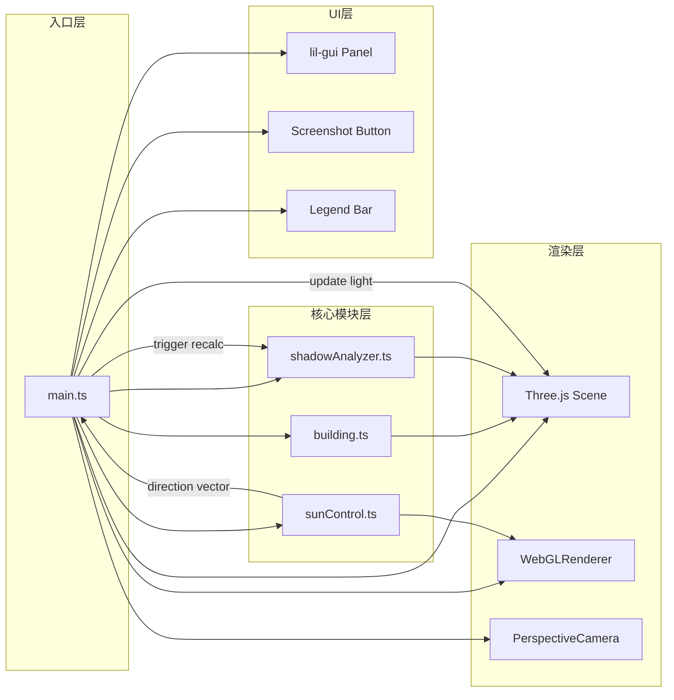

## 1. 架构设计



## 2. 技术说明

- **前端构建**：Vite 5.x + TypeScript 5.x（严格模式）
- **3D引擎**：Three.js 0.160.x + @types/three
- **UI控制**：lil-gui 0.19.x（参数面板）
- **无后端**：纯前端单页应用，所有计算在浏览器端完成

## 3. 模块数据流向

### 3.1 文件职责与调用关系

| 文件 | 职责 | 输入 | 输出 | 被调用方 |
|------|------|------|------|----------|
| src/main.ts | 场景入口，初始化渲染器/场景/相机/控制器，协调各模块 | 用户参数（月份） | 场景更新循环 | building.ts, sunControl.ts, shadowAnalyzer.ts |
| src/building.ts | 创建建筑模型（墙体、屋顶、窗户） | 无 | THREE.Group（已分组三维物体） | main.ts |
| src/sunControl.ts | 太阳拖拽控制器，创建球体并绑定拖拽事件 | scene, light, camera | THREE.Vector3（光源方向向量） | main.ts |
| src/shadowAnalyzer.ts | 阴影分析工具，投射探针网格并计算阴影因子 | scene, building, lightDirection | 更新网格顶点颜色 | main.ts |

### 3.2 核心数据流

1. **初始化阶段**：
   - main.ts → 调用 building.createBuilding() 获取建筑模型 → 添加到场景
   - main.ts → 调用 sunControl.createSunController(scene, light, camera) 获取控制器
   - main.ts → 调用 shadowAnalyzer.createShadowAnalyzer(scene, building) 获取分析器

2. **拖拽交互阶段**：
   - 用户拖拽太阳球体 → sunControl.ts 内部计算球面坐标 → 输出方向向量
   - main.ts 更新平行光 position/target → shadowAnalyzer.update(lightDirection)

3. **月份切换阶段**：
   - lil-gui 月份变更 → main.ts 查询预设太阳路径数据 → TWEEN动画过渡太阳位置
   - sunControl 更新球体位置 → 同步更新光源方向 → 阴影网格重新计算

4. **截图导出阶段**：
   - 点击按钮 → main.ts 设置渲染尺寸 2048x2048 → 离屏渲染
   - Canvas 2D 叠加信息栏 → 转 Blob → 触发下载

## 4. 数据结构定义

```typescript
// 太阳位置（球坐标）
interface SunSpherical {
  radius: number;      // 天球半径
  theta: number;       // 方位角（弧度，0~2π）
  phi: number;         // 极角（弧度，0~π/2，上半球）
}

// 月份太阳路径预设
interface MonthSunData {
  month: number;       // 1~12
  elevation: number;   // 高度角（度）
  azimuth: number;     // 方位角（度）
}

// 阴影探针节点
interface ShadowProbe {
  position: THREE.Vector3;
  shadowFactor: number; // 0~1，0无阴影，1全阴影
}
```

## 5. 性能优化策略

- **阴影贴图**：DirectionalLight.shadow.mapSize = 2048x2048，camera 合理裁剪
- **阴影网格计算**：使用 Raycaster 批量检测，限制 20ms 内完成
- **拖拽节流**：RAF 驱动，避免重复计算，确保 30fps 以上
- **几何体复用**：建筑各部件共享基础几何体实例
