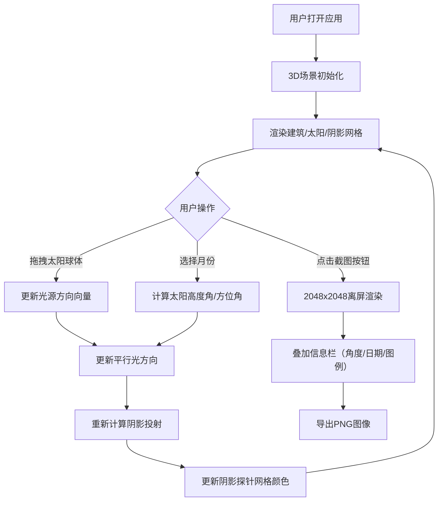

## 1. 产品概述

交互式日照模拟与阴影分析应用，面向建筑可视化领域，帮助用户快速比较同一建筑模型在不同季节光照和阴影下的外观效果。用户通过拖拽太阳球体或选择月份来模拟不同时刻/季节的日照，实时观察建筑阴影投射情况。

- 目标用户：建筑师、室内设计师、建筑可视化工程师
- 产品价值：替代传统手动调整光源或等待实时渲染的低效方式，提供直观、高效的日照分析工具

## 2. 核心功能

### 2.1 用户角色
| 角色 | 注册方式 | 核心权限 |
|------|----------|----------|
| 普通用户 | 无需注册 | 使用全部日照模拟与阴影分析功能 |

### 2.2 功能模块
1. **3D场景渲染**：建筑模型展示、光照系统、阴影投射
2. **太阳拖拽控制**：金色球体在天球上拖拽，实时改变光源方向
3. **阴影分析网格**：地面投射阴影探针网格，绿色到红色渐变显示阴影覆盖比例
4. **季节模拟面板**：月份选择器，自动调整太阳高度角和方位角
5. **截图导出**：2048x2048分辨率PNG截图，叠加太阳角度、日期和阴影分析信息

### 2.3 页面详情
| 页面名称 | 模块名称 | 功能描述 |
|----------|----------|----------|
| 主页面 | 3D渲染画布 | 展示建筑模型、太阳球体、阴影分析网格 |
| 主页面 | lil-gui参数面板 | 月份选择控件，动画切换太阳位置 |
| 主页面 | 截图按钮 | 导出2048x2048 PNG图像，含信息栏 |
| 主页面 | 颜色图例条 | 显示阴影比例对应颜色渐变 |
| 主页面 | 应用标题 | 左上角显示"日照模拟与分析" |

## 3. 核心流程

用户打开应用后，默认展示3D建筑场景与初始太阳位置。用户可通过两种方式调整光照：
1. 直接拖拽场景中的金色太阳球体，实时观察光照变化
2. 在左侧参数面板中选择月份，太阳自动过渡到对应季节位置

同时，地面阴影分析网格实时更新颜色，反映各区域阴影覆盖比例。点击左下角截图按钮可导出当前场景的高清图像，附带参数信息供后续对比。

## 4. 用户界面设计

### 4.1 设计风格
- **主色调**：深灰#1a1a2e到深蓝#16213e的径向渐变背景
- **建筑色**：浅灰白色#e0e0e0
- **地面色**：柔和绿色#2d5a27，带微弱棋盘格纹理
- **太阳色**：金色#ffd700，带柔和光晕
- **阴影网格**：#00ff00（0%阴影）到#ff0000（100%阴影）渐变，透明度0.3
- **UI风格**：深色半透明背景rgba(0,0,0,0.7)，圆角边框4px
- **字体**：白色中等粗细，应用标题置于左上角

### 4.2 页面设计概述
| 页面名称 | 模块名称 | UI元素 |
|----------|----------|--------|
| 主页面 | 3D画布 | 全屏渲染，建筑居中，地面棋盘格 |
| 主页面 | 太阳球体 | 金色发光球体，半径0.5，拖拽高亮 |
| 主页面 | 阴影分析网格 | 15x15半透明网格，右侧颜色图例条 |
| 主页面 | lil-gui面板 | 左侧，月份下拉选择器 |
| 主页面 | 截图按钮 | 左下角，图标+文字，悬停背景变浅 |
| 主页面 | 标题 | 左上角白色文字"日照模拟与分析" |

### 4.3 响应性
- 桌面端优先，全屏自适应3D画布
- 支持鼠标拖拽交互，轨道控制器旋转缩放场景

### 4.4 3D场景指导
- **环境**：深色径向渐变背景，营造专业分析氛围
- **光照**：单平行光模拟太阳，环境光提供基础照明
- **相机**：PerspectiveCamera，OrbitControls轨道控制，初始视角略微俯视
- **阴影**：PCFSoftShadowMap软阴影，建筑和地面接收/投射阴影
- **后处理**：无额外后处理，确保帧率稳定30fps以上
