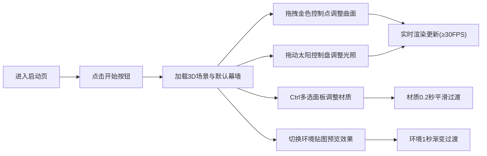

## 1. 产品概述

参数化曲面幕墙设计器是一款面向建筑设计师的浏览器端3D设计工具，解决传统CAD软件中手动调整复杂曲面网格效率低、难以实时预览光照反射效果的痛点。用户可通过拖拽控制点快速生成Catmull-Rom样条曲面，实时调整面板材质与光照环境，直观呈现幕墙最终效果。

## 2. 核心功能

### 2.1 功能模块
1. **主设计页面**: 3D场景画布、侧边控制面板、迷你小地图
2. **曲面编辑模块**: 6+可拖拽控制点、Catmull-Rom样条曲面实时生成
3. **材质编辑模块**: 四边形面板批量选择、材质参数（颜色/透明度/金属度/粗糙度）调节
4. **光照控制模块**: 太阳方位角/高度角调节、环境贴图（晴空/黄昏/阴天）切换
5. **响应式布局模块**: 窄屏汉堡菜单抽屉

### 2.2 页面详情
| 页面名称 | 模块名称 | 功能描述 |
|----------|----------|----------|
| 启动页 | Hero区域 | 全屏渐变背景、半透明标题、开始按钮 |
| 主设计页 | 3D场景 | 80%视口区域，展示幕墙网格与控制点 |
| 主设计页 | 侧边控制面板 | 控制点编辑区、材质参数区、光照控制区 |
| 主设计页 | 迷你小地图 | 150x150px俯视图，展示控制点位置与相机朝向 |

## 3. 核心流程

## 4. 用户界面设计

### 4.1 设计风格
- **主色调**: 深蓝灰 (#1a1a2e → #16213e 渐变) 与金色高亮 (#d4af37)
- **辅色**: 蓝色发光描边 (#4488ff) 用于控件选中反馈
- **面板背景**: 半透明深灰 rgba(30,30,50,0.85)
- **视觉风格**: 高端建筑设计工具，精致卡片式布局，强调3D空间感与材质质感

### 4.2 页面设计概述
| 页面名称 | 模块名称 | UI元素 |
|----------|----------|--------|
| 启动页 | Hero区域 | 全屏渐变、居中半透明玻璃态卡片、金色标题、发光按钮 |
| 主设计页 | 侧边面板 | 280px宽浮动面板、卡片式区域、细分割线、折叠/展开动画 |
| 主设计页 | 太阳控制盘 | 直径120px圆形控件、中心太阳图标、角度数值显示 |
| 主设计页 | 迷你地图 | 150x150px悬浮于右下角、交互时边框发光 |

### 4.3 响应式设计
- 桌面端: 主场景80% + 侧边面板280px
- 窄屏(<768px): 侧边面板隐藏为汉堡菜单，点击后抽屉式滑出，覆盖屏幕左侧

### 4.4 3D场景指导
- **环境与氛围**: 三种预设HDR环境（晴空/黄昏/阴天），支持1秒平滑渐变过渡
- **光照设置**: 方向光模拟太阳，可调节方位角(0-360°)和高度角(0-90°)，环境光配合
- **相机设置**: 透视相机(Fov 50°)，OrbitControls轨道控制，默认距离15单位
- **交互与动画**: 控制点拖拽实时更新曲面，材质参数平滑过渡0.2秒，环境切换渐变1秒
- **性能要求**: 拖拽/材质调整时保持40FPS以上，网格300-500个四边形面板
