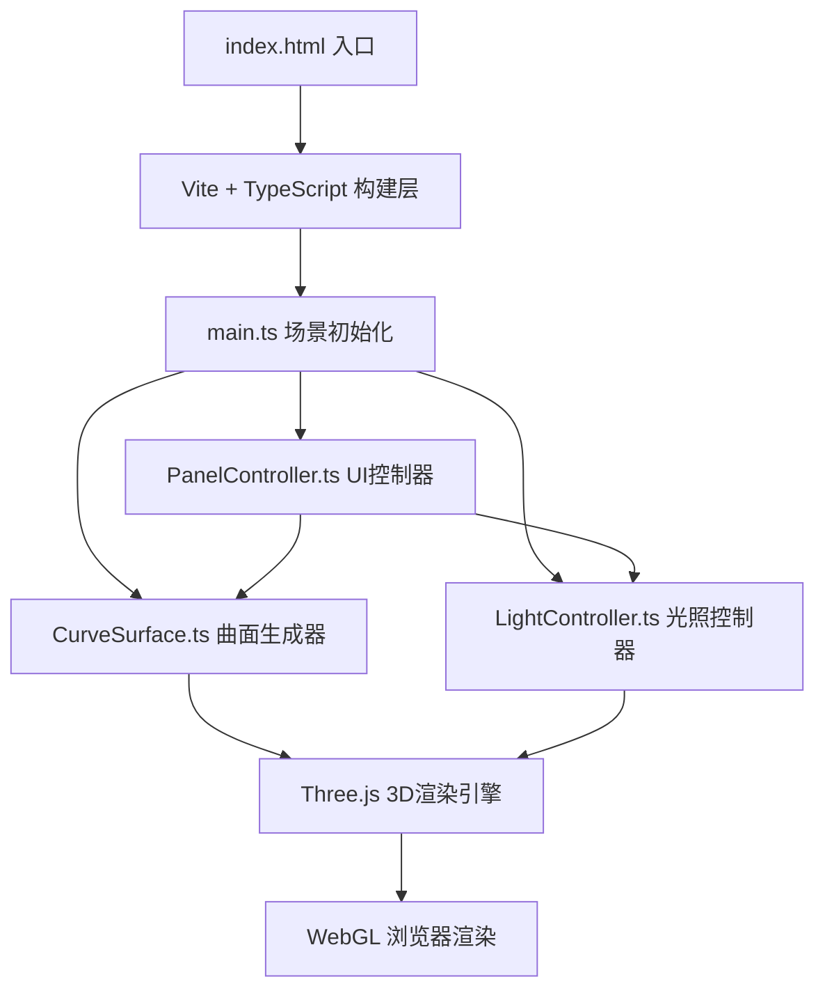

## 1. 架构设计



## 2. 技术描述
- **前端框架**: 原生TypeScript + Three.js (无UI框架，自定义DOM控件)
- **构建工具**: Vite 5.x (内置TypeScript支持)
- **3D引擎**: Three.js r160+
- **类型定义**: @types/three
- **调试工具**: lil-gui (仅开发调试用)
- **无后端**: 纯前端应用，数据本地处理

## 3. 文件组织
| 文件路径 | 职责 |
|----------|------|
| package.json | 依赖声明与脚本配置 |
| index.html | 入口页面，全屏背景与启动页 |
| tsconfig.json | TypeScript严格模式配置(ES2020) |
| vite.config.js | Vite构建配置 |
| src/main.ts | 场景初始化、相机/渲染器/控制器、动画循环 |
| src/CurveSurface.ts | Catmull-Rom样条曲面计算、网格生成 |
| src/LightController.ts | 日光源角度、环境贴图切换与渐变 |
| src/PanelController.ts | 侧边栏UI、控制点编辑、材质参数、光照控制盘 |

## 4. 模块接口定义

### 4.1 CurveSurface
```typescript
interface ControlPoint {
  x: number; y: number; z: number;
}

class CurveSurface {
  constructor(scene: THREE.Scene, controlPoints?: ControlPoint[]);
  updateControlPoints(points: ControlPoint[]): void;
  getPanels(): THREE.Mesh[];
  getControlPointMeshes(): THREE.Mesh[];
  dispose(): void;
}
```

### 4.2 LightController
```typescript
type EnvPreset = 'clearSky' | 'sunset' | 'cloudy';

class LightController {
  constructor(scene: THREE.Scene, renderer: THREE.WebGLRenderer);
  setSunAngle(azimuth: number, altitude: number): void;
  setEnvMap(preset: EnvPreset, animate?: boolean): void;
  getSunAngle(): { azimuth: number; altitude: number };
  getCurrentEnv(): EnvPreset;
}
```

### 4.3 PanelController
```typescript
interface MaterialParams {
  color: string;
  opacity: number;  // 0.3-0.9
  metalness: number; // 0.0-1.0
  roughness: number; // 0.0-1.0
}

class PanelController {
  constructor(
    container: HTMLElement,
    surface: CurveSurface,
    lightCtrl: LightController,
    camera: THREE.PerspectiveCamera,
    onSelectPanels?: (indices: number[]) => void
  );
  updateMaterialForSelected(params: Partial<MaterialParams>): void;
  togglePanel(section: string, expanded: boolean): void;
  dispose(): void;
}
```

## 5. 性能优化策略
- **几何复用**: 控制点拖拽时仅更新BufferGeometry的position属性，不重建Mesh
- **材质实例化**: 相同参数面板共享Material实例，减少GPU内存
- **帧率控制**: 使用requestAnimationFrame，仅在参数变化时触发几何更新
- **LOD策略**: 小地图使用简化渲染，降低额外开销
- **WebGL优化**: 开启antialias、使用Float32BufferAttribute减少内存复制
