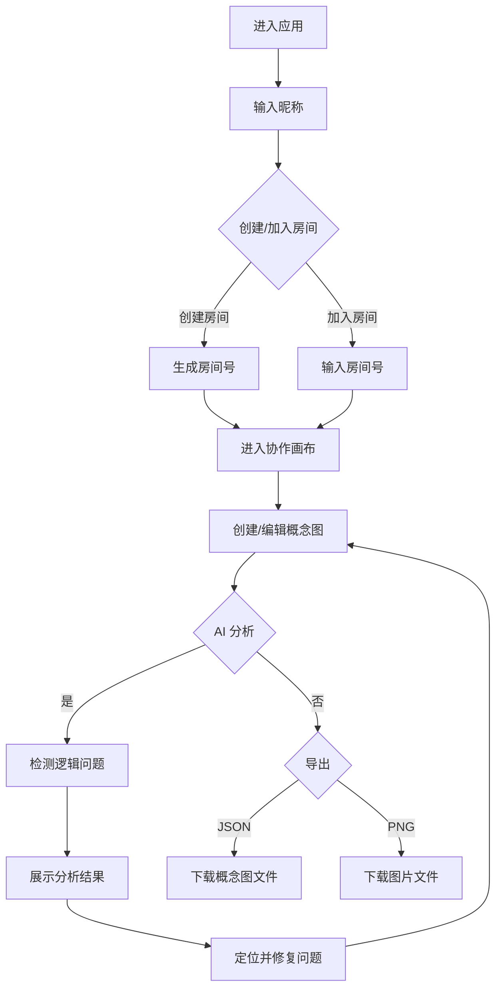
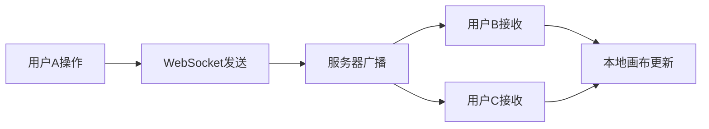

## 1. 产品概述

实时协作式概念图创建与分析应用，专为在线教育场景设计，支持教师与学生协同梳理知识结构、构建概念图谱。解决传统概念图工具缺乏多人实时协作能力、无法自动检测逻辑关系缺失或冲突的痛点。

- 核心价值：多人实时协同创作 + AI 智能逻辑分析，提升知识梳理的效率与质量
- 目标用户：在线教育平台的教师、学生及知识工作者

## 2. 核心功能

### 2.1 用户角色

| 角色 | 加入方式 | 核心权限 |
|------|----------|----------|
| 房间创建者 | 生成房间号 | 拥有完整编辑权限，可导出概念图 |
| 协作者 | 输入房间号加入 | 与创建者享有同等编辑权限，实时同步操作 |

### 2.2 功能模块

1. **协作画布**：无限可缩放二维画布，支持创建概念节点、连线，多人实时同步编辑
2. **节点样式工具**：预设6种莫兰迪色系填充色，支持圆形/矩形节点，自定义边框色和文字标签
3. **连线工具**：支持单向箭头、双向箭头、无箭头三种连线样式
4. **AI 逻辑分析**：检测孤立节点、循环引用、缺失定义三种逻辑问题
5. **导入导出**：支持 JSON 格式导入/导出，PNG 图片导出
6. **协作者感知**：实时显示协作者光标位置（彩色圆点+昵称标签）

### 2.3 页面详情

| 页面名称 | 模块名称 | 功能描述 |
|----------|----------|----------|
| 主画布页 | 顶部工具栏 | 房间号展示、AI 分析按钮、导入/导出按钮 |
| 主画布页 | 左侧边栏 | 节点类型选择、预设颜色选择、连线箭头样式选择 |
| 主画布页 | 无限画布 | 支持拖拽平移、滚轮缩放（0.5x-5x），网格背景 |
| 主画布页 | AI 分析浮层 | 展示分析结果列表，支持点击定位问题节点 |
| 主画布页 | 协作者光标 | 不同颜色圆点+昵称标签，实时显示位置 |

## 3. 核心流程

### 用户创建与加入房间流程
1. 用户访问应用，自动生成唯一昵称
2. 创建新房间获取房间号，或输入已有房间号加入
3. 进入协作画布，开始创建概念图
4. 分享房间号给协作者，多人实时同步编辑
5. 点击 AI 分析按钮，系统检测逻辑问题
6. 根据分析结果优化概念图
7. 导出为 JSON 或 PNG 格式

### 实时同步流程

## 4. 用户界面设计

### 4.1 设计风格
- **主色调**：莫兰迪低饱和度色系，主色 #45B7D1（柔和蓝），辅助色 #4ECDC4（薄荷绿）、#96CEB4（鼠尾草绿）
- **预设颜色**：#FF6B6B, #4ECDC4, #45B7D1, #96CEB4, #FFEAA7, #DDA0DD
- **背景色**：画布背景 #F0F0F0，网格线 #E0E0E0
- **按钮样式**：圆角矩形，0.15s 缩放弹跳动画反馈
- **字体**：使用现代无衬线字体，标题 16px，正文 14px
- **布局风格**：左侧边栏 + 主画布 + 顶部工具栏，桌面端三栏布局，平板端侧边栏折叠为顶部悬浮图标栏
- **交互反馈**：节点选中高亮，拖拽半透明预览，连线吸附效果

### 4.2 页面设计概述

| 页面名称 | 模块名称 | UI 元素 |
|----------|----------|----------|
| 主画布页 | 顶部工具栏 | 房间号展示框、AI 分析按钮（主色填充）、导入按钮、导出下拉菜单、缩放比例显示 |
| 主画布页 | 左侧边栏 | 节点形状切换（圆形/矩形）、6个预设颜色块、连线箭头样式选择、帮助提示 |
| 主画布页 | 无限画布 | 浅灰网格背景、概念节点（可拖拽）、带箭头连线、协作者光标 |
| 主画布页 | AI 分析浮层 | 右侧滑入面板、问题分类标签（孤立节点/循环/缺失）、问题列表、关闭按钮 |
| 主画布页 | 房间加入弹窗 | 模态框、昵称输入框、创建/加入切换、房间号输入框 |

### 4.3 响应式设计
- **桌面端（≥768px）**：左侧边栏固定展开，宽度 240px，主画布自适应剩余空间
- **平板端（<768px）**：侧边栏自动折叠为顶部悬浮图标栏，点击展开为抽屉式面板
- **触摸优化**：支持双指缩放画布，长按选中节点，拖拽移动

### 4.4 动画与交互细节
- **按钮交互**：点击时 scale(0.95) → scale(1.05) → scale(1)，总时长 0.15s
- **节点创建**：从鼠标位置缩放出现，opacity 0 → 1，duration 0.2s
- **AI 分析**：问题节点红色虚线边框闪烁动画，1.5s 周期
- **画布缩放**：平滑过渡，duration 0.15s
- **协作者光标**：位置移动使用 ease-out 缓动，duration 0.1s

## 5. 性能要求

- 实时同步延迟：≤ 200ms
- 画布帧率：50 节点 + 100 连线时，缩放拖动帧率 ≥ 45fps
- 缩放范围：0.5x - 5x
- 网格线：间距 20px，线宽 1px，颜色 #E0E0E0
