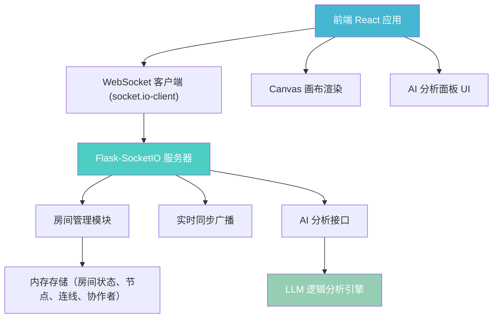
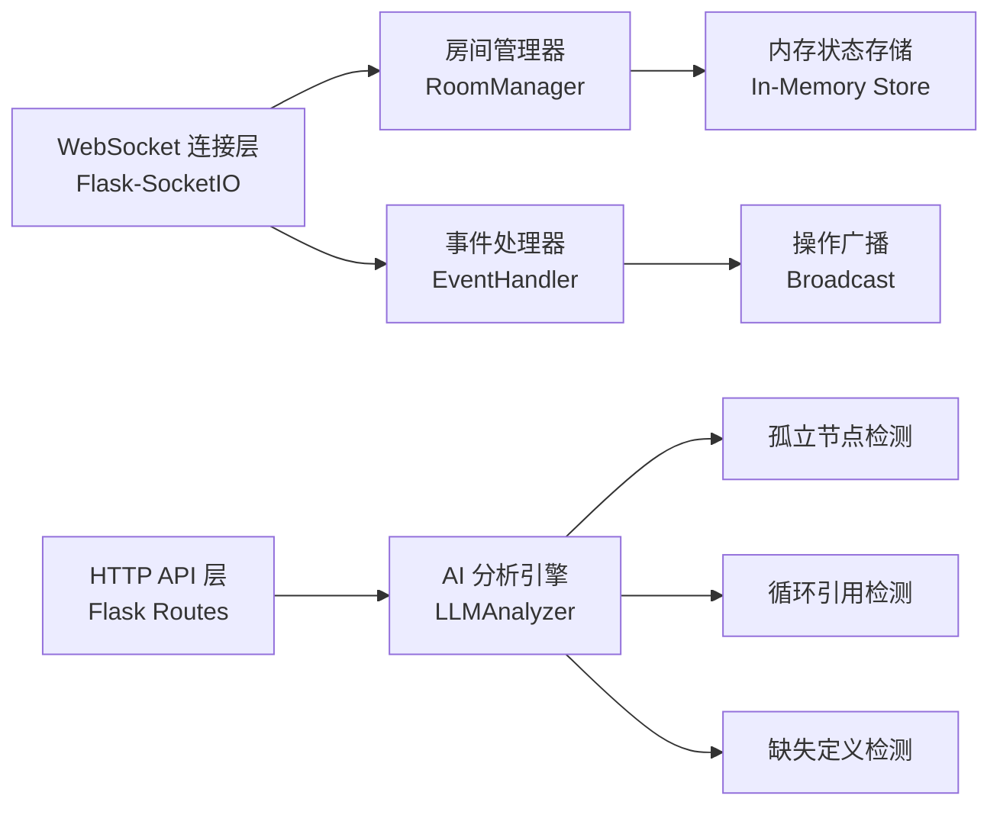

## 1. 架构设计



## 2. 技术栈说明

### 前端技术栈
- **框架**：React@18 + TypeScript@5
- **构建工具**：Vite@5
- **实时通信**：socket.io-client@4
- **文件处理**：file-saver@2
- **压缩工具**：jszip@3
- **类型定义**：@types/react@18, @types/react-dom@18

### 后端技术栈
- **Web 框架**：Flask@3
- **WebSocket**：Flask-SocketIO@5
- **AI 分析**：自定义 Python 逻辑分析引擎
- **CORS 处理**：flask-cors@4
- **异步支持**：eventlet 或 gevent

## 3. 文件结构

```
project/
├── package.json
├── index.html
├── tsconfig.json
├── vite.config.js
└── src/
    ├── frontend/
    │   ├── main.tsx          # React 入口，初始化 WebSocket
    │   ├── App.tsx           # 根组件，布局与状态管理
    │   ├── CanvasBoard.tsx   # 核心画布组件
    │   ├── AIPanel.tsx       # AI 分析结果浮层
    │   ├── Sidebar.tsx       # 左侧工具栏
    │   ├── Toolbar.tsx       # 顶部工具栏
    │   └── types.ts          # 类型定义
    └── backend/
        ├── app.py            # Flask 服务器
        ├── llm_analyzer.py   # AI 逻辑分析引擎
        └── requirements.txt  # Python 依赖
```

## 4. 数据模型定义

### 4.1 TypeScript 类型定义

```typescript
// 节点类型
interface ConceptNode {
  id: string;
  x: number;
  y: number;
  width: number;
  height: number;
  shape: 'circle' | 'rectangle';
  fillColor: string;
  borderColor: string;
  label: string;
  createdAt: number;
  createdBy: string;
}

// 连线类型
interface Connection {
  id: string;
  fromNodeId: string;
  toNodeId: string;
  arrowType: 'none' | 'one-way' | 'two-way';
  createdAt: number;
  createdBy: string;
}

// 协作者类型
interface Collaborator {
  id: string;
  name: string;
  color: string;
  cursorX: number;
  cursorY: number;
  lastActive: number;
}

// 房间状态
interface RoomState {
  roomId: string;
  nodes: ConceptNode[];
  connections: Connection[];
  collaborators: Collaborator[];
}

// AI 分析结果
interface AnalysisResult {
  type: 'isolated' | 'cycle' | 'missing';
  severity: 'warning' | 'error';
  message: string;
  nodeIds: string[];
}

// WebSocket 事件类型
type SocketEvent = 
  | { type: 'join_room'; roomId: string; user: Omit<Collaborator, 'cursorX' | 'cursorY' | 'lastActive'> }
  | { type: 'leave_room'; roomId: string; userId: string }
  | { type: 'node_add'; roomId: string; node: ConceptNode }
  | { type: 'node_update'; roomId: string; node: ConceptNode }
  | { type: 'node_delete'; roomId: string; nodeId: string }
  | { type: 'connection_add'; roomId: string; connection: Connection }
  | { type: 'connection_delete'; roomId: string; connectionId: string }
  | { type: 'cursor_move'; roomId: string; userId: string; x: number; y: number }
  | { type: 'room_state'; state: RoomState };
```

### 4.2 核心数据结构

| 实体 | 字段 | 类型 | 说明 |
|------|------|------|------|
| ConceptNode | id | string | 唯一标识，UUID |
| | x, y | number | 画布坐标 |
| | width, height | number | 节点尺寸 |
| | shape | 'circle' \| 'rectangle' | 节点形状 |
| | fillColor | string | 填充色（HEX） |
| | borderColor | string | 边框色（HEX） |
| | label | string | 文字标签 |
| Connection | id | string | 唯一标识 |
| | fromNodeId | string | 起始节点ID |
| | toNodeId | string | 目标节点ID |
| | arrowType | 'none' \| 'one-way' \| 'two-way' | 箭头类型 |

## 5. API 接口定义

### 5.1 HTTP API

| 方法 | 路径 | 说明 | 请求体 | 响应 |
|------|------|------|--------|------|
| POST | `/api/analyze` | AI 分析概念图 | `{ nodes: ConceptNode[], connections: Connection[] }` | `{ results: AnalysisResult[] }` |
| GET | `/api/room/:roomId/state` | 获取房间状态 | - | `RoomState` |
| POST | `/api/room` | 创建新房间 | `{ userId: string; userName: string }` | `{ roomId: string }` |

### 5.2 WebSocket 事件

| 事件名 | 方向 | 数据 | 说明 |
|--------|------|------|------|
| `join_room` | Client → Server | `{ roomId, user }` | 加入房间 |
| `room_state` | Server → Client | `RoomState` | 房间状态同步 |
| `node_add` | Client ↔ Server | `{ node, roomId }` | 添加节点 |
| `node_update` | Client ↔ Server | `{ node, roomId }` | 更新节点 |
| `node_delete` | Client ↔ Server | `{ nodeId, roomId }` | 删除节点 |
| `connection_add` | Client ↔ Server | `{ connection, roomId }` | 添加连线 |
| `connection_delete` | Client ↔ Server | `{ connectionId, roomId }` | 删除连线 |
| `cursor_move` | Client ↔ Server | `{ userId, x, y, roomId }` | 光标移动 |
| `user_joined` | Server → Client | `{ user }` | 新用户加入通知 |
| `user_left` | Server → Client | `{ userId }` | 用户离开通知 |

## 6. 服务器架构



### 核心模块说明

1. **RoomManager（房间管理器）**
   - 维护活跃房间列表
   - 管理房间成员加入/离开
   - 房间状态持久化（内存）

2. **EventHandler（事件处理器）**
   - 验证操作权限
   - 应用操作到房间状态
   - 广播操作到所有协作者

3. **LLMAnalyzer（AI 分析引擎）**
   - 孤立节点检测：遍历节点，检查是否有入边或出边
   - 循环引用检测：DFS 检测有向图中的环
   - 缺失定义检测：统计根概念（只有出边无入边）数量

## 7. 性能优化策略

### 前端性能优化
1. **Canvas 渲染优化**
   - 使用 requestAnimationFrame 批量重绘
   - 离屏 Canvas 预渲染网格背景
   - 视口裁剪：只渲染可见区域内的节点和连线

2. **状态更新优化**
   - 使用 React.memo 避免不必要重渲染
   - 节点和连线使用 memoized 组件
   - 防抖处理高频光标移动事件（节流 16ms）

3. **WebSocket 优化**
   - 批量同步操作（每 50ms 合并多次操作为一次发送）
   - 差分更新：只发送变更字段而非完整对象

### 后端性能优化
1. **内存存储**：使用字典而非数组存储节点，O(1) 查找
2. **广播优化**：按房间分组发送，避免全局广播
3. **心跳检测**：自动清理超时不活跃的协作者

## 8. AI 分析算法

### 8.1 孤立节点检测
```python
def detect_isolated_nodes(nodes, connections):
    connected_nodes = set()
    for conn in connections:
        connected_nodes.add(conn['fromNodeId'])
        connected_nodes.add(conn['toNodeId'])
    isolated = [n for n in nodes if n['id'] not in connected_nodes]
    return isolated
```

### 8.2 循环引用检测（DFS 环检测）
```python
def detect_cycles(nodes, connections):
    adj = defaultdict(list)
    for conn in connections:
        if conn['arrowType'] in ['one-way', 'two-way']:
            adj[conn['fromNodeId']].append(conn['toNodeId'])
        if conn['arrowType'] == 'two-way':
            adj[conn['toNodeId']].append(conn['fromNodeId'])
    # DFS 检测有向环
    # 返回所有环的节点列表
```

### 8.3 缺失定义检测
```python
def detect_missing_definitions(nodes, connections):
    in_degree = defaultdict(int)
    out_degree = defaultdict(int)
    for conn in connections:
        out_degree[conn['fromNodeId']] += 1
        in_degree[conn['toNodeId']] += 1
    root_concepts = [n for n in nodes 
                    if out_degree[n['id']] > 0 and in_degree[n['id']] == 0]
    if len(root_concepts) == len(nodes) and len(nodes) > 1:
        return True  # 所有节点都是根概念，缺少关联
    return root_concepts
```

## 9. 依赖清单

### package.json 依赖
```json
{
  "dependencies": {
    "react": "^18.2.0",
    "react-dom": "^18.2.0",
    "socket.io-client": "^4.7.4",
    "jszip": "^3.10.1",
    "file-saver": "^2.0.5"
  },
  "devDependencies": {
    "typescript": "^5.3.3",
    "vite": "^5.0.12",
    "@types/react": "^18.2.48",
    "@types/react-dom": "^18.2.18",
    "@types/file-saver": "^2.0.7"
  }
}
```

### requirements.txt 依赖
```
Flask==3.0.0
Flask-SocketIO==5.3.6
flask-cors==4.0.0
python-socketio==5.11.0
eventlet==0.35.2
```
