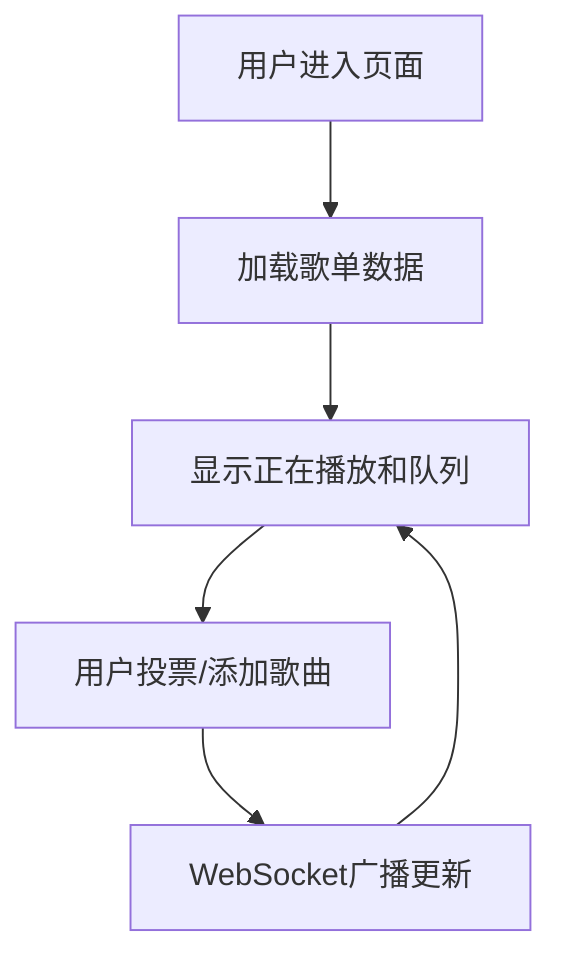

## 1. 产品概述

协作型音乐歌单共享面板，支持多人实时投票决定下一首播放歌曲，查看歌单播放历史和热度排名。

- 目标用户：朋友、同事等小群体，用于聚会、办公环境等场景的共同音乐播放
- 核心价值：让音乐选择民主化，增强社交互动体验

## 2. 核心功能

### 2.1 用户角色
| 角色 | 注册方式 | 核心权限 |
|------|----------|----------|
| 普通用户 | 无需注册，进入即可参与 | 浏览歌单、投票、添加歌曲、查看实时状态 |

### 2.2 功能模块
1. **主界面**：正在播放面板、待播队列、导航栏、歌曲添加栏
2. **实时播放状态**：当前歌曲信息、播放进度、封面旋转动画
3. **投票系统**：歌曲卡片展示、+1投票、票数动画反馈
4. **歌曲添加**：链接解析、实时校验、添加动画反馈
5. **实时通信**：WebSocket推送投票更新、在线人数

### 2.3 页面详情
| 页面名称 | 模块名称 | 功能描述 |
|----------|----------|----------|
| 主界面 | 导航栏 | 标题、刷新按钮、在线人数、歌曲总数 |
| 主界面 | 正在播放面板 | 封面图、歌名、艺人、进度条、时间显示 |
| 主界面 | 待播队列 | 歌曲卡片列表、缩略图、歌名、艺人、投票按钮、票数气泡 |
| 主界面 | 添加歌曲栏 | 链接输入框、校验、添加按钮、成功提示 |

## 3. 核心流程

用户进入页面 → 查看当前播放歌曲和待播队列 → 为喜欢的歌曲投票 → 投票数据实时同步给所有在线用户 → 添加新歌曲到队列 → 歌曲按票数排序播放

## 4. 用户界面设计

### 4.1 设计风格
- 主色背景：#121212（深邃黑暗风）
- 卡片底色：#1e1e1e
- 强调色：#1db954（Spotify风格绿色）
- 次要文字：#b3b3b3
- 按钮样式：圆角、绿色强调、悬停上浮
- 字体：Google Fonts - Inter 或类似现代无衬线字体
- 布局：两栏布局（2:1），顶部固定导航，底部浮动输入
- 图标风格：简洁线性图标

### 4.2 页面设计概览
| 页面名称 | 模块名称 | UI元素 |
|----------|----------|--------|
| 主界面 | 导航栏 | 深色半透明(#121212cc)、背景模糊8px、刷新按钮旋转动画、徽标数字 |
| 主界面 | 正在播放面板 | 封面大图(30秒一圈旋转动画)、歌名大号字体、艺人、渐变绿色进度条、悬停时间标签 |
| 主界面 | 待播队列 | 卡片圆角8px、缩略小图、歌名、艺人、用户头像、票数气泡(弹性动画)、+1按钮(涟漪特效) |
| 主界面 | 添加歌曲栏 | 毛玻璃半透明背景、背景模糊10px、输入框(红色边框校验+抖动)、绿色对勾成功动画 |

### 4.3 响应式
- 桌面端优先，两栏布局
- 移动端自适应为单栏垂直布局
- 触摸优化：点击区域足够大

### 4.4 动画效果
- 封面旋转：30秒一圈，持续缓慢
- 票数气泡：放大缩小弹性动画，0.3秒
- 按钮涟漪：点击扩散特效
- 卡片悬停：translateY(-2px)，0.2秒过渡，淡色投影
- 刷新按钮：点击旋转360度，0.6秒
- 添加成功：绿色对勾1秒后消失
- 链接校验失败：边框红色+抖动0.5秒
