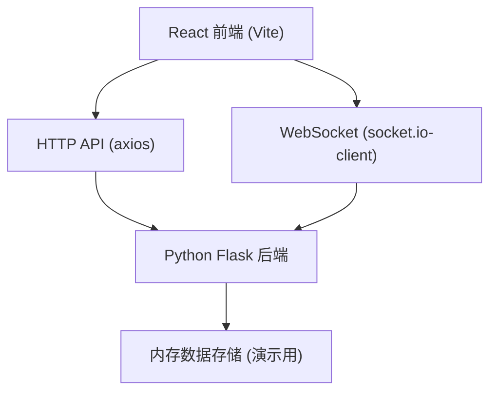
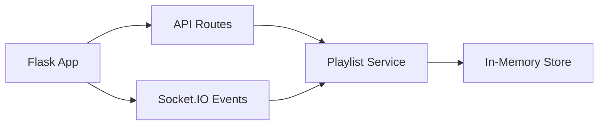
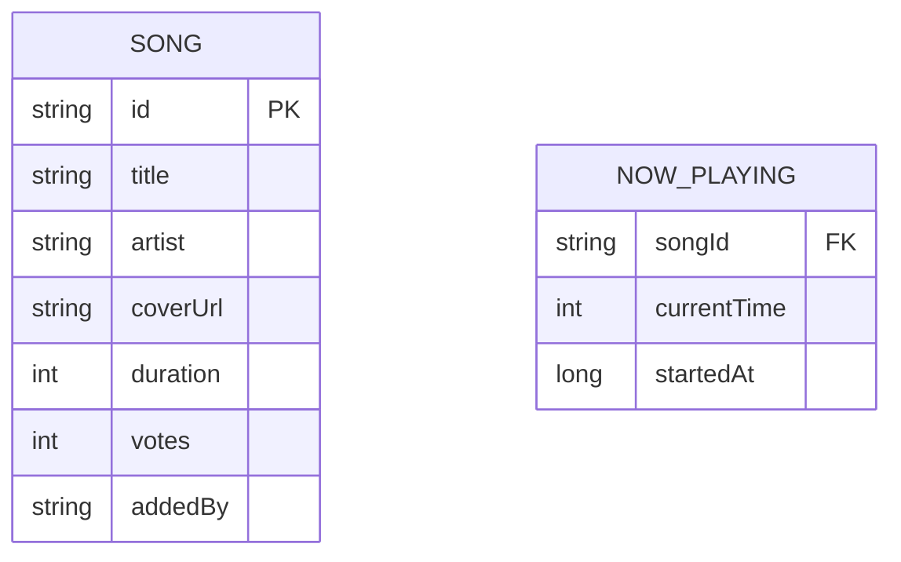

## 1. 架构设计



## 2. 技术说明

- 前端：React 18 + TypeScript + Vite
- 初始化工具：Vite
- 后端：Python Flask + Flask-SocketIO
- 数据库：内存数据结构（演示项目，无需持久化）
- 实时通信：Socket.IO（WebSocket）
- HTTP请求：axios
- 路由：react-router-dom

## 3. 路由定义

| 路由 | 用途 |
|------|------|
| / | 主页面，展示完整音乐共享面板 |

## 4. API 定义

### 4.1 TypeScript 类型定义
```typescript
interface Song {
  id: string;
  title: string;
  artist: string;
  coverUrl: string;
  duration: number; // 秒
  votes: number;
  addedBy: string;
}

interface NowPlaying {
  song: Song;
  currentTime: number; // 已播放秒数
  startedAt: number; // 开始播放时间戳
}

interface PlaylistState {
  nowPlaying: NowPlaying;
  queue: Song[];
  onlineUsers: number;
  totalSongs: number;
}
```

### 4.2 REST API 端点
| 方法 | 路径 | 描述 |
|------|------|------|
| GET | /api/playlist | 获取当前歌单状态 |
| POST | /api/songs | 添加新歌曲（body: { url: string }） |
| POST | /api/songs/:id/vote | 为歌曲投票 |

### 4.3 WebSocket 事件
| 事件名 | 方向 | 数据 | 描述 |
|--------|------|------|------|
| playlist:update | Server → Client | PlaylistState | 歌单状态实时更新 |
| song:vote | Client → Server | { songId: string } | 发送投票 |
| song:added | Server → Client | Song | 新歌曲添加通知 |
| user:join | Server → Client | { onlineUsers: number } | 用户加入通知 |

## 5. 服务器架构



## 6. 数据模型

### 6.1 数据模型定义


### 6.2 内存数据结构
```python
# 演示项目使用内存存储
playlist_state = {
    "now_playing": {
        "song": {...},
        "current_time": 0,
        "started_at": 0
    },
    "queue": [...],
    "online_users": 0
}
```

## 7. 项目文件结构

```
auto58/
├── package.json
├── index.html
├── vite.config.js
├── tsconfig.json
├── src/
│   ├── App.tsx
│   ├── components/
│   │   ├── NowPlaying.tsx
│   │   ├── QueueList.tsx
│   │   └── AddSongBar.tsx
│   └── utils/
│       ├── socket.ts
│       └── api.ts
└── server/
    └── app.py
```
