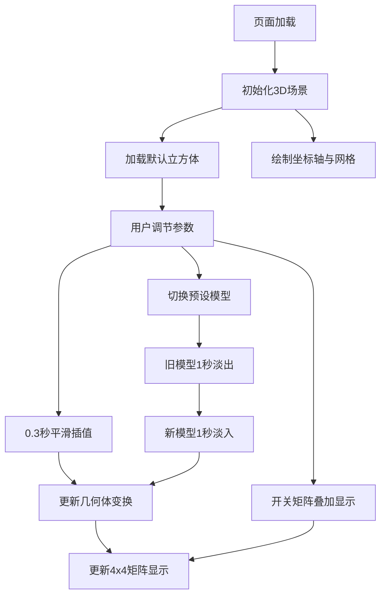

## 1. 产品概述

三维空间几何变换交互式教学工具，帮助学生在3D场景中实时操控平移、旋转、缩放、错切参数，直观理解抽象的线性变换对物体外观的影响。解决传统数学教学中仅靠公式和静态图难以建立空间想象力的痛点。

- 目标用户：高校线性代数/计算机图形学学生及教师
- 核心价值：将抽象矩阵参数与实时3D可视化建立直觉联系，参数变化0.3秒内平滑插值，帧率≥40FPS

## 2. 核心功能

### 2.1 功能模块

1. **主3D场景页**：3D几何体展示、坐标轴、参考网格、变换控制、矩阵显示

### 2.2 页面详情

| 页面名称 | 模块名称 | 功能描述 |
|----------|----------|----------|
| 主3D场景页 | 3D视口 | 加载彩色几何体（立方体/二十面体/环面结/多面体组合），表面白色半透明线框，深蓝紫太空渐变背景 |
| 主3D场景页 | 参考网格 | 半透明辅助网格（范围-10到10，白色不透明度0.15） |
| 主3D场景页 | 坐标轴 | 三根带箭头坐标轴（X红/Y绿/Z蓝，长度6单位） |
| 主3D场景页 | 控制面板 | 左侧毛玻璃面板，含4组滑块+输入框（平移X/-5~5，旋转Y/0~360°，缩放/0.5~2.0，错切X/-1~1） |
| 主3D场景页 | 矩阵显示 | 右上角4x4组合变换矩阵（3位小数，数值变化时0.2秒高亮闪烁） |
| 主3D场景页 | 模型切换 | 预设模型切换（环面结、多面体组合），旧模型1秒淡出缩小消失，新模型1秒淡入放大出现 |
| 主3D场景页 | 叠加矩阵开关 | 开关控制右上角4x4矩阵的显示与隐藏 |

## 3. 核心流程

用户打开页面 → 3D场景初始化（默认彩色立方体+坐标轴+网格）→ 左侧面板调节参数 → 参数变化触发0.3秒平滑线性插值 → 几何体实时变换 → 右上角矩阵数值实时更新 → 可切换预设模型（淡入淡出动画）→ 可开启矩阵叠加显示

## 4. 用户界面设计

### 4.1 设计风格

- 主色调：深蓝紫太空渐变（#0a0a2e → #1a1a4e），科幻暗色调
- 强调色：白色半透明线框、渐变色滑块轨道（#3a3a6e → #5a5a9e）
- 字体：无衬线字体（Inter），标题18px，数值14px，列表项间距8px
- 布局：主3D场景占中央80%，左侧控制面板280px
- 交互：悬停0.2秒放大1.05倍，点击0.1秒缩小0.95倍回弹

### 4.2 页面设计详情

| 页面名称 | 模块名称 | UI元素 |
|----------|----------|--------|
| 主3D场景页 | 3D视口 | 深蓝紫渐变背景，中央80%面积，支持鼠标拖拽旋转+滚轮缩放(1-20) |
| 主3D场景页 | 控制面板 | 毛玻璃效果(rgba(255,255,255,0.1),blur6px)，宽度280px，内边距20px，每组参数含标签+渐变滑块+深色输入框(圆角4px) |
| 主3D场景页 | 滑块 | 轨道渐变#3a3a6e→#5a5a9e，白色圆点按钮16px，悬停外发光2px |
| 主3D场景页 | 矩阵显示 | 右上角4x4网格，单元格深色背景，数值白色3位小数，变化时0.2秒高亮闪烁 |

### 4.3 响应式适配

- < 768px：控制面板折叠为底部抽屉式，点击图标展开
- 768px ~ 1024px：控制面板浮动于场景左上角，宽度240px
- \> 1024px：控制面板固定左侧，宽度280px

### 4.4 3D场景指引

- 环境：深蓝紫太空渐变背景，无HDRI
- 灯光：环境光 + 定向光，确保几何体颜色鲜明
- 相机：透视相机，鼠标控制旋转/缩放（OrbitControls），缩放范围1-20
- 构图：几何体居中，坐标轴和网格作为空间参照
- 交互：参数滑块实时驱动变换，0.3秒平滑插值
- 性能：预编译几何体数据，初始化<2秒，更新延迟<50ms，帧率≥40FPS
