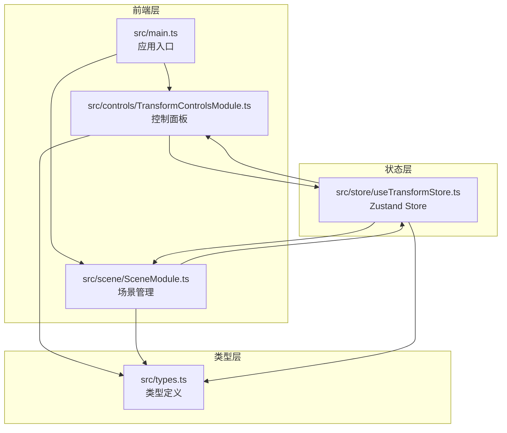
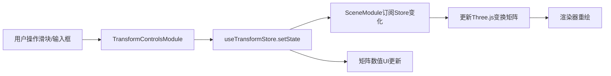

## 1. 架构设计



## 2. 技术说明

- 前端框架：TypeScript + Three.js（原生，非React封装）
- 构建工具：Vite
- 状态管理：Zustand
- 调试工具：Tweakpane（开发辅助）
- 初始化工具：Vite + 手动配置（非React模板，因为使用原生Three.js）
- 后端：无
- 数据库：无

### 依赖清单

| 依赖 | 版本 | 用途 |
|------|------|------|
| typescript | ^5.x | 类型安全 |
| vite | ^5.x | 构建与开发服务器 |
| three | ^0.170.x | 3D渲染引擎 |
| @types/three | ^0.170.x | Three.js类型定义 |
| zustand | ^5.x | 状态管理 |
| tweakpane | ^4.x | 开发调试面板（可选） |

## 3. 路由定义

单页应用，无路由。所有功能在一个3D场景页中完成。

## 4. 文件结构与模块职责

| 文件路径 | 职责 |
|----------|------|
| `package.json` | 依赖声明与启动脚本（npm run dev） |
| `index.html` | 入口HTML页面 |
| `tsconfig.json` | TypeScript严格模式配置 |
| `vite.config.js` | Vite构建配置 |
| `src/main.ts` | 应用入口：创建场景、相机、渲染器，连接控制模块和场景模块，激活Zustand store |
| `src/scene/SceneModule.ts` | 场景管理：初始化场景、加载几何体、应用变换矩阵、更新网格和辅助对象 |
| `src/controls/TransformControlsModule.ts` | 控制面板：管理滑块/输入框状态、计算组合变换矩阵、通过Store发布更新 |
| `src/store/useTransformStore.ts` | Zustand store：持有变换参数和组合矩阵，提供更新方法和订阅机制 |
| `src/types.ts` | 类型定义：变换参数接口、模型预设枚举 |

## 5. 数据流



### 状态定义

```typescript
interface TransformParams {
  translateX: number;   // -5 ~ 5
  rotateY: number;      // 0 ~ 360
  scale: number;        // 0.5 ~ 2.0
  shearX: number;       // -1 ~ 1
}

interface TransformState {
  params: TransformParams;
  combinedMatrix: number[][];  // 4x4
  activeModel: ModelPreset;
  showMatrix: boolean;
  setParams: (partial: Partial<TransformParams>) => void;
  setActiveModel: (model: ModelPreset) => void;
  toggleMatrix: () => void;
}
```

## 6. 性能策略

- 预编译几何体数据（BoxGeometry, IcosahedronGeometry, TorusKnotGeometry等），避免运行时计算
- 参数变化时使用requestAnimationFrame驱动的0.3秒线性插值，而非每帧重算
- 变换矩阵通过Three.js的Matrix4.compose + shear扩展计算，单次赋值
- 矩阵数值变化时仅更新变化的DOM单元格，避免全量重绘
- 目标：初始化<2秒，更新延迟<50ms，帧率≥40FPS
