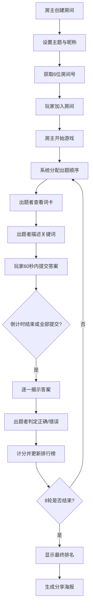

## 1. 产品概述

猜词同乐桌游助手——一款为桌游吧及朋友聚会打造的猜词桌游全流程数字化应用，解决传统实体桌游记分麻烦、词卡复用率低、无法回溯精彩瞬间的问题。
- 目标用户：桌游吧经营者、朋友聚会玩家，3-10人同乐
- 核心价值：零纸质计分、丰富词库持续更新、全流程数字回放、一键生成分享海报

## 2. 核心功能

### 2.1 用户角色

| 角色 | 进入方式 | 核心权限 |
|------|----------|----------|
| 房主 | 创建房间 | 设置主题、开始游戏、提前结束倒计时、揭示答案 |
| 玩家 | 输入6位房间号加入 | 输入昵称、提交猜测、查看得分与日志 |

### 2.2 功能模块

1. **主页**：创建房间 / 加入房间入口、等待动画
2. **游戏房间（等待中）**：显示已加入玩家列表与头像、主题设置、房主操作区
3. **游戏进行中**：出题者描述区、60秒倒计时、玩家答案提交区、揭示答案、记分面板、回合日志
4. **游戏结束**：最终排名（前三名奖牌）、精彩瞬间、海报生成与下载、历史回看入口

### 2.3 页面详情

| 页面名称 | 模块名称 | 功能描述 |
|----------|----------|----------|
| 主页 | 创建房间卡片 | 输入昵称、选择主题（6预设+自定义）、创建房间获取6位房间号 |
| 主页 | 加入房间卡片 | 输入昵称和6位房间号加入房间 |
| 游戏房间 | 玩家列表 | 展示已加入玩家的彩色头像和昵称，三个彩色小球弹跳等待动画 |
| 游戏房间 | 开始游戏按钮 | 房主专属按钮，一键开始游戏 |
| 游戏进行中 | 出题者描述区 | 显示词卡（关键词+3禁说词），仅出题者可见 |
| 游戏进行中 | 倒计时 | 60秒倒计时，客户端本地精确计时，出题者可提前结束 |
| 游戏进行中 | 答案提交区 | 猜测者输入答案，提交后不可修改 |
| 游戏进行中 | 揭示答案 | 逐一展示答案，出题者点击正确/错误 |
| 游戏进行中 | 记分面板（右侧） | 实时排行榜，得分变化时弹出放大+金色闪烁特效 |
| 游戏进行中 | 回合日志（底部） | 每轮结果滚动显示，0.4秒滑入动画 |
| 游戏结束 | 最终排名 | 前三名头像放大+金/银/铜奖牌图标 |
| 游戏结束 | 精彩瞬间 | 自动选出本局最搞笑答案展示 |
| 游戏结束 | 分享海报 | Canvas生成PNG海报，包含房间名、前三名、最搞笑答案，可下载 |

## 3. 核心流程

1. 房主创建房间 → 设置主题和昵称 → 获取6位房间号
2. 其他玩家输入房间号+昵称加入 → 随机分配彩色头像
3. 房主点击开始 → 系统随机分配出题者顺序 → 第1轮开始
4. 出题者看到词卡（关键词+3禁说词）→ 描述关键词
5. 其他玩家60秒内提交答案
6. 出题者逐一揭示答案（正确/错误）→ 计分
7. 8轮结束 → 显示最终排名 → 生成海报

## 4. 界面设计

### 4.1 设计风格

- 主背景色：浅奶白 #FFF8E7，辅以柔和渐变过渡
- 主色调：明亮卡通风，高饱和度彩色头像和按钮
- 按钮样式：圆角12px，悬停0.2秒上浮阴影效果
- 字体：Poppins（英文/数字），系统默认中文字体
- 布局：左侧游戏主区域 + 右侧300px固定记分面板 + 底部回合日志
- 记分面板：深色毛玻璃效果 rgba(0,0,0,0.05)
- 回合切换：背景色0.8秒平滑过渡
- 主题包调色板：每个主题对应一组配色，回合切换时平滑过渡

### 4.2 页面设计概览

| 页面名称 | 模块名称 | UI元素 |
|----------|----------|--------|
| 主页 | 创建/加入房间 | 卡片式表单，柔和圆角，Poppins字体，彩色按钮 |
| 游戏房间 | 等待区 | 三个彩色小球循环弹跳动画，玩家头像网格 |
| 游戏进行中 | 出题者区 | 词卡（大号关键词+禁说词标签），60秒圆形倒计时 |
| 游戏进行中 | 答案提交区 | 输入框+提交按钮，已提交显示勾选状态 |
| 游戏进行中 | 揭示答案 | 答案卡片依次展开，正确绿色✓/错误红色✗ |
| 游戏进行中 | 记分面板 | 排行榜头像+分数，得分变化0.3秒弹出放大+金色闪烁 |
| 游戏进行中 | 回合日志 | 底部滚动条，0.4秒滑入动画 |
| 游戏结束 | 最终排名 | 前三名放大头像+奖牌，其他人缩小排列 |
| 游戏结束 | 海报 | Canvas绘制海报预览，下载按钮 |

### 4.3 响应式适配

- 桌面优先设计，最低支持1280px宽度
- 1280px以下：记分面板折叠为浮动面板
- 核心游戏区域始终可见

### 4.4 动画规范

- 回合背景过渡：0.8秒 ease-in-out
- 得分变化特效：0.3秒弹出放大 + 金色#FFD700闪烁
- 日志滑入：0.4秒 ease-out
- 按钮悬停：0.2秒上浮阴影
- 等待动画：三个彩色小球无限循环弹跳
