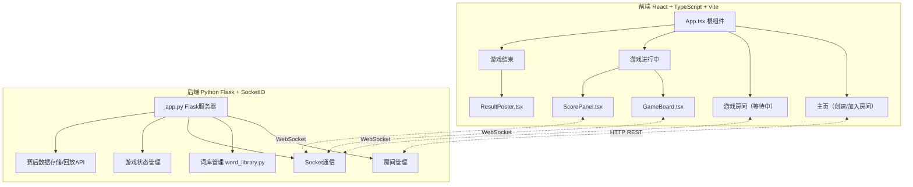
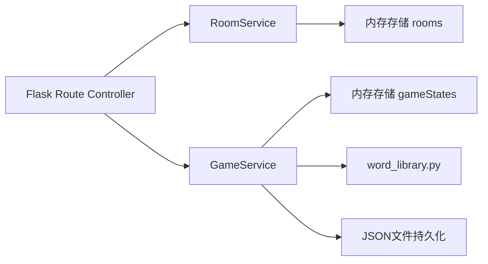
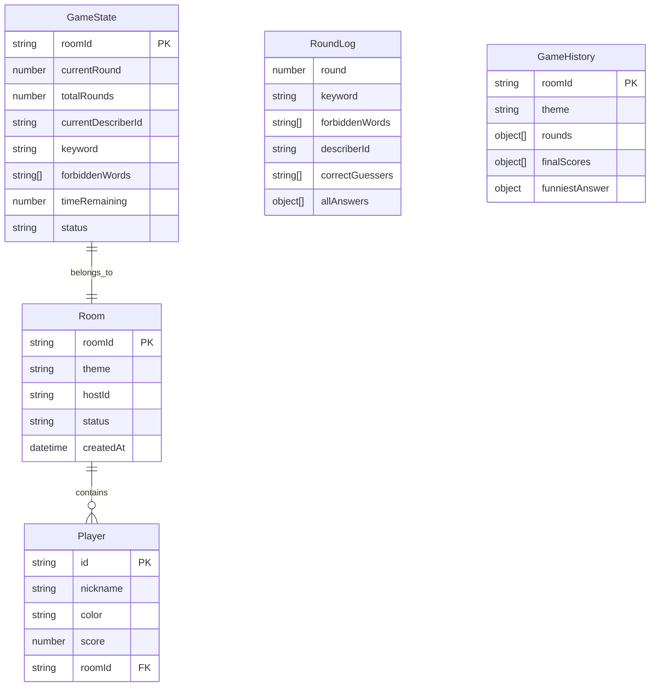

## 1. 架构设计



## 2. 技术说明

- 前端：React 18 + TypeScript + Vite + socket.io-client + html-to-image
- 后端：Python Flask + flask-socketio + flask-cors
- 通信：WebSocket (Socket.IO) 实时同步，HTTP REST 用于房间创建/加入
- 数据存储：内存存储（游戏状态）+ JSON文件（赛后数据持久化）
- 初始化工具：Vite

## 3. 路由定义

| 路由 | 用途 |
|------|------|
| / | 主页：创建房间 / 加入房间 |
| /room/:roomId | 游戏房间等待页面 |
| /game/:roomId | 游戏进行中页面 |
| /result/:roomId | 游戏结束页面 |

## 4. API 定义

### 4.1 HTTP REST API

```typescript
interface CreateRoomRequest {
  nickname: string;
  theme: string;
  customThemeWords?: string[];
}

interface CreateRoomResponse {
  roomId: string;
  player: PlayerInfo;
}

interface JoinRoomRequest {
  roomId: string;
  nickname: string;
}

interface JoinRoomResponse {
  roomId: string;
  player: PlayerInfo;
  players: PlayerInfo[];
  theme: string;
}

interface PlayerInfo {
  id: string;
  nickname: string;
  color: string;
  score: number;
}

interface GameHistoryResponse {
  roomId: string;
  theme: string;
  rounds: RoundLog[];
  finalScores: PlayerInfo[];
  funniestAnswer: FunniestAnswer;
}

interface RoundLog {
  round: number;
  keyword: string;
  forbiddenWords: string[];
  describer: PlayerInfo;
  correctGuessers: string[];
  allAnswers: { playerId: string; answer: string; correct: boolean }[];
}

interface FunniestAnswer {
  playerId: string;
  nickname: string;
  answer: string;
  keyword: string;
  reason: string;
}
```

### 4.2 WebSocket 事件

```typescript
interface ServerToClientEvents {
  "player:joined": (players: PlayerInfo[]) => void;
  "player:left": (players: PlayerInfo[]) => void;
  "game:started": (gameState: GameState) => void;
  "round:start": (roundData: RoundStartData) => void;
  "round:countdown": (remaining: number) => void;
  "round:ended": (answers: PlayerAnswer[]) => void;
  "answer:revealed": (answerIndex: number, correct: boolean) => void;
  "round:result": (result: RoundResult) => void;
  "score:update": (scores: PlayerInfo[]) => void;
  "game:ended": (finalResult: GameFinalResult) => void;
}

interface ClientToServerEvents {
  "room:create": (data: CreateRoomRequest) => void;
  "room:join": (data: JoinRoomRequest) => void;
  "room:leave": (data: { roomId: string }) => void;
  "game:start": (data: { roomId: string }) => void;
  "answer:submit": (data: { roomId: string; answer: string }) => void;
  "answer:judge": (data: { roomId: string; answerIndex: number; correct: boolean }) => void;
  "countdown:skip": (data: { roomId: string }) => void;
}
```

## 5. 服务器架构图



## 6. 数据模型

### 6.1 数据模型定义



### 6.2 数据存储

- 游戏进行中：全部数据存储在内存（Python字典）
- 游戏结束后：序列化为JSON文件保存至 `backend/data/history/` 目录
- 历史回查：通过房间号查询对应的JSON文件

## 7. 关键技术决策

### 7.1 倒计时精确性
- 倒计时由客户端本地 setInterval 驱动（100ms精度）
- 服务端仅发送"回合开始"和"回合结束"事件
- 客户端在收到"回合开始"时记录本地开始时间，基于本地时间计算剩余时间
- 误差控制在0.5秒内

### 7.2 词库设计
- 6个预设主题包，每个主题包50+词卡
- 每张词卡包含：关键词 + 3个禁说词
- 自定义主题支持玩家输入关键词，系统自动生成禁说词
- 已使用的词卡在当前房间内不重复

### 7.3 海报生成
- 使用 html-to-image 将 DOM 转为 PNG
- Canvas绘制包含：房间名、前三名信息、最搞笑答案、装饰元素
- 生成时间目标 < 2秒

### 7.4 最搞笑答案算法
- 规则1：猜测答案与关键词完全无关但被出题者选为正确
- 规则2：多人猜测了完全不同的词
- 后端随机选择一条规则标记，选出对应答案
