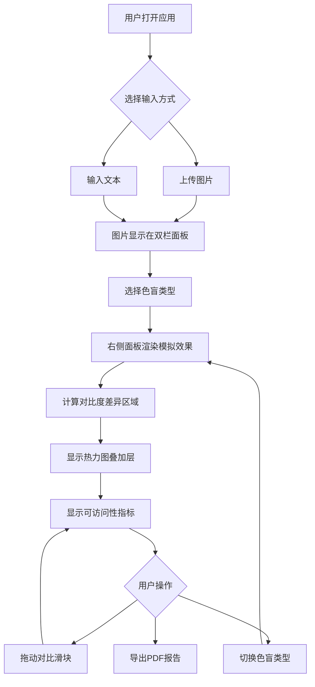

## 1. 产品概述
交互式色彩盲区模拟与无障碍对比检查应用，帮助设计师和开发者验证内容在不同色盲类型下的可读性。用户可上传图片或输入文本，实时查看色盲模拟效果与WCAG对比度差异分析。

## 2. 核心功能

### 2.1 用户角色
| 角色 | 注册方式 | 核心权限 |
|------|----------|----------|
| 设计师/开发者 | 无需注册 | 上传图片、输入文本、选择色盲类型、查看对比分析、导出报告 |

### 2.2 功能模块
1. **主页面**：图片上传、文本输入、色盲类型选择、双栏对比视图、对比度差异热力图、导出报告

### 2.3 页面详情
| 页面名称 | 模块名称 | 功能描述 |
|----------|----------|----------|
| 主页面 | 图片上传区 | 虚线边框拖拽上传区域，支持JPG/PNG最大5MB，拖拽高亮 |
| 主页面 | 文本输入区 | textarea宽80%最大500字符，16px深灰字体渲染 |
| 主页面 | 色盲类型选择 | 下拉菜单切换红色盲/绿色盲/蓝色盲/全色盲 |
| 主页面 | 双栏对比面板 | 左侧原始视图、右侧模拟视图，可拖动对比滑块 |
| 主页面 | 热力图叠加层 | 对比度差异超过阈值0.05区域以半透明红色标注 |
| 主页面 | 可访问性指标 | 显示平均色差deltaE和WCAG对比度差异比例 |
| 主页面 | 导出报告按钮 | 生成PDF报告含缩略图、色盲类型、指标数据和差异截图 |

## 3. 核心流程

用户打开应用 → 上传图片或输入文本 → 内容显示在双栏面板 → 选择色盲类型 → 右侧面板实时渲染模拟效果 → 对比度差异区域高亮标注 → 查看可访问性指标 → 可拖动对比滑块进行瞬时对比 → 导出PDF报告

## 4. 用户界面设计

### 4.1 设计风格
- 主色调：白色(#ffffff)、浅灰(#f5f5f5)、品牌蓝(#4dabf7)
- 按钮风格：圆角8px，悬浮阴影上升2px
- 字体：正文16px深灰#333，数值等宽monospace 16px
- 布局风格：顶部固定工具栏 + 双栏主区域，极简主义
- 工具栏：毛玻璃效果（背景模糊10px，半透明白色）

### 4.2 页面设计概览
| 页面名称 | 模块名称 | UI元素 |
|----------|----------|--------|
| 主页面 | 工具栏 | 固定60px高，毛玻璃背景，色盲下拉菜单，导出按钮 |
| 主页面 | 上传区 | 虚线边框大圆角300x200px，背景#f8f9fa，边框#4dabf7，拖拽高亮#1976d2 |
| 主页面 | 双栏面板 | 各占50%宽度，object-fit contain居中，可拖动分割线cursor:col-resize |
| 主页面 | 对比滑块 | 垂直细线2px红色#e03131，带圆点手柄 |
| 主页面 | 热力图 | 半透明红色#ff000033叠加层 |
| 主页面 | 指标区 | 等宽字体16px，绿色#2e7d32/黄色#f57f17/红色#c62828分级 |

### 4.3 响应式
- 桌面优先，视口宽度小于768px时双栏切换为上下堆叠布局
- 每个面板宽100%，高度各占50%
- 触控优化：拖动操作兼容触控手势

### 4.4 性能要求
- 图像处理（色盲矩阵转换+对比度分析）主线程完成，全流程不超过500ms
- 上传后1秒内完成初次渲染
- 拖动对比滑块帧率不低于30fps
