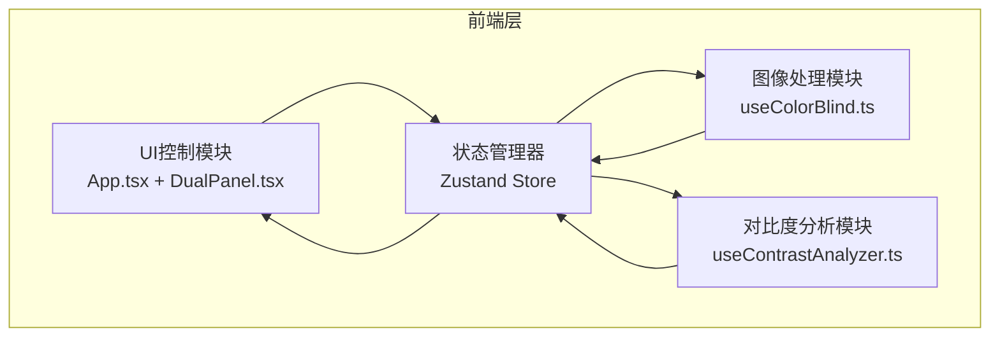

## 1. 架构设计



## 2. 技术说明
- 前端：React@18 + TypeScript + Vite + Zustand
- 初始化工具：vite-init
- 后端：无
- 数据库：无

## 3. 路由定义
| 路由 | 用途 |
|------|------|
| / | 主页面，包含所有功能模块 |

## 4. 技术实现细节

### 4.1 色盲模拟矩阵
色盲模拟基于颜色空间线性变换矩阵，对每个像素的RGB值进行矩阵乘法：
- 红色盲(Protanopia)：缺失L锥细胞
- 绿色盲(Deuteranopia)：缺失M锥细胞
- 蓝色盲(Tritanopia)：缺失S锥细胞
- 全色盲(Achromatopsia)：所有锥细胞缺失，转为灰度

### 4.2 对比度分析
- 使用WCAG 2.0对比度算法：`contrast = (L1 + 0.05) / (L2 + 0.05)`
- 相对亮度计算：`L = 0.2126*R + 0.7152*G + 0.0722*B`（线性化后）
- 差异区域阈值：0.05，超过则标记为热力图区域
- 色差计算：基于CIE76 deltaE公式

### 4.3 状态管理(Zustand)
集中状态包括：
- 原始图像数据(ImageData)
- 色盲模拟后图像数据(ImageData)
- 当前选中的色盲类型
- 对比度差异区域坐标数组
- 平均对比度值和deltaE值
- 对比滑块位置
- 上传的文件/输入的文本

### 4.4 文件结构
```
├── package.json
├── index.html
├── tsconfig.json
├── vite.config.js
├── src/
│   ├── App.tsx
│   ├── main.tsx
│   ├── store/
│   │   └── useAppStore.ts
│   ├── hooks/
│   │   ├── useColorBlind.ts
│   │   └── useContrastAnalyzer.ts
│   ├── components/
│   │   └── DualPanel.tsx
│   └── utils/
│       ├── colorBlindMatrices.ts
│       ├── contrastCalculator.ts
│       └── pdfExporter.ts
```

## 5. 无后端架构
本应用为纯前端应用，所有图像处理和计算均在浏览器主线程完成，无需后端服务。
