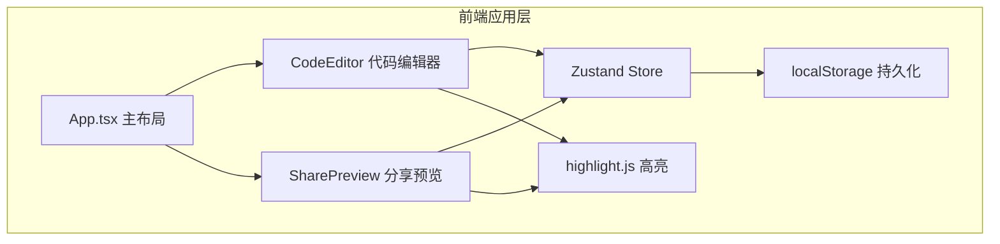

## 1. 架构设计

纯前端单页应用，使用 React + TypeScript + Vite 构建，状态管理采用 Zustand，数据持久化通过 localStorage 实现。



## 2. 技术描述

- **前端框架**：React@18 + TypeScript
- **构建工具**：Vite@5 + @vitejs/plugin-react
- **状态管理**：Zustand@4
- **代码高亮**：highlight.js
- **样式方案**：纯 CSS（CSS Variables 主题系统）
- **数据持久化**：localStorage
- **初始数据**：内置示例代码片段

## 3. 路由与视图

| 视图/状态 | 说明 |
|----------|------|
| editor | 编辑器视图，代码输入和语言选择 |
| preview | 预览视图，可添加批注 |
| share | 分享视图，双栏布局 |

通过 Zustand 中的 `view` 状态管理视图切换，不使用 react-router。

## 4. 数据模型

### 4.1 数据类型定义

```typescript
interface Annotation {
  id: string;
  lineNumber: number;
  content: string;
  createdAt: number;
}

interface Snippet {
  id: string;
  code: string;
  language: 'javascript' | 'typescript' | 'python' | 'html' | 'css';
  annotations: Annotation[];
  createdAt: number;
}
```

### 4.2 Store 状态

```typescript
interface CodeReviewState {
  currentView: 'editor' | 'preview' | 'share';
  currentSnippetId: string | null;
  snippets: Record<string, Snippet>;
  selectedLines: [number, number] | null;
  darkMode: boolean;
  
  // actions
  setView: (view: 'editor' | 'preview' | 'share') => void;
  setCurrentSnippet: (id: string) => void;
  createSnippet: (code: string, language: Snippet['language']) => string;
  addAnnotation: (snippetId: string, lineNumber: number, content: string) => void;
  loadSnippetById: (id: string) => Snippet | null;
  setSelectedLines: (lines: [number, number] | null) => void;
  toggleDarkMode: () => void;
  saveToLocalStorage: () => void;
  loadFromLocalStorage: () => void;
}
```

## 5. 文件结构

```
├── index.html
├── package.json
├── tsconfig.json
├── vite.config.js
└── src/
    ├── App.tsx          # 主布局，导航栏，视图切换
    ├── store.ts         # Zustand 状态管理
    ├── CodeEditor.tsx   # 代码编辑器组件
    ├── SharePreview.tsx # 预览/分享/批注组件
    └── index.css        # 全局样式和主题变量
```

## 6. 核心实现要点

### 6.1 代码高亮
- 使用 highlight.js 的 highlight 方法
- textarea 透明叠加在高亮 div 上
- 输入时同步滚动位置和内容

### 6.2 行选择
- 监听 mousedown/mousemove/mouseup 事件
- 计算鼠标所在行数，记录选中范围
- 选中行添加半透明背景层

### 6.3 短链接生成
- 8 位随机字符串（字母 + 数字）
- localStorage key: `code_review_snippets`
- JSON 序列化存储所有 snippets

### 6.4 主题切换
- CSS Variables 管理颜色
- body 上添加 data-theme 属性
- 月亮/太阳图标切换

### 6.5 批注闪烁动画
- CSS keyframes 定义闪烁效果
- 添加 class 触发 3 次闪烁
- 每次 300ms，颜色 #fff3cd
