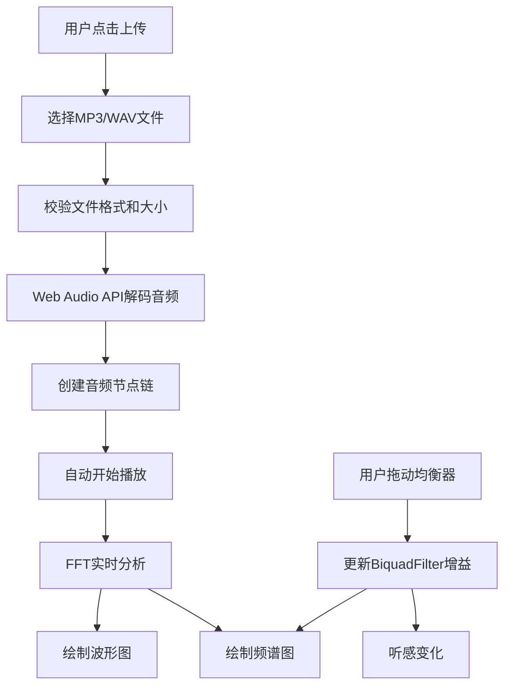

## 1. 产品概述
交互式音乐波形可视化与均衡器模拟应用，用户可上传音频文件（MP3/WAV），实时查看时域波形和频域频谱，并通过均衡器调整不同频段增益，实现音频处理与可视化的完美结合。

- 目标用户：音乐爱好者、音频工程师、学生
- 产品价值：直观理解音频信号处理，提供沉浸式的音乐可视化体验

## 2. 核心功能

### 2.1 功能模块
1. **主界面**：顶栏（歌曲名+播放控制）、主区域（左栏波形图、右栏频谱图+均衡器）
2. **音频上传模块**：支持MP3/WAV格式，最大10MB
3. **波形可视化模块**：时域波形振幅包络实时绘制
4. **频谱可视化模块**：FFT频域柱状图实时显示
5. **均衡器模块**：6频段增益调节（60Hz、250Hz、1kHz、4kHz、12kHz、16kHz）
6. **播放控制模块**：播放/暂停、进度条拖拽、音量控制

### 2.2 页面详情
| 页面名称 | 模块名称 | 功能描述 |
|---------|---------|----------|
| 主界面 | 音频上传 | 点击按钮选择文件，自动解码播放 |
| 主界面 | 顶栏 | 显示歌曲文件名、当前/总时长（mm:ss格式） |
| 主界面 | 波形图 | 480x200px Canvas，蓝色渐变填充，60fps实时刷新 |
| 主界面 | 频谱图 | 480x150px Canvas，绿到红渐变柱状图，20Hz-20kHz对数分布 |
| 主界面 | 均衡器面板 | 6个垂直滑块，-12dB到+12dB范围，实时调整增益 |
| 主界面 | 播放控制 | 播放/暂停按钮、可拖拽进度条、音量滑块 |

## 3. 核心流程
用户上传音频文件 → 系统解码并创建AudioContext → 自动开始播放 → 实时进行FFT分析 → 绘制波形和频谱 → 用户调整均衡器 → 滤波器参数更新 → 听感与可视化同步变化

## 4. 用户界面设计

### 4.1 设计风格
- 主色调：纯黑背景 #000000，深灰卡片 #1a1a2e
- 强调色：蓝色 #1a73e8（波形/进度），亮青 #00e5ff（激活状态）
- 渐变色：波形 #1a73e8→#64b5f6，频谱 #00e676→#ff1744
- 中性色：深灰 #1e1e1e（Canvas背景），中灰 #444 #555 #666，白色 #ffffff
- 字体：无衬线系统字体
- 卡片样式：圆角12px，边框 #333

### 4.2 页面设计概览
| 页面名称 | 模块名称 | UI元素 |
|---------|---------|--------|
| 主界面 | 整体布局 | 左右分栏（桌面）/ 上下排列（<768px），纯黑背景 |
| 主界面 | 顶栏 | 文件名左对齐，时长右对齐 |
| 主界面 | 波形图Canvas | 480x200px，蓝色渐变填充，浅灰刻度线 |
| 主界面 | 频谱图Canvas | 480x150px，绿红渐变柱状图 |
| 主界面 | 均衡器滑块 | 垂直条40x120px，圆形滑块头8px半径 |
| 主界面 | 播放按钮 | 圆形36px直径，白色Unicode图标 |
| 主界面 | 进度条 | 80%宽度，4px高度，可拖拽 |
| 主界面 | 音量滑块 | 水平，0-1范围，默认0.7 |

### 4.3 响应式设计
- 桌面端（≥768px）：左右分栏布局，左波形右频谱+均衡器
- 移动端（<768px）：上下堆叠布局，波形图和频谱图高度等比缩小
- 所有控件悬停状态：0.2s平滑过渡动画
- 触摸设备友好的滑块交互

### 4.4 性能指标
- Canvas渲染：稳定60fps
- CPU占用：≤30%（桌面Chrome i5）
- 音频处理：Web Audio API异步处理，FFT使用AnalyserNode
