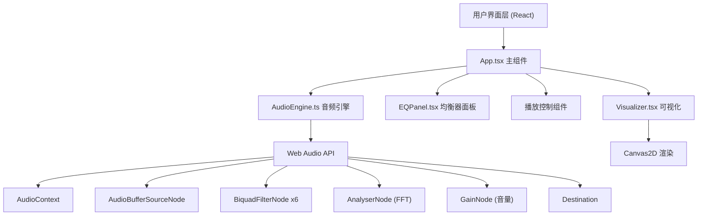

## 1. 架构设计



## 2. 技术说明
- 前端：React 18 + TypeScript + Vite
- 构建工具：Vite 5 + @vitejs/plugin-react
- 音频处理：原生 Web Audio API（AudioContext, AnalyserNode, BiquadFilterNode）
- 可视化：HTML5 Canvas 2D API
- 状态管理：React useState/useRef（轻量场景，无需额外状态库）

## 3. 项目文件结构
```
auto20/
├── package.json
├── tsconfig.json
├── vite.config.js
├── index.html
└── src/
    ├── App.tsx          # 主组件，布局管理
    ├── AudioEngine.ts   # 音频引擎模块
    ├── Visualizer.tsx   # 可视化组件（波形+频谱）
    └── EQPanel.tsx      # 均衡器面板
```

## 4. 核心模块设计

### 4.1 AudioEngine.ts
```typescript
class AudioEngine {
  // 音频上下文
  private audioContext: AudioContext | null
  // 音频源
  private source: AudioBufferSourceNode | null
  // 6个频段滤波器
  private filters: BiquadFilterNode[]
  // 分析器节点
  private analyser: AnalyserNode
  // 音量节点
  private gainNode: GainNode
  // 状态
  public isPlaying: boolean
  public currentTime: number
  public duration: number

  // 方法
  async loadFile(file: File): Promise<void>
  play(): void
  pause(): void
  stop(): void
  seek(time: number): void
  setVolume(value: number): void
  setBandGain(bandIndex: number, gain: number): void
  getTimeDomainData(): Uint8Array
  getFrequencyData(): Uint8Array
}
```

### 4.2 频段配置
| 索引 | 频率 | 滤波器类型 | Q值 |
|------|------|-----------|-----|
| 0 | 60Hz | lowshelf | 1 |
| 1 | 250Hz | peaking | 1 |
| 2 | 1kHz | peaking | 1 |
| 3 | 4kHz | peaking | 1 |
| 4 | 12kHz | peaking | 1 |
| 5 | 16kHz | highshelf | 1 |

### 4.3 音频节点连接图
```
AudioBufferSourceNode
    ↓
BiquadFilterNode (60Hz lowshelf)
    ↓
BiquadFilterNode (250Hz peaking)
    ↓
BiquadFilterNode (1kHz peaking)
    ↓
BiquadFilterNode (4kHz peaking)
    ↓
BiquadFilterNode (12kHz peaking)
    ↓
BiquadFilterNode (16kHz highshelf)
    ↓
AnalyserNode (FFT分析)
    ↓
GainNode (音量控制)
    ↓
AudioDestination (输出)
```

## 5. 性能优化策略
1. **Canvas渲染优化**
   - 使用 requestAnimationFrame 实现60fps渲染
   - 复用 TypedArray（Uint8Array）避免频繁GC
   - 频谱数据缓存，避免重复计算

2. **音频处理优化**
   - AnalyserNode fftSize: 2048（平衡精度与性能）
   - 频率数据对数映射预计算索引表
   - 增益更新节流（每16ms最多一次）

3. **React渲染优化**
   - 使用 useRef 存储高频更新数据，避免触发重渲染
   - Canvas绘制在 useEffect 中独立运行
   - 滑块值更新使用 useCallback 稳定引用
