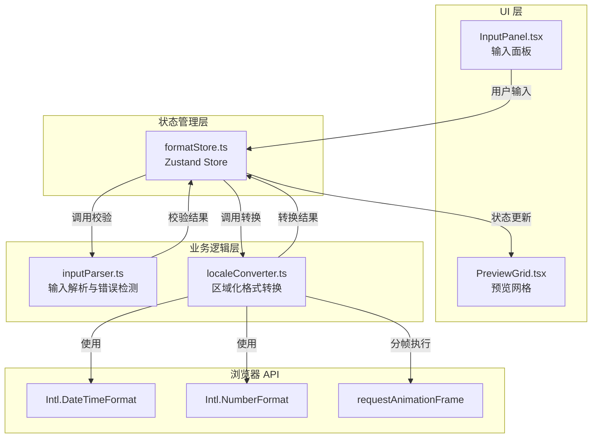

## 1. 架构设计



## 2. 技术描述

- **前端框架**: React@18 + TypeScript@5
- **构建工具**: Vite@5 + @vitejs/plugin-react@4
- **状态管理**: Zustand@4
- **国际化 API**: 浏览器内置 Intl API (ICU 规范)
- **性能优化**: requestAnimationFrame 分帧、防抖 100ms

## 3. 目录结构与文件职责

```
├── package.json              # 项目依赖与脚本配置
├── vite.config.js            # Vite 构建配置
├── tsconfig.json             # TypeScript 编译配置（严格模式）
├── index.html                # 入口 HTML
└── src/
    ├── App.tsx               # 主布局组件，初始化 Store，全局布局
    ├── store/
    │   └── formatStore.ts    # Zustand 状态管理器，集中管理所有状态和 Action
    ├── modules/
    │   ├── localeConverter.ts # 区域化格式转换模块，封装 Intl API 调用
    │   └── inputParser.ts     # 输入解析与错误检测模块，格式校验逻辑
    └── components/
        ├── InputPanel.tsx    # 输入面板组件，四个带浮动标签的输入框
        └── PreviewGrid.tsx   # 预览网格组件，2x2 四区域格式展示
```

## 4. 模块调用关系与数据流向

### 4.1 数据流示意图

```
用户输入
  ↓ (onChange)
InputPanel.tsx ── setInputValue(value, type) ──→ formatStore.ts
  ↑                                                ↓
  │                                          parseInput(value, type)
  │                                                ↓
  │                                          inputParser.ts ──→ 校验规则
  │                                                ↓ (解析结果)
  │                                          formatStore.ts
  │                                                ↓
  │                                          convertFormat(value, locale, type)
  │                                                ↓
  │                                          localeConverter.ts ──→ Intl API
  │                                                ↓ (转换结果)
  │                                          formatStore.ts
  └──── getConvertedResults() ────────────────────┘
  ↓
PreviewGrid.tsx 渲染
```

### 4.2 核心模块调用关系

| 调用方 | 被调用方 | 调用内容 | 数据流向 |
|--------|----------|----------|----------|
| App.tsx | formatStore.ts | 初始化 store，获取全局状态 | 状态 → UI |
| InputPanel.tsx | formatStore.ts | 调用 setDate / setTime / setNumber / setCurrency | 输入值 → Store |
| formatStore.ts | inputParser.ts | 调用 parseDate / parseTime / parseNumber / parseCurrency | 原始输入 → 解析结果 |
| formatStore.ts | localeConverter.ts | 调用 convertDate / convertTime / convertNumber / convertCurrency | 有效值 → 多区域格式字符串 |
| PreviewGrid.tsx | formatStore.ts | 获取 convertedResults 状态 | 转换结果 → UI |

## 5. 数据模型定义

### 5.1 Store 状态接口

```typescript
interface FormatState {
  inputs: {
    date: string;
    time: string;
    number: string;
    currency: string;
  };
  validation: {
    date: { isValid: boolean; error: string | null };
    time: { isValid: boolean; error: string | null };
    number: { isValid: boolean; error: string | null };
    currency: { isValid: boolean; error: string | null };
  };
  convertedResults: {
    'zh-CN': { date: string; time: string; number: string; currency: string };
    'en-US': { date: string; time: string; number: string; currency: string };
    'ja-JP': { date: string; time: string; number: string; currency: string };
    'ar-SA': { date: string; time: string; number: string; currency: string };
  };
  setDate: (value: string) => void;
  setTime: (value: string) => void;
  setNumber: (value: string) => void;
  setCurrency: (value: string) => void;
  validateAndConvert: () => void;
}
```

### 5.2 解析结果接口

```typescript
interface ParseResult {
  isValid: boolean;
  error: string | null;
  parsedValue: Date | number | null;
  errorType: 'format' | 'range' | 'invalid' | null;
}
```

### 5.3 区域配置

```typescript
type LocaleCode = 'zh-CN' | 'en-US' | 'ja-JP' | 'ar-SA';

const LOCALE_CONFIG: Record<LocaleCode, {
  name: string;
  timeZone: string;
}> = {
  'zh-CN': { name: '中文 (中国)', timeZone: 'Asia/Shanghai' },
  'en-US': { name: 'English (US)', timeZone: 'America/New_York' },
  'ja-JP': { name: '日本語 (日本)', timeZone: 'Asia/Tokyo' },
  'ar-SA': { name: 'العربية (السعودية)', timeZone: 'Asia/Riyadh' },
};
```

## 6. 性能设计

### 6.1 防抖机制

输入变化使用 `setTimeout` 实现 100ms 防抖，避免频繁转换导致的性能问题。

### 6.2 分帧执行

格式转换任务使用 `requestAnimationFrame` 分帧处理，防止主线程阻塞：
- 日期转换 → 第一帧
- 时间转换 → 第二帧
- 数字转换 → 第三帧
- 货币转换 → 第四帧

### 6.3 性能指标

- 单次输入处理总耗时 ≤ 200ms
- 转换响应延迟 ≤ 100ms
- FPS ≥ 50，无可见卡顿

## 7. 类型定义

### 7.1 输入类型

```typescript
type InputType = 'date' | 'time' | 'number' | 'currency';
```

### 7.2 支持的货币代码

```typescript
const VALID_CURRENCIES = ['USD', 'EUR', 'JPY', 'CNY', 'GBP'] as const;
type CurrencyCode = typeof VALID_CURRENCIES[number];
```
