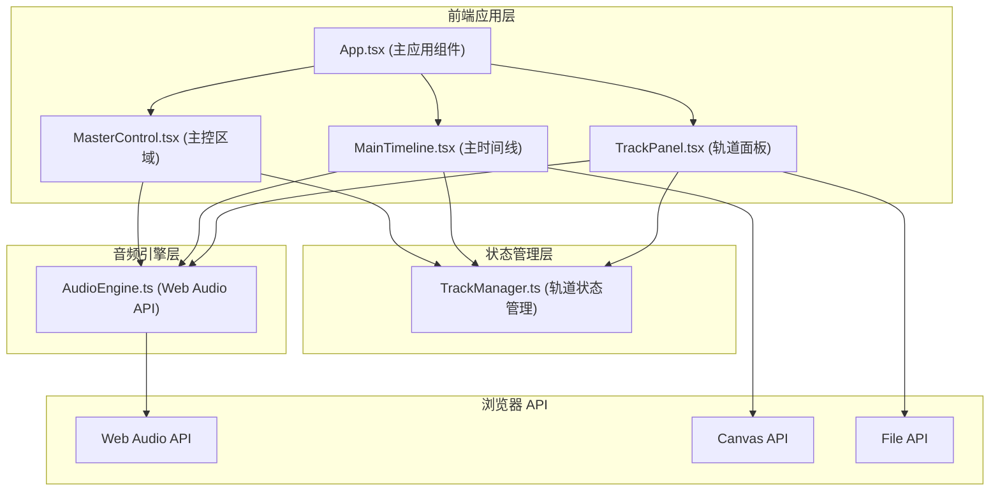

## 1. 架构设计



## 2. 技术说明

- **前端框架**：React 18 + TypeScript
- **构建工具**：Vite 5
- **音频处理**：Web Audio API（AudioContext、GainNode、BiquadFilterNode、OfflineAudioContext）
- **波形绘制**：Canvas 2D API
- **状态管理**：TrackManager 类（观察者模式）+ React useState
- **样式方案**：CSS Modules / 内联样式（按需求使用）
- **字体**：Poppins（Google Fonts）、JetBrains Mono（Google Fonts）

## 3. 文件结构

```
src/
├── AudioEngine.ts      # 核心音频引擎模块
├── TrackManager.ts     # 轨道管理模块
├── TrackPanel.tsx      # 轨道面板 UI 组件
├── MainTimeline.tsx    # 主时间线视图组件
├── App.tsx             # 主应用组件
├── main.tsx            # 入口文件
└── index.css           # 全局样式
```

## 4. 核心数据模型

### 4.1 轨道数据结构

```typescript
interface Track {
  id: string;
  name: string;
  color: string;
  audioBuffer: AudioBuffer | null;
  waveformData: { peaks: number[]; rms: number[] } | null;
  volume: number;          // 0-100
  muted: boolean;
  solo: boolean;
  eq: {
    low: number;          // -12 到 +12 dB, 80Hz
    mid: number;          // -12 到 +12 dB, 1kHz
    high: number;         // -12 到 +12 dB, 8kHz
  };
}
```

### 4.2 音频节点结构

```typescript
interface TrackAudioNodes {
  source: AudioBufferSourceNode | null;
  gainNode: GainNode;
  lowFilter: BiquadFilterNode;
  midFilter: BiquadFilterNode;
  highFilter: BiquadFilterNode;
}
```

## 5. 核心模块说明

### 5.1 AudioEngine
- 管理全局 AudioContext
- 音频文件解码（decodeAudioData）
- 创建音频节点链：Source → 低通滤波 → 中频 → 高频 → 增益 → 主增益
- 播放/暂停/停止控制
- 当前播放时间获取
- OfflineAudioContext 混音导出 WAV
- 波形采样数据计算（峰值 + RMS）

### 5.2 TrackManager
- 维护轨道列表状态
- 轨道增删改查操作
- 选中轨道管理
- 独奏/静音逻辑处理
- 观察者模式通知 UI 更新

### 5.3 TrackPanel 组件
- 渲染轨道列表（垂直排列）
- 各轨道控件：名称编辑、音量滑块、EQ 旋钮、静音/独奏按钮
- 波形预览（Canvas）
- 添加音轨按钮
- 文件加载处理

### 5.4 MainTimeline 组件
- 主时间轴波形显示
- 时间刻度渲染
- 播放头动画（requestAnimationFrame）
- 鼠标拖拽时间定位
- Shift+拖拽选区操作
- 文件拖放加载

## 6. 性能优化策略

- **波形预计算**：音频加载时一次性计算波形采样数据，避免实时计算
- **Canvas 分层绘制**：静态波形与动态播放头分层，减少重绘区域
- **requestAnimationFrame**：播放循环与 UI 更新同步
- **音频节点复用**：暂停时不销毁节点，仅停止 source
- **节流/防抖**：滑块调节使用节流，避免频繁参数更新
- **离屏渲染**：波形绘制使用离屏 Canvas 缓存

## 7. 构建与运行

- **开发命令**：npm run dev
- **构建命令**：npm run build
- **依赖安装**：npm install
- **依赖清单**：
  - react
  - react-dom
  - typescript
  - vite
  - @vitejs/plugin-react
