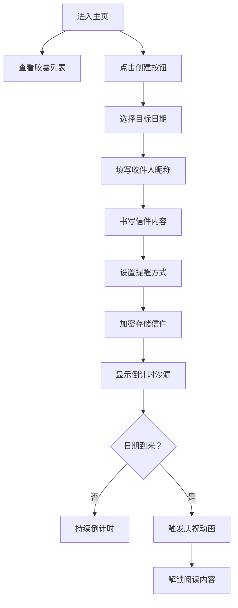

## 1. 产品概述

时间胶囊是一个匿名时光信箱应用，让用户可以给未来的自己或他人写信，在设定的日期才能开启阅读。通过精美的3D沙漏动画、磨砂玻璃UI和加密存储技术，创造一种充满期待感和仪式感的数字体验。

- 核心价值：将当下的思绪封存，在未来的某个时刻重新遇见自己
- 目标用户：喜欢记录生活、对未来充满期待的年轻用户群体

## 2. 核心功能

### 2.1 用户角色
| 角色 | 注册方式 | 核心权限 |
|------|----------|----------|
| 普通用户 | 无需注册，匿名使用 | 创建胶囊、查看列表、解锁阅读 |

### 2.2 功能模块
1. **主页**：3D沙漏倒计时、胶囊瀑布流列表、创建胶囊按钮
2. **胶囊创建向导**：四步表单（日期选择→收件人→信件内容→提醒设置）
3. **胶囊预览**：半透明预览窗，显示模糊标题和基础信息
4. **信件阅读**：倒计时结束后解锁完整内容，手写字体展示

### 2.3 页面详情
| 页面名称 | 模块名称 | 功能描述 |
|----------|----------|----------|
| 主页 | Hero区域 | 全屏深蓝渐变背景，中央3D沙漏动画，自定义日期倒计时 |
| 主页 | 胶囊列表 | 瀑布流布局展示所有胶囊，磨砂玻璃卡片，模糊标题 |
| 主页 | 创建按钮 | 右下角金色渐变浮动按钮，脉动动画 |
| 模态框 | 创建向导 | 四步滑入式表单，日期验证，Markdown实时预览 |
| 模态框 | 预览窗 | 半透明背景，模糊标题，可查看发送时间和收件人 |

## 3. 核心流程

用户进入主页 → 查看已有的胶囊列表 → 点击创建按钮 → 填写四步表单 → 信件加密存储 → 展示倒计时沙漏 → 等待日期到来 → 触发庆祝动画 → 解锁阅读完整内容

## 4. 用户界面设计

### 4.1 设计风格
- **主色调**：深蓝渐变 #0a192f → #1a365d
- **强调色**：暖金色 #f0e68c，金色渐变 #d4af37 → #f0e68c
- **字体**：
  - 倒计时：'Courier New', monospace（复古打字机风格）
  - 信件内容：'Dancing Script', cursive（手写风格）
- **磨砂玻璃效果**：rgba(255,255,255,0.1) + backdrop-filter: blur(20px)
- **卡片圆角**：24px，边框 1px solid rgba(255,255,255,0.2)

### 4.2 页面设计概述
| 页面名称 | 模块名称 | UI元素 |
|----------|----------|--------|
| 主页 | Hero区域 | 全屏深蓝渐变背景，中央半透明3D沙漏（沙粒流动），暖金色倒计时数字（每秒淡入淡出） |
| 主页 | 胶囊卡片 | 磨砂玻璃效果，顶部动态沙漏图标（旋转+浮动），模糊标题blur(10px)，悬停上浮8px+发光阴影 |
| 主页 | 创建按钮 | 圆形56px，金色渐变，发光阴影，脉动动画 |
| 模态框 | 创建向导 | 半透明遮罩rgba(0,0,0,0.7)，四步滑入动画translateX 0.3s ease-out，表单验证 |
| 模态框 | 庆祝效果 | 边框金色光晕闪烁，Canvas金色粒子雨3秒 |

### 4.3 响应式设计
- 桌面端优先，瀑布流列宽280px，间距20px
- 移动端自适应列数，卡片最小宽度260px
- 触摸设备优化点击区域，确保可交互元素≥44px

### 4.4 3D场景设计
- **环境**：深蓝渐变背景，轻微雾效增强深度感
- **光照**：柔和环境光 + 金色点光源照亮沙漏
- **相机**：固定视角，轻微呼吸式位移动画
- **沙粒**：最多200个粒子，每60帧更新一次位置，金色半透明材质
- **后处理**：轻微泛光效果增强梦幻感

