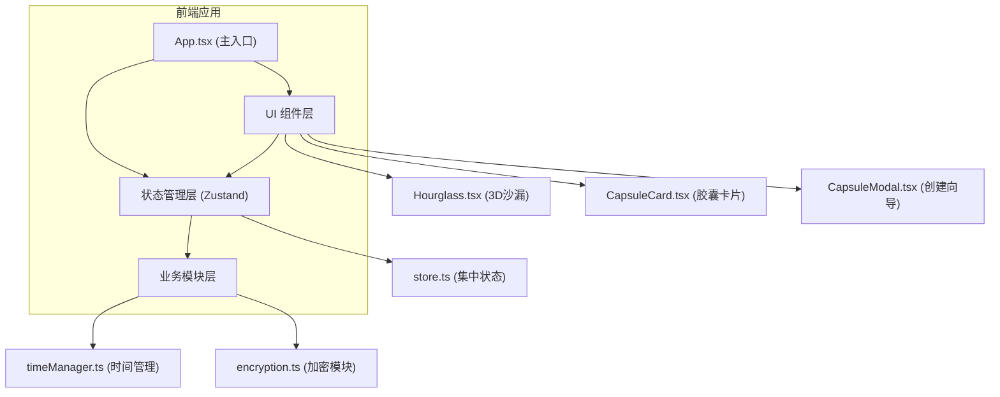
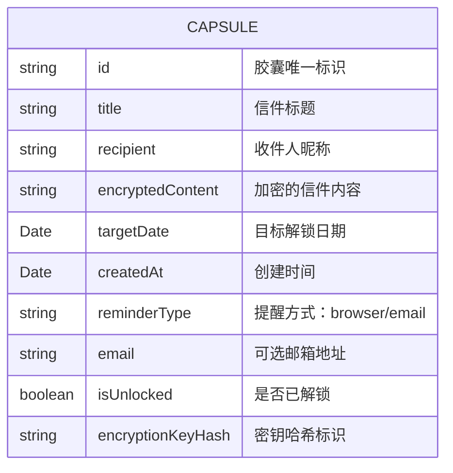

## 1. 架构设计



## 2. 技术描述

- **前端框架**：React 18 + TypeScript + Vite
- **3D渲染**：Three.js + @react-three/fiber + @react-three/drei
- **状态管理**：Zustand
- **加密方案**：Web Crypto API (AES-GCM)
- **样式方案**：原生CSS + CSS变量 + CSS动画
- **构建工具**：Vite 5

### 依赖包说明
| 包名 | 版本 | 用途 |
|------|------|------|
| react | ^18.2.0 | 前端框架 |
| react-dom | ^18.2.0 | React DOM渲染 |
| three | ^0.160.0 | 3D渲染引擎 |
| @react-three/fiber | ^8.15.12 | React Three.js渲染器 |
| @react-three/drei | ^9.92.7 | Three.js辅助组件 |
| zustand | ^4.4.7 | 状态管理 |
| typescript | ^5.3.3 | 类型系统 |
| vite | ^5.0.8 | 构建工具 |
| @vitejs/plugin-react | ^4.2.1 | Vite React插件 |

## 3. 路由定义

| 路由 | 用途 |
|------|------|
| / | 主页，展示沙漏倒计时和胶囊列表 |

## 4. 数据模型

### 4.1 数据模型定义



### 4.2 TypeScript 类型定义

```typescript
interface Capsule {
  id: string;
  title: string;
  recipient: string;
  encryptedContent: string;
  targetDate: Date;
  createdAt: Date;
  reminderType: 'browser' | 'email';
  email?: string;
  isUnlocked: boolean;
  encryptionKeyHash: string;
}

interface TimeRemaining {
  days: number;
  hours: number;
  minutes: number;
  seconds: number;
  total: number;
}

interface CapsuleFormData {
  targetDate: Date | null;
  recipient: string;
  title: string;
  content: string;
  reminderType: 'browser' | 'email';
  email: string;
}
```

## 5. 模块设计

### 5.1 时间管理模块 (timeManager.ts)
- `getRemainingTime(targetDate: Date): TimeRemaining` - 计算剩余时间
- `startCountdown(targetDate: Date, callback: (time: TimeRemaining) => void): () => void` - 启动倒计时
- `validateTargetDate(date: Date): boolean` - 验证目标日期（至少一天后）
- `formatDate(date: Date): string` - 格式化日期显示

### 5.2 加密模块 (encryption.ts)
- `generateKeyFromDate(targetDate: Date): Promise<CryptoKey>` - 基于日期哈希生成密钥
- `encryptContent(content: string, key: CryptoKey): Promise<string>` - AES加密内容
- `decryptContent(encrypted: string, key: CryptoKey): Promise<string>` - AES解密内容
- `hashDate(date: Date): string` - 日期哈希用于标识

### 5.3 状态管理 (store.ts)
- 胶囊列表管理（增删改查）
- 当前选中胶囊状态
- 倒计时状态追踪
- 解锁状态管理
- 模态框显示状态

### 5.4 3D沙漏组件 (Hourglass.tsx)
- Three.js场景配置
- 沙漏几何模型
- 沙粒粒子系统（≤200个粒子）
- 流动动画逻辑（每60帧更新）
- 接收剩余时间参数控制流速

### 5.5 胶囊卡片组件 (CapsuleCard.tsx)
- 磨砂玻璃效果
- 模糊标题显示
- 倒计时显示
- CSS沙漏图标动画
- 悬停交互效果
- 解锁庆祝动画（边框闪烁+粒子雨）

### 5.6 创建向导模态框 (CapsuleModal.tsx)
- 四步滑入动画
- 表单验证
- 日期选择器
- Markdown编辑器+实时预览
- 提醒方式设置

## 6. 性能优化

- 沙粒粒子数量限制在200个以内
- 帧率控制在55fps以上
- 使用requestAnimationFrame进行动画
- 节流处理倒计时更新
- 懒加载Three.js场景
- 组件记忆化优化重渲染

## 7. 项目结构

```
.
├── index.html
├── package.json
├── tsconfig.json
├── vite.config.js
└── src/
    ├── main.tsx
    ├── App.tsx
    ├── store.ts
    ├── styles.css
    ├── modules/
    │   ├── timeManager.ts
    │   └── encryption.ts
    └── components/
        ├── Hourglass.tsx
        ├── CapsuleCard.tsx
        └── CapsuleModal.tsx
```
