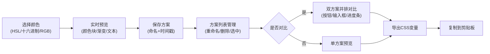

## 1. 产品概述

CSS主题配色方案生成器是一款面向前端开发者的可视化配色工具，帮助用户在浏览器中创建、调整和导出个人专属CSS主题配色方案，解决设计阶段反复修改颜色值、缺乏实时预览和多方案对比的效率问题。

- **核心价值**：通过可视化界面实时预览配色效果，支持多方案对比，一键导出CSS变量，大幅提升前端开发效率
- **目标用户**：前端开发者、UI设计师、需要定制主题的技术人员

## 2. 核心功能

### 2.1 功能模块
1. **颜色选择模块**：HSL色相环+饱和度明度方形区域，支持十六进制/RGB输入
2. **方案管理模块**：侧边栏方案列表，支持添加、删除、重命名、选中、对比
3. **预览面板模块**：实时预览配色效果，支持单方案预览和双方案对比
4. **导出模块**：生成CSS变量文件，支持一键复制

### 2.3 页面详情
| 页面名称 | 模块名称 | 功能描述 |
|-----------|-------------|---------------------|
| 主页面 | 颜色选择区 | HSL色相环选取主色/辅色/背景色，支持十六进制/RGB值输入，实时更新预览 |
| 主页面 | 方案列表区 | 240px宽可滚动侧边栏，展示所有配色方案卡片，支持双击重命名、删除、选中 |
| 主页面 | 预览区 | 右侧预览卡片展示颜色块、渐变条、示例文本，对比模式下双栏展示UI组件效果 |
| 主页面 | 导出模态框 | 半透明遮罩，缩放淡入动画，展示CSS变量内容，支持复制 |

## 3. 核心流程

用户创建配色方案流程：选择颜色 → 实时预览 → 保存方案 → 多方案对比 → 导出CSS变量

## 4. 用户界面设计

### 4.1 设计风格
- **主色调**：用户自定义（默认#3b82f6蓝色）
- **布局**：左右两栏布局，中间可拖拽分隔线（宽度3px，默认左栏420px）
- **卡片样式**：圆角12px，浅阴影box-shadow: 0 1px 3px rgba(0,0,0,0.1)
- **按钮样式**：主色填充，悬停亮度提升10%，点击缩放回弹动画
- **字体**：使用现代无衬线字体（如Inter），支持多种字重和字号展示
- **动效**：模态框缩放淡入（200ms ease-out），按钮点击回弹（150ms）

### 4.2 页面设计概述
| 页面名称 | 模块名称 | UI元素 |
|-----------|-------------|-------------|
| 主页面 | 颜色选择区 | HSL色相环、饱和度明度方块、十六进制输入框、RGB输入框、颜色类型切换（主色/辅色/背景色） |
| 主页面 | 方案列表区 | 方案卡片（名称/三色预览/时间）、删除按钮（红色圆形X）、选中边框（2px主色）、悬停背景#f1f5f9 |
| 主页面 | 预览区 | 颜色块、渐变条、示例文本段落（多字重字号）、对比模式双栏布局、按钮（圆形/填充/轮廓）、输入框、进度条 |
| 主页面 | 导出模态框 | 半透明遮罩rgba(0,0,0,0.4)、代码展示区、复制按钮、关闭按钮 |

### 4.3 响应式设计
- **桌面端**（≥768px）：左右两栏布局，可拖拽分隔线
- **移动端**（<768px）：上下布局，颜色面板折叠为汉堡菜单
- **交互优化**：触摸友好的点击区域，滚动性能优化

### 4.4 性能要求
- UI响应时间 ≤ 50ms
- 颜色选择实时更新无卡顿
- 列表滚动流畅
