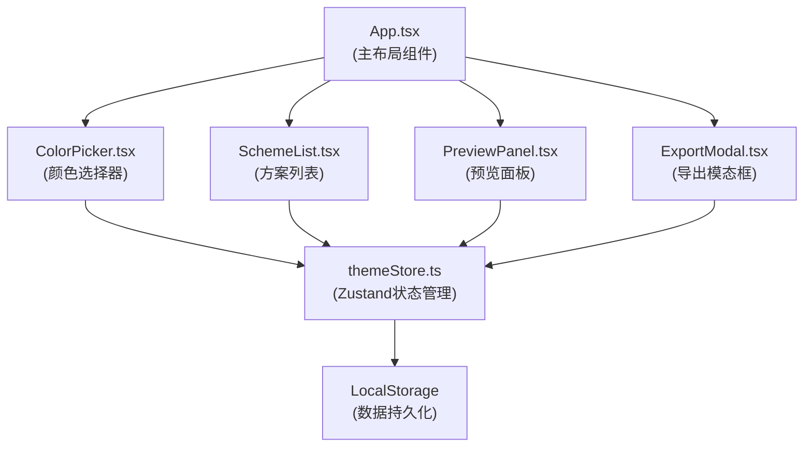

## 1. 架构设计



## 2. 技术描述
- **前端框架**：React@18 + TypeScript@5
- **构建工具**：Vite@5
- **状态管理**：Zustand@4
- **样式方案**：Tailwind CSS@3 + PostCSS@8 + Autoprefixer@10
- **图标库**：lucide-react（符合项目规范）

## 3. 数据模型

### 3.1 数据类型定义
```typescript
interface ColorScheme {
  id: string;
  name: string;
  primary: string;
  secondary: string;
  background: string;
  text: string;
  createdAt: number;
}

interface ThemeState {
  schemes: ColorScheme[];
  currentScheme: ColorScheme | null;
  selectedForCompare: string[];
  isCompareMode: boolean;
  showExportModal: boolean;
}
```

### 3.2 Store方法
- `addScheme(scheme: Omit<ColorScheme, 'id' | 'createdAt'>)`: 添加新方案
- `updateScheme(id: string, updates: Partial<ColorScheme>)`: 更新方案
- `deleteScheme(id: string)`: 删除方案
- `selectScheme(id: string)`: 选中方案
- `toggleCompare(id: string)`: 切换对比选中状态
- `setCompareMode(enabled: boolean)`: 开启/关闭对比模式
- `exportCSS(scheme: ColorScheme)`: 生成CSS变量字符串
- `copyToClipboard(text: string)`: 复制到剪贴板

## 4. 目录结构
```
├── package.json
├── index.html
├── tsconfig.json
├── vite.config.ts
├── tailwind.config.js
├── postcss.config.js
└── src/
    ├── App.tsx              # 主布局（左右分栏+拖拽分隔线）
    ├── main.tsx             # 入口文件
    ├── index.css            # Tailwind入口
    ├── stores/
    │   └── themeStore.ts    # Zustand状态管理
    ├── components/
    │   ├── ColorPicker.tsx  # HSL颜色选择器
    │   ├── SchemeList.tsx   # 方案列表侧边栏
    │   ├── PreviewPanel.tsx # 预览面板
    │   └── ExportModal.tsx  # 导出模态框
    └── utils/
        └── colorUtils.ts    # 颜色转换工具函数
```

## 5. 关键实现要点

### 5.1 颜色转换工具（colorUtils.ts）
- `hexToRgb(hex: string)`: 十六进制转RGB
- `rgbToHsl(r: number, g: number, b: number)`: RGB转HSL
- `hslToRgb(h: number, s: number, l: number)`: HSL转RGB
- `rgbToHex(r: number, g: number, b: number)`: RGB转十六进制
- `getContrastColor(bgColor: string)`: 计算对比文本色

### 5.2 HSL颜色选择器实现
- **色相环**：使用Canvas绘制色相环，监听鼠标点击/拖拽事件获取色相值
- **饱和度明度方块**：Canvas绘制，横向为饱和度(0-100%)，纵向为明度(100%-0%)
- **实时预览**：颜色变化时通过Zustand更新状态，触发预览面板重渲染

### 5.3 可拖拽分隔线
- 使用React状态记录分隔线位置（leftWidth）
- 监听mousedown/mousemove/mouseup事件实现拖拽
- 拖拽时高亮分隔线为#3b82f6蓝色
- 保存用户调整的位置到localStorage

### 5.4 动画实现
- **模态框**：CSS transition实现scale(0.95) → scale(1)，opacity 0→1，200ms ease-out
- **按钮交互**：hover时filter: brightness(1.1)，active时transform: scale(0.95)，150ms过渡
- **方案卡片**：hover背景色过渡，选中边框加粗动画

### 5.5 响应式实现
- 使用Tailwind的`md:`断点实现移动端适配
- 移动端：flex-col布局，颜色面板使用state控制展开/折叠
- 汉堡菜单按钮控制颜色面板显隐
