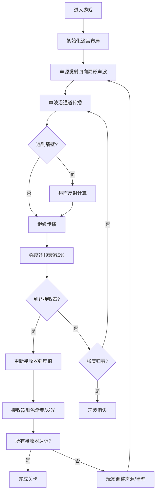

## 1. 产品概述

回声迷宫是一款基于物理声学模拟的益智游戏，玩家通过在黑暗迷宫中放置声源和接收器，利用声波的传播与反射特性，让所有接收器同时接收到最佳信号。

- 核心玩法：通过调整声源位置和迷宫墙壁布局，控制声波传播路径，实现对所有接收器的信号覆盖
- 目标用户：对物理模拟、益智解谜类游戏感兴趣的玩家
- 产品价值：将抽象的声学原理可视化，提供寓教于乐的游戏体验

## 2. 核心功能

### 2.1 用户角色

| 角色 | 注册方式 | 核心权限 |
|------|----------|----------|
| 玩家 | 无需注册 | 完整游戏体验，迷宫编辑、声源拖拽、实时观察声波模拟 |

### 2.2 功能模块

1. **迷宫编辑系统**：墙壁绘制与删除、网格对齐、数量限制（最多15段）
2. **声源交互系统**：声源拖拽定位、四向扇形声波发射
3. **物理模拟系统**：声波传播、镜面反射、强度衰减、回声叠加
4. **接收器系统**：多接收器布局、强度可视化、阈值检测发光
5. **视觉特效系统**：动态光晕粒子、悬停信息显示、深色磨砂玻璃UI
6. **响应式适配系统**：移动端缩放、性能降级策略

### 2.3 页面详情

| 页面名称 | 模块名称 | 功能描述 |
|---------|----------|----------|
| 主游戏页面 | 迷宫画布 | 700x700像素网格迷宫，支持墙壁绘制/删除、声源拖拽 |
| 主游戏页面 | 声波模拟 | 实时计算声波传播路径、反射、衰减，可视化显示声波场 |
| 主游戏页面 | 接收器面板 | 显示多个接收器位置，根据接收强度变色发光 |
| 主游戏页面 | 粒子特效 | 墙壁反射点生成动态飘散光点，增强视觉效果 |
| 主游戏页面 | 信息提示 | 鼠标悬停接收器显示强度百分比，操作指引 |

## 3. 核心流程

玩家进入游戏后，首先看到预设的迷宫布局和初始声源位置。玩家可以：
1. 按住左键在空白格点拖动绘制墙壁（自动对齐网格，最多15段）
2. 右键点击墙壁删除
3. 拖拽金色声源圆点到任意空白位置
4. 实时观察声波从声源向四向发射，沿通道传播、遇墙反射
5. 观察接收器根据声波强度从暗红渐变到亮绿，超过阈值时闪烁
6. 调整声源和墙壁布局，直到所有接收器同时进入最佳信号区

## 4. 用户界面设计

### 4.1 设计风格

- **主色调**：深色主题，背景 #0f0f1a，迷宫背景 #1a1a2e
- **强调色**：金色 #ffd700（声源）、亮青色 #00ffff（接收器外环）、亮绿 #00ff00（最佳信号）、暗红 #8b0000（无信号）
- **辅助色**：淡蓝 #87ceeb（粒子特效）、白色 #e0e0e0（墙壁）、半透明蓝色（声波）
- **UI风格**：半透明磨砂玻璃效果，背景模糊8px，圆角12px
- **字体**：现代无衬线字体，清晰易读

### 4.2 页面设计概述

| 页面名称 | 模块名称 | UI元素 |
|---------|----------|--------|
| 主游戏页面 | 迷宫画布 | 700x700像素深灰背景网格，白色6px厚墙壁，自动对齐绘制 |
| 主游戏页面 | 声源 | 半径10px金色脉动圆点，默认(50,50)，可拖拽到空白格点 |
| 主游戏页面 | 声波 | 半透明蓝色扇形，3px/帧速度扩散，遇墙镜面反射 |
| 主游戏页面 | 接收器 | 半径12px半透明圆环，外环亮青色，内环强度渐变，阈值触发闪烁 |
| 主游戏页面 | 粒子特效 | 反射点随机飘散淡蓝色小光点，逐渐消失 |
| 主游戏页面 | 悬停提示 | 鼠标悬停接收器显示12px白色强度百分比文字 |

### 4.3 响应式设计

- **桌面端**：700x700迷宫，完整粒子特效，居中网格布局
- **移动端/小屏**：迷宫缩小到500x500，隐藏部分粒子特效，优化触摸交互
- **性能策略**：声波更新帧率不低于30FPS，复杂场景自动降级粒子数量

### 4.4 交互设计

- **左键拖动**：绘制墙壁，自动对齐网格
- **右键点击**：删除墙壁
- **左键拖拽声源**：移动声源到新位置
- **鼠标悬停接收器**：显示当前强度百分比
- **实时反馈**：声波传播、接收器变色、粒子特效全程动态展示

## 5. 技术约束

- **核心框架**：React 18 + TypeScript
- **图形渲染**：p5.js 用于Canvas绘制和动画循环
- **状态管理**：Zustand 实现中央状态管理
- **构建工具**：Vite
- **模块划分**：物理模拟模块(physics.ts) + UI交互模块(ui.tsx)
- **性能目标**：声波模拟帧率 ≥ 30FPS
