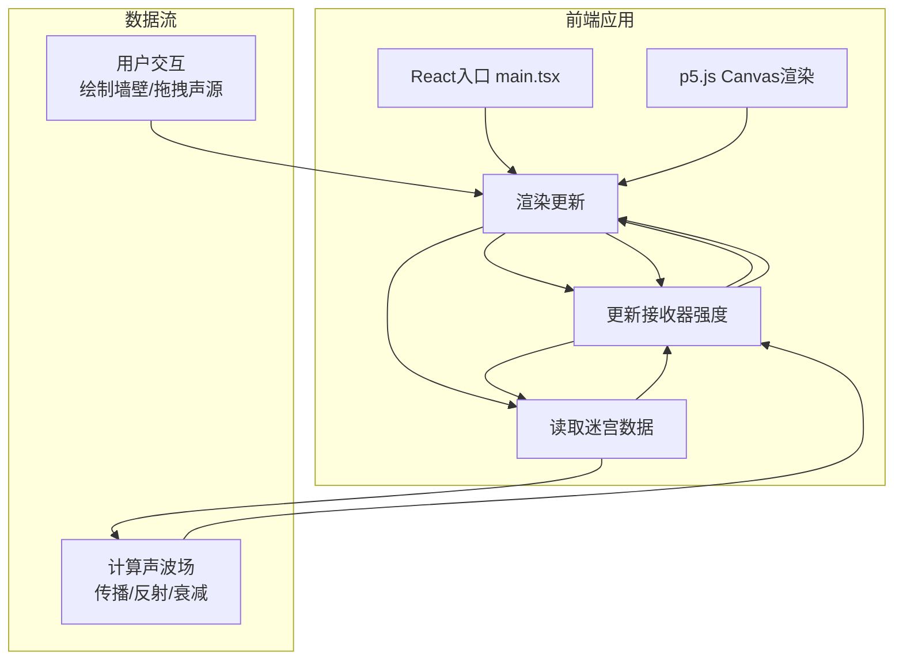

## 1. 架构设计



## 2. 技术描述

- **前端框架**：React 18 + TypeScript（严格模式，target ES2020）
- **图形渲染**：p5.js（Canvas 2D绘制，动画循环管理）
- **状态管理**：Zustand 4.x（轻量级中央状态仓库）
- **构建工具**：Vite 5.x + @vitejs/plugin-react
- **包管理器**：npm
- **项目初始化**：vite-init react-ts 模板

## 3. 模块职责划分

### 3.1 物理模拟模块 (src/physics.ts)

**核心职责**：纯逻辑计算，不涉及UI渲染

| 函数/类 | 功能描述 | 输入 | 输出 |
|---------|----------|------|------|
| `SoundWave` | 声波类，封装单条声波的状态 | 起点坐标、方向角度、初始强度 | 声波对象 |
| `propagateWave()` | 单帧声波传播计算 | 声波对象、墙壁数组 | 更新后的声波对象、碰撞点信息 |
| `calculateReflection()` | 镜面反射方向计算 | 入射方向向量、墙壁法向量 | 反射方向向量 |
| `checkReceiverCollision()` | 检测声波是否到达接收器 | 声波位置、接收器列表 | 接收器强度增量 |
| `simulateFrame()` | 单帧完整物理模拟 | 所有声波、墙壁、接收器 | 更新后的声波数组、接收器强度数组 |

**物理规则**：
- 声波速度：3px/帧
- 强度衰减：每帧减少5%（乘以0.95）
- 反射规则：严格镜面反射（入射角等于反射角）
- 扇形声波：四向发射，每向90度扇形，使用多射线模拟

### 3.2 UI交互模块 (src/ui.tsx)

**核心职责**：p5.js画布渲染、用户交互处理、特效渲染

| 组件/函数 | 功能描述 |
|-----------|----------|
| `MazeCanvas` | 主画布组件，封装p5.js实例 |
| `setup()` | p5.js初始化，创建画布、设置参数 |
| `draw()` | 每帧渲染循环，调用物理模拟、绘制所有元素 |
| `handleMousePress()` | 鼠标按下事件，开始绘制墙壁或拖拽声源 |
| `handleMouseDrag()` | 鼠标拖动事件，墙壁绘制自动对齐网格 |
| `handleMouseClick()` | 右键点击删除墙壁 |
| `drawWalls()` | 绘制墙壁（白色6px线条） |
| `drawSource()` | 绘制声源（金色脉动圆点） |
| `drawWaves()` | 绘制声波（半透明蓝色扇形） |
| `drawReceivers()` | 绘制接收器（圆环，强度颜色渐变） |
| `drawParticles()` | 绘制反射点粒子特效 |
| `drawHoverInfo()` | 绘制悬停强度提示 |

### 3.3 状态管理 (src/store.ts)

**Zustand Store 状态定义**：

```typescript
interface Wall {
  x1: number; y1: number;  // 起点
  x2: number; y2: number;  // 终点
}

interface Source {
  x: number;
  y: number;
}

interface Receiver {
  id: number;
  x: number;
  y: number;
  intensity: number;  // 0.0 - 1.0
  threshold: number;  // 触发发光阈值，默认0.6
}

interface Particle {
  x: number;
  y: number;
  vx: number;
  vy: number;
  life: number;  // 0.0 - 1.0
}

interface SoundWave {
  x: number;
  y: number;
  angle: number;  // 传播方向
  intensity: number;
  age: number;
  maxAge: number;
}

interface GameState {
  // 迷宫数据
  walls: Wall[];
  maxWalls: number;  // 15
  
  // 声源
  source: Source;
  isDraggingSource: boolean;
  
  // 接收器
  receivers: Receiver[];
  
  // 声波
  waves: SoundWave[];
  
  // 粒子特效
  particles: Particle[];
  
  // 编辑状态
  isDrawingWall: boolean;
  wallStart: { x: number; y: number } | null;
  hoveredReceiverId: number | null;
  
  // Actions
  addWall: (wall: Wall) => boolean;
  removeWall: (index: number) => void;
  setSourcePosition: (x: number, y: number) => void;
  updateReceiverIntensity: (id: number, intensity: number) => void;
  addWave: (wave: SoundWave) => void;
  removeWave: (index: number) => void;
  clearWaves: () => void;
  addParticle: (particle: Particle) => void;
  updateParticles: () => void;
  setHoveredReceiver: (id: number | null) => void;
  resetGame: () => void;
}
```

## 4. 项目文件结构

```
echo-maze/
├── package.json              # 项目依赖和脚本
├── index.html                # HTML入口
├── tsconfig.json             # TypeScript配置
├── vite.config.js            # Vite构建配置
└── src/
    ├── main.tsx              # React应用入口
    ├── store.ts              # Zustand状态管理
    ├── physics.ts            # 物理模拟模块
    └── ui.tsx                # UI交互模块
```

## 5. 核心算法

### 5.1 声波反射算法

```
入射向量: V = (vx, vy)
墙壁法向量: N = (nx, ny) （单位向量）
反射向量: R = V - 2 * (V · N) * N

其中点积: V · N = vx * nx + vy * ny
```

### 5.2 线段相交检测（用于墙壁碰撞）

```
给定线段AB和CD，计算交点：
denominator = (Bx - Ax) * (Dy - Cy) - (By - Ay) * (Dx - Cx)
如果 denominator == 0，线段平行或共线

t = ((Cx - Ax) * (Dy - Cy) - (Cy - Ay) * (Dx - Cx)) / denominator
u = -((Bx - Ax) * (Cy - Ay) - (By - Ay) * (Cx - Ax)) / denominator

如果 0 ≤ t ≤ 1 且 0 ≤ u ≤ 1，线段相交
交点坐标: (Ax + t * (Bx - Ax), Ay + t * (By - Ay))
```

### 5.3 强度颜色渐变

```
输入强度: i (0.0 - 1.0)
暗红 #8b0000 → 亮绿 #00ff00

R = 139 * (1 - i)
G = 0 * (1 - i) + 255 * i
B = 0
```

### 5.4 网格对齐

```
网格大小: 50px (700/14)
对齐函数: snapToGrid(x) = round(x / gridSize) * gridSize
```

## 6. 性能优化策略

1. **声波数量限制**：每帧发射固定数量的声波射线（如每向8条，共32条），避免无限增长
2. **声波生命周期**：强度低于0.01或超出边界时立即销毁
3. **空间分区**：使用网格空间索引加速碰撞检测
4. **粒子池**：限制最大粒子数量（如100个），循环复用
5. **帧率控制**：p5.js的frameRate(60)，物理模拟和渲染解耦
6. **移动端降级**：屏幕宽度<768px时，减少声波射线数量，禁用部分粒子

## 7. 关键常量定义

```typescript
// 尺寸
const MAZE_SIZE = 700;
const MAZE_SIZE_MOBILE = 500;
const GRID_SIZE = 50;
const WALL_THICKNESS = 6;

// 声源
const SOURCE_RADIUS = 10;
const SOURCE_DEFAULT_X = 50;
const SOURCE_DEFAULT_Y = 50;

// 声波
const WAVE_SPEED = 3;
const WAVE_DECAY = 0.95;  // 每帧衰减系数
const WAVES_PER_DIRECTION = 8;  // 每方向发射的声波数量
const MAX_WAVES = 500;

// 接收器
const RECEIVER_RADIUS = 12;
const RECEIVER_THRESHOLD = 0.6;
const MAX_RECEIVERS = 5;

// 墙壁
const MAX_WALLS = 15;

// 颜色
const COLORS = {
  BG_MAIN: '#0f0f1a',
  BG_MAZE: '#1a1a2e',
  WALL: '#e0e0e0',
  SOURCE: '#ffd700',
  WAVE: 'rgba(100, 149, 237, 0.6)',
  RECEIVER_OUTER: '#00ffff',
  RECEIVER_LOW: '#8b0000',
  RECEIVER_HIGH: '#00ff00',
  PARTICLE: '#87ceeb',
};

// 性能
const TARGET_FPS = 60;
const MIN_PHYSICS_FPS = 30;
```
