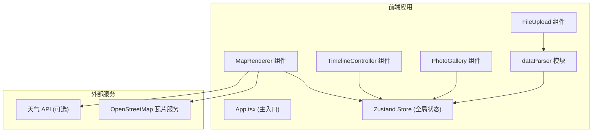

## 1. 架构设计



## 2. 技术描述

- **前端框架**：React 18 + TypeScript
- **构建工具**：Vite
- **地图渲染**：Leaflet + react-leaflet
- **状态管理**：Zustand
- **CSV 解析**：PapaParse
- **样式方案**：CSS Modules / 内联样式（按需求描述）
- **地图底图**：OpenStreetMap
- **天气数据**：模拟数据 / 免费天气 API

## 3. 文件结构

```
src/
├── dataParser.ts          # CSV 解析与数据校验模块
├── store.ts               # Zustand 全局状态管理
├── mapRenderer.tsx        # 地图渲染组件
├── timelineController.tsx # 时间轴控制组件
├── components/
│   ├── FileUpload.tsx     # 文件上传组件
│   └── PhotoGallery.tsx   # 照片画廊侧边栏
├── types/
│   └── travel.ts          # TypeScript 类型定义
├── App.tsx                # 主应用组件
├── main.tsx               # 应用入口
└── index.css              # 全局样式
```

## 4. 核心模块说明

### 4.1 数据解析模块 (dataParser.ts)

- 输入：CSV File 对象
- 处理：使用 PapaParse 解析，校验字段完整性（lat, lng, date, photoUrl, note）
- 输出：`Array<{lat: number, lng: number, date: string, photoUrl: string, note: string}>`
- 错误处理：字段缺失、格式错误、文件超限（5MB）

### 4.2 状态管理 (store.ts)

- travelData: TravelPoint[] - 旅行数据数组
- selectedPoint: number | null - 选中的图钉索引
- currentTime: number - 当前时间戳（动画位置）
- isPlaying: boolean - 播放状态
- isGalleryOpen: boolean - 画廊侧边栏状态
- Actions: setTravelData, selectPoint, setCurrentTime, togglePlayback, toggleGallery

### 4.3 地图渲染模块 (mapRenderer.tsx)

- MapContainer + TileLayer：OpenStreetMap 底图
- Polyline：暖橙色路径线（#ff7043，线宽 3px，圆角）
- Marker：自定义彩色图钉图标，按日期渐变色
- Popup：照片缩略图、天气图标、笔记文本
- 动画标记：红色发光圆点，随 currentTime 移动

### 4.4 时间轴控制模块 (timelineController.tsx)

- 横向滑块：范围从最早到最晚日期，步长 1 天
- 播放/暂停按钮：自动播放动画
- 实时计算：当前时间对应的最接近旅行点
- 动画插值：沿路径线平滑移动

### 4.5 照片画廊模块 (PhotoGallery.tsx)

- 右侧滑入面板（400px 宽）
- 轮播组件：左右箭头 + 底部指示器
- 懒加载：仅加载当前图片
- 水平滑动过渡动画（0.3s）

## 5. 数据模型

### 5.1 TravelPoint

```typescript
interface TravelPoint {
  lat: number;
  lng: number;
  date: string; // ISO date string
  photoUrl: string;
  note: string;
}
```

### 5.2 Store State

```typescript
interface TravelStore {
  travelData: TravelPoint[];
  selectedPoint: number | null;
  currentTime: number;
  isPlaying: boolean;
  isGalleryOpen: boolean;
  setTravelData: (data: TravelPoint[]) => void;
  selectPoint: (index: number | null) => void;
  setCurrentTime: (time: number) => void;
  togglePlayback: () => void;
  toggleGallery: () => void;
}
```

## 6. 性能优化策略

- **地图瓦片缓存**：利用 Leaflet 内置缓存
- **时间轴动画**：requestAnimationFrame 实现平滑插值
- **照片懒加载**：Intersection Observer / 按需加载
- **并发控制**：图片请求限制 5 个并发
- **数据预计算**：日期排序、路径总长度预计算
- **组件优化**：React.memo 避免不必要重渲染
