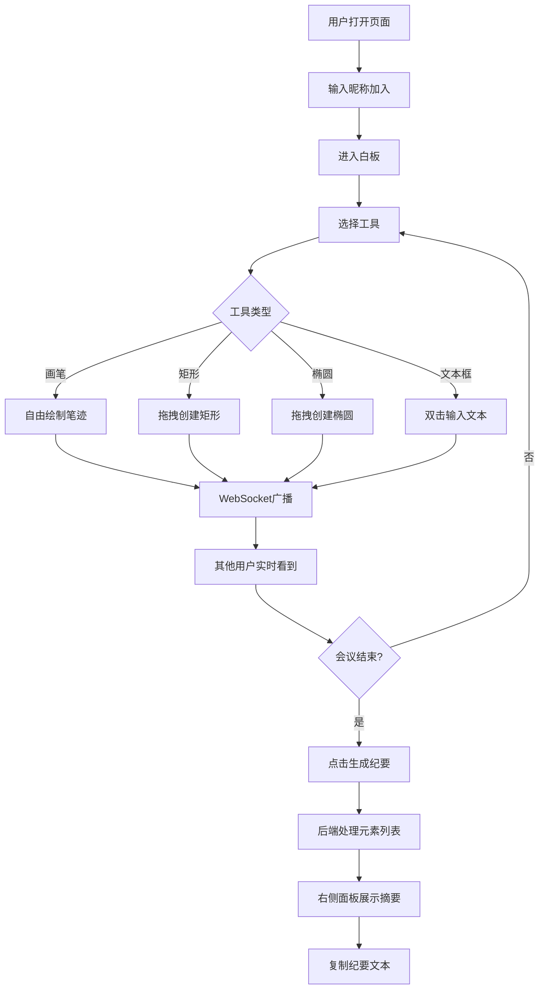

## 1. 产品概述

绘记白板——一款面向远程团队的在线协作电子白板应用，支持多人实时书写、绘制和贴便签，并可一键生成结构化会议纪要摘要。目标用户为需要远程协作的团队，核心价值在于将白板上的视觉内容自动转化为可复用的文本记录。

## 2. 核心功能

### 2.1 用户角色

| 角色 | 加入方式 | 核心权限 |
|------|----------|----------|
| 协作者 | 输入昵称自动加入 | 绘制、输入文本、查看他人内容、生成纪要 |

### 2.2 功能模块

1. **白板页面**：无限画布、工具栏、实时协作、纪要生成

### 2.3 页面详情

| 页面名称 | 模块名称 | 功能描述 |
|----------|----------|----------|
| 白板页面 | 左侧工具栏 | 画笔（3档粗细/8色预设）、矩形、椭圆、文本框工具切换，选中高亮 |
| 白板页面 | 中央画布 | 无限画布，微米白背景+5x5网格，元素淡入动画，支持50+元素60fps |
| 白板页面 | 顶部头像栏 | 显示所有在线用户圆形头像（48px，首字白色，8色背景分配） |
| 白板页面 | 右上纪要按钮 | 点击调用后端生成会议纪要 |
| 白板页面 | 右侧纪要面板 | 毛玻璃效果滑出面板，展示纪要文本，支持复制 |
| 白板页面 | 网络状态条 | 断开时红色警告"连接已断开，正在重试"，恢复后自动同步 |

## 3. 核心流程

用户打开页面→输入昵称→进入白板→选择工具（画笔/矩形/椭圆/文本）→在画布上绘制→内容实时同步给其他用户→会议结束点击"生成纪要"→右侧面板展示摘要→复制纪要文本

## 4. 用户界面设计

### 4.1 设计风格

- 主色调：微米白(#f5f0e8)画布背景，工具栏白色底
- 辅助色：8色预设（红#ff4d4d、蓝#4da6ff、绿#4dff4d、黄#ffcc4d、紫#b366ff、橙#ff9933、粉#ff66b2、黑#333）
- 按钮风格：扁平圆角8px，hover上移2px+颜色加深
- 字体：16px深灰#444用于文本框内容，系统字体用于UI
- 布局：左侧固定工具栏 + 中央画布 + 右侧可收起面板
- 选中工具高亮：蓝色描边2px，底色#e6f0ff

### 4.2 页面设计概览

| 页面名称 | 模块名称 | UI元素 |
|----------|----------|--------|
| 白板页面 | 左侧工具栏 | 垂直排列图标按钮，选中态蓝色描边+淡蓝底色，hover上移2px |
| 白板页面 | 中央画布 | 微米白背景+5x5淡色网格，元素0.2s淡入动画 |
| 白板页面 | 顶部头像栏 | 水平排列48px圆形头像，白色首字，彩色背景 |
| 白板页面 | 右上纪要按钮 | 圆角8px按钮，主色调 |
| 白板页面 | 右侧纪要面板 | 毛玻璃效果(#ffffffcc, blur 12px)，滑出动画，复制按钮 |
| 白板页面 | 网络断开警告 | 红色横条，显示"连接已断开，正在重试" |

### 4.3 响应式设计

- 桌面端（≥1024px）：全屏显示，工具栏展开，面板正常显示
- 平板端（768px~1024px）：工具栏保持，面板可收起
- 移动端（<768px）：侧栏自动收起为图标按钮，面板覆盖显示

### 4.4 动效设计

- 元素添加：0.2秒opacity淡入(0→1)
- 工具切换：选中高亮动画
- 纪要面板：右侧滑出动画
- 按钮：hover上移2px + 颜色加深
- 网络断开/恢复：警告条滑入/滑出
