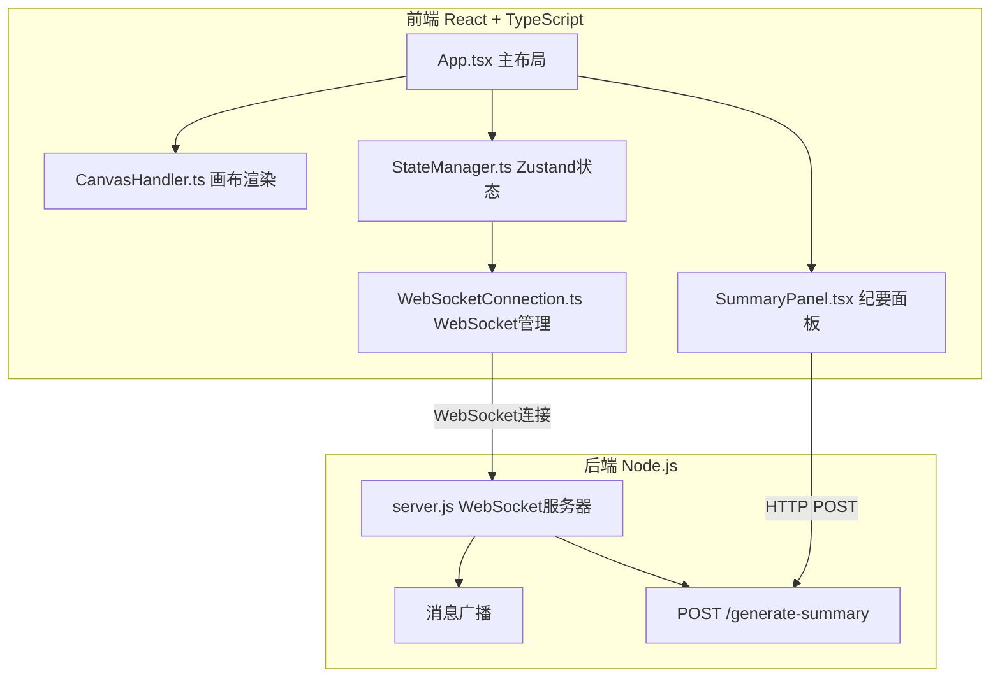
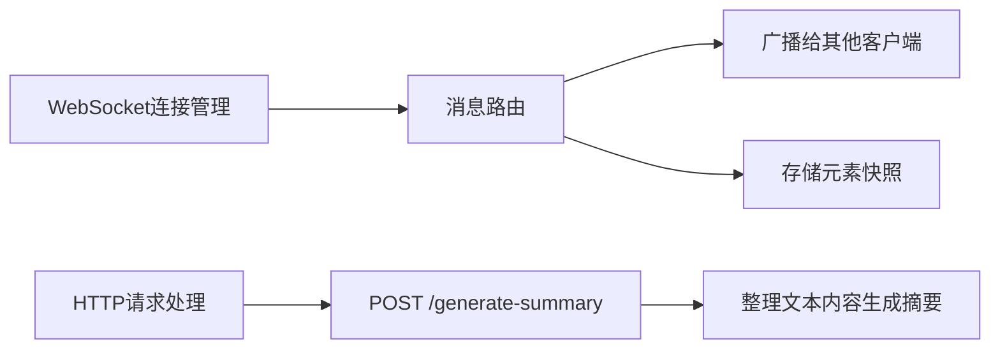
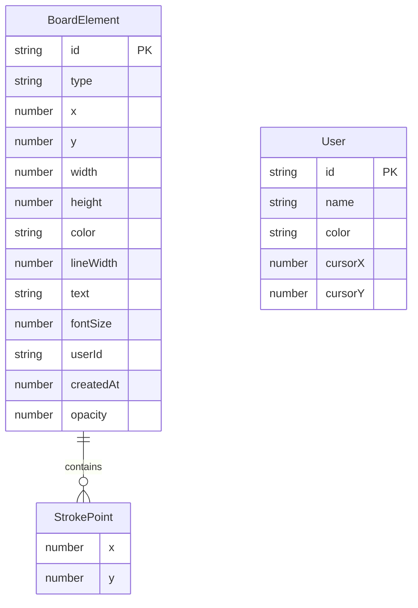

## 1. 架构设计



## 2. 技术说明

- 前端：React@18 + TypeScript + Vite + Zustand
- 初始化工具：vite-init (react-ts模板)
- 后端：Node.js + ws库（WebSocket服务器）+ http模块（REST API）
- 数据库：无（内存存储，元素列表在客户端和服务器间同步）
- 实时通信：WebSocket（ws库）

## 3. 路由定义

| 路由 | 用途 |
|------|------|
| / | 白板主页面（单页应用） |

## 4. API定义

### 4.1 WebSocket消息类型

```typescript
type MessageType = 'add' | 'update' | 'delete' | 'cursor';

interface WSMessage {
  type: MessageType;
  element?: BoardElement;
  elements?: BoardElement[];
  cursor?: { x: number; y: number };
  userId: string;
}

interface BoardElement {
  id: string;
  type: 'stroke' | 'rect' | 'ellipse' | 'text';
  x: number;
  y: number;
  width?: number;
  height?: number;
  points?: { x: number; y: number }[];
  color: string;
  lineWidth?: number;
  text?: string;
  fontSize?: number;
  userId: string;
  createdAt: number;
  opacity?: number;
}
```

### 4.2 REST API

```
POST /generate-summary
请求体: { elements: BoardElement[] }
响应体: { summary: string }
```

## 5. 服务器架构图



## 6. 数据模型

### 6.1 数据模型定义



### 6.2 文件结构

```
├── package.json
├── index.html
├── tsconfig.json
├── vite.config.js
├── server.js
├── src/
│   ├── App.tsx
│   ├── CanvasHandler.ts
│   ├── StateManager.ts
│   ├── WebSocketConnection.ts
│   └── SummaryPanel.tsx
```
