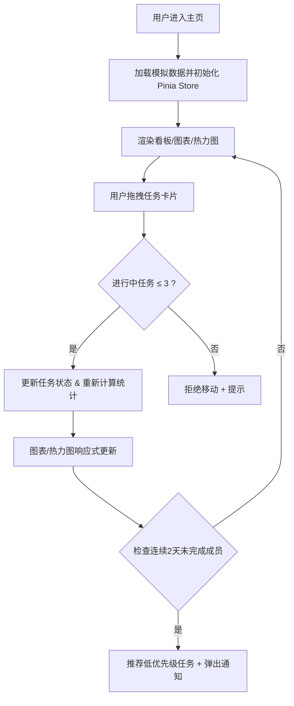

## 1. 产品概述
TeamPulse 是一款面向敏捷开发团队的短期协作效率记录与分析工具，解决团队在开发过程中无法实时跟踪个人任务完成度与整体产能的痛点。通过可视化看板、效率仪表盘和团队热力图，帮助团队管理者及时发现瓶颈、优化资源分配。

- 目标用户：Scrum Master、技术主管、项目经理、敏捷开发团队成员
- 核心价值：实时可视化团队工作状态，量化个体产出，识别协作瓶颈

## 2. 核心功能

### 2.1 功能模块
1. **任务看板**：三列看板（待办/进行中/已完成），支持任务卡片拖拽移动、编辑、创建
2. **效率仪表盘**：双轴图表展示每日完成任务数（柱状图）与工时偏差率（折线图），支持图例交互
3. **团队热力图**：按天展示每位成员的任务切换频率与在办任务数，绿到红渐变，支持月份平滑切换
4. **任务推荐系统**：连续两天未完成任务自动推荐低优先级待办，并弹出非阻塞通知

### 2.2 页面详情
| 页面名称 | 模块名称 | 功能描述 |
|---------|---------|---------|
| 主界面 | 顶部导航栏 | 应用标题、成员筛选、月份切换 |
| 主界面 | 任务看板区 | 三列拖拽看板、任务卡片创建/编辑、单人最多3个进行中任务校验 |
| 主界面 | 效率仪表盘 | ECharts 双轴图（柱状+折线）、可点击图例切换系列显隐 |
| 主界面 | 团队热力图 | Canvas 渲染热力网格、300ms 月份切换动画、悬停查看详情 |
| 主界面 | 通知区域 | 非阻塞式通知条、淡入淡出效果、5秒自动消失 |

## 3. 核心流程

## 4. 用户界面设计

### 4.1 设计风格
- **主色调**：深蓝 #1a1a2e、深紫 #16213e 作为背景渐变
- **强调色**：金橙 #e94560 用于按钮、选中态、数据高亮
- **字体**：使用 Space Grotesk 作为标题字体，JetBrains Mono 作为数值字体，Noto Sans SC 作为正文字体
- **卡片风格**：圆角 12px、柔和阴影 box-shadow: 0 4px 20px rgba(0,0,0,0.3)、微缩放悬浮效果 scale(1.02) 200ms ease
- **热力图**：颜色从 #22c55e（绿/低负荷）→ #f59e0b（黄/中负荷）→ #ef4444（红/高负荷）平滑渐变

### 4.2 页面设计概述
| 页面名称 | 模块名称 | UI 元素 |
|---------|---------|---------|
| 主界面 | 看板列 | 深色背景、标题栏、卡片容器、dropzone 高亮提示 |
| 主界面 | 任务卡片 | 优先级标签、标题、描述截断、负责人头像、预估工时徽章 |
| 主界面 | 图表容器 | ECharts canvas、下方图例按钮组（点击切换透明度 1↔0.3） |
| 主界面 | 热力网格 | 列=日期、行=成员、单元格hover高亮、tooltip 详情 |
| 主界面 | 通知条 | 右上角悬浮、背景半透明、淡入 300ms、5秒后淡出 300ms |

### 4.3 响应式设计
- **桌面端（>1024px）**：看板三列并排布局，图表容器 600px 宽
- **平板/移动端（≤1024px）**：看板单列堆叠，图表自适应容器宽度并保持纵横比 16:9，热力图支持横向滚动
- **触摸优化**：拖拽区域增大至 44px 最小触控目标

## 5. 性能指标
- 仪表盘 100 数据点渲染 ≤ 100ms，1000 数据点 ≤ 200ms
- 任务拖拽响应延迟 ≤ 50ms（使用 HTML5 Drag API + requestAnimationFrame）
- 页面初始加载 ≤ 2s（Vite 构建优化、按需 ECharts 引入）
- 热力图月份切换 CSS 过渡 300ms 平滑动画
