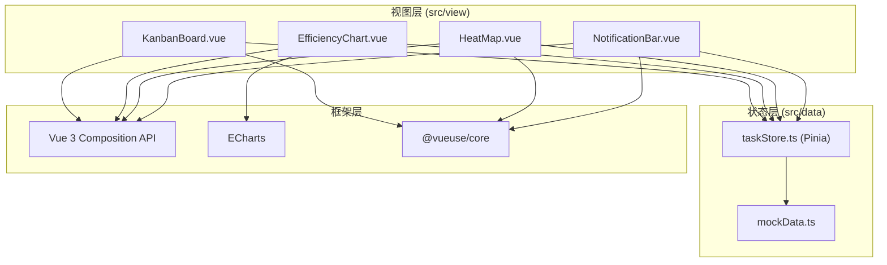
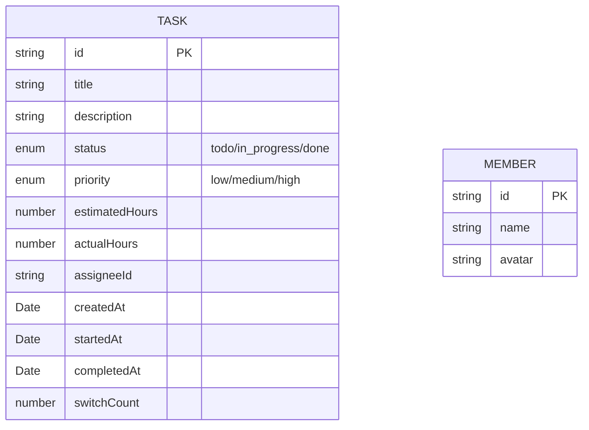

## 1. 架构设计



## 2. 技术栈说明
- **前端框架**：Vue@3 + TypeScript（严格模式）+ Vite
- **状态管理**：Pinia（集中管理任务 CRUD、统计计算、热力图数据）
- **图表库**：echarts（按需引入 Bar + Line 系列组件）
- **工具库**：@vueuse/core（useDraggable、useTimeoutFn、useResizeObserver）
- **构建工具**：Vite + ESBuild target esnext，路径别名 @ → src

## 3. 模块定义

| 模块路径 | 职责 |
|---------|------|
| `src/data/mockData.ts` | 生成 100 条初始任务，5 位成员 × 7 天时间跨度，随机状态/优先级/工时 |
| `src/data/taskStore.ts` | Pinia Store：tasks 数组、CRUD 方法、效率统计（日维度）、热力图数据、推荐逻辑 |
| `src/view/KanbanBoard.vue` | 三列看板、HTML5 拖拽 API、卡片内联编辑、进行中数量校验 |
| `src/view/EfficiencyChart.vue` | ECharts 封装：双轴图（柱+线）、图例点击切换、ResizeObserver 自适应 |
| `src/view/HeatMap.vue` | HTML5 Canvas 热力网格、300ms CSS 过渡动画、悬停 Tooltip |
| `src/view/NotificationBar.vue` | Teleport 至 body、淡入淡出、5s 自动消失、非阻塞点击穿透 |

## 4. 数据模型



### TypeScript 类型定义
```typescript
type TaskStatus = 'todo' | 'in_progress' | 'done'
type TaskPriority = 'low' | 'medium' | 'high'

interface Task {
  id: string
  title: string
  description: string
  status: TaskStatus
  priority: TaskPriority
  estimatedHours: number
  actualHours: number
  assigneeId: string
  createdAt: Date
  startedAt?: Date
  completedAt?: Date
  switchCount: number
}

interface TeamMember {
  id: string
  name: string
  avatar: string
}

interface DailyStats {
  date: string
  completedCount: number
  hoursDeviation: number
  activeMinutes: number
}

interface HeatMapCell {
  memberId: string
  date: string
  switchCount: number
  inProgressCount: number
  loadLevel: 1 | 2 | 3
}
```

## 5. 性能优化策略
- **ECharts 按需引入**：仅引入 BarChart、LineChart、GridComponent、TooltipComponent、LegendComponent
- **拖拽性能**：使用原生 HTML5 Drag and Drop API，避免频繁 setState，在 `dragend` 事件统一提交
- **Canvas 渲染**：热力图使用 Canvas 2D 直接绘制，1000+ 单元格仍保持 60fps
- **响应式优化**：使用 `computed` 缓存统计结果，`watch` 带 `{ flush: 'post' }` 批量更新图表
- **路径别名**：`@/*` 映射至 `src/*`，减少相对路径层级
