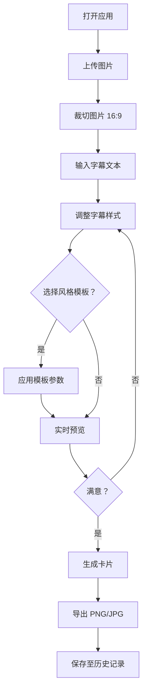

## 1. 产品概述

电影台词卡片生成器——一款面向电影爱好者的在线工具，让用户上传截图后快速创建带电影风格字幕的分享卡片。解决手动从视频中截取、裁剪、加字幕的繁琐流程，实现一键生成高质量电影台词卡片。

- 目标用户：热衷于收集和分享电影台词截图的影迷群体
- 核心价值：将耗时数分钟的手动截图-裁剪-加字幕流程压缩至数秒内完成

## 2. 核心功能

### 2.1 用户角色

| 角色 | 注册方式 | 核心权限 |
|------|----------|----------|
| 普通用户 | 无需注册 | 上传图片、编辑字幕、生成卡片、查看历史 |

### 2.2 功能模块

1. **主编辑页**：图片上传与剪裁、字幕编辑、风格模板选择、实时预览、卡片导出、历史记录

### 2.3 页面详情

| 页面名称 | 模块名称 | 功能描述 |
|----------|----------|----------|
| 主编辑页 | 图片上传与剪裁 | 支持上传JPG/PNG（最大4MB），16:9比例锁定裁切，实时预览裁切结果 |
| 主编辑页 | 字幕编辑 | 文本输入（最多60字）、字体选择（5种）、字号（16-40px）、颜色（20种电影配色）、阴影（4级）、对齐（3种） |
| 主编辑页 | 风格模板 | 5种经典电影字幕模板，切换时所有参数自动更新，0.3秒淡入过渡动画 |
| 主编辑页 | 卡片导出 | 合并原图+字幕为PNG/JPG，分辨率≥1920x1080，非阻塞UI |
| 主编辑页 | 历史记录 | IndexedDB自动保存导出卡片，网格缩略图展示，点击重新加载编辑，最多50条 |

## 3. 核心流程

用户打开应用 → 上传图片 → 裁切图片（16:9） → 输入字幕文本 → 选择/调整字幕样式 → 可选：选择风格模板一键设置 → 实时预览效果 → 点击生成卡片 → 导出PNG/JPG → 自动保存至历史记录

## 4. 用户界面设计

### 4.1 设计风格

- 主色调：背景 #1a1a2e，主色 #e94560，辅色 #0f3460（深色电影主题）
- 按钮风格：圆角8px，悬停时颜色渐变+translateY(-2px)上浮，点击涟漪波纹扩散特效
- 字体：UI字体使用系统无衬线体，字幕字体提供黑体/宋体/楷体/Arial/Georgia
- 布局：左右两栏（40%/60%），移动端上下布局
- 卡片面板：圆角12px，内阴影微凹质感

### 4.2 页面设计概览

| 页面名称 | 模块名称 | UI元素 |
|----------|----------|--------|
| 主编辑页 | 左侧编辑区 | 卡片式面板（圆角12px、内阴影）、图片上传区、裁切画布、字幕输入框、字体/字号/颜色/阴影/对齐控件、模板选择器、生成按钮 |
| 主编辑页 | 右侧预览区 | 实时预览画布（图片+字幕叠加）、导出格式切换、历史记录网格 |

### 4.3 响应式设计

- 桌面端（≥768px）：左右两栏布局，编辑区40%，预览区60%
- 移动端（<768px）：上下布局，编辑区在上，预览区在下，宽度均为100%，工具栏按钮最小触摸目标48px

### 4.4 动效设计

- 模板切换：编辑区参数控件0.3秒高度折叠动画+淡入过渡
- 按钮悬停：颜色渐变+translateY(-2px)
- 按钮点击：涟漪波纹扩散特效
- 字幕预览：延迟≤100ms实时跟随参数变化
- 裁切预览：≥30FPS更新频率
