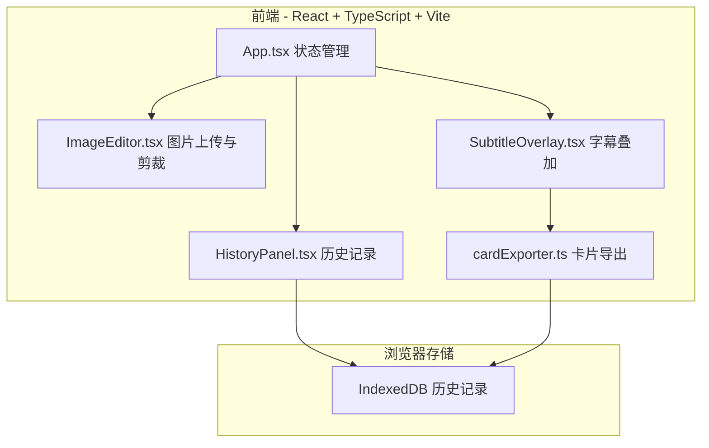
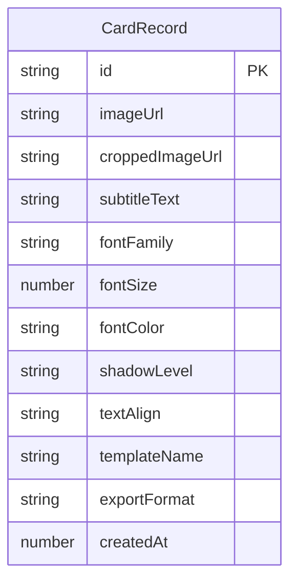
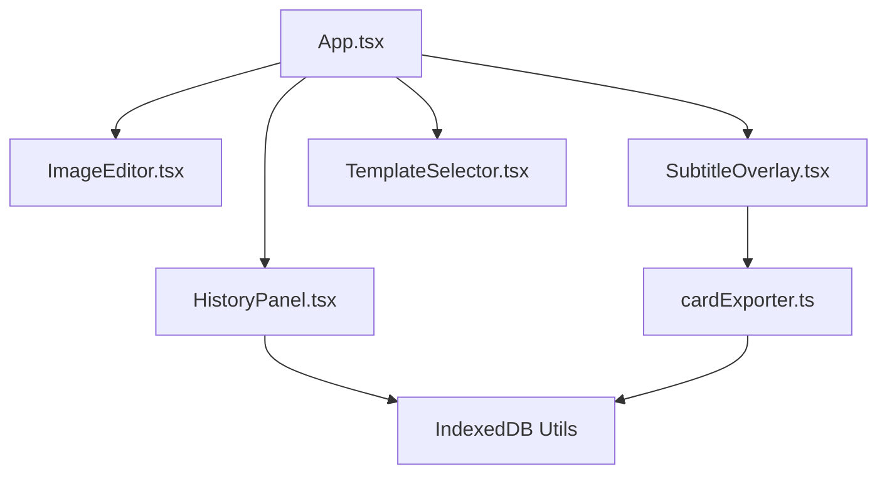

## 1. 架构设计



## 2. 技术说明

- 前端框架：React 18 + TypeScript + Vite
- 初始化工具：vite-init（react-ts 模板）
- 样式方案：Tailwind CSS 3 + CSS Modules（局部样式覆盖）
- 状态管理：Zustand
- 数据库：浏览器 IndexedDB（存储历史卡片记录）
- 无后端服务

## 3. 路由定义

| 路由 | 用途 |
|------|------|
| / | 主编辑页，包含所有功能模块 |

本项目为单页应用，无需多路由。

## 4. API 定义

无后端 API。所有数据操作均在浏览器端完成：

- IndexedDB 操作通过封装的工具函数完成
- 图片处理通过 Canvas API 完成
- 卡片导出通过 html2canvas + Canvas API 完成

## 5. 数据模型

### 5.1 数据模型定义



### 5.2 数据定义

```typescript
interface CardRecord {
  id: string;
  imageUrl: string;
  croppedImageUrl: string;
  subtitleText: string;
  fontFamily: string;
  fontSize: number;
  fontColor: string;
  shadowLevel: 'none' | 'light' | 'medium' | 'heavy';
  textAlign: 'left' | 'center' | 'right';
  templateName: string;
  exportFormat: 'png' | 'jpg';
  createdAt: number;
}

interface SubtitleStyle {
  fontFamily: string;
  fontSize: number;
  fontColor: string;
  shadowLevel: 'none' | 'light' | 'medium' | 'heavy';
  textAlign: 'left' | 'center' | 'right';
}

interface MovieTemplate {
  name: string;
  style: SubtitleStyle;
  label: string;
}
```

## 6. 组件架构



### 关键状态（Zustand Store）

```typescript
interface AppStore {
  imageUrl: string | null;
  croppedImageUrl: string | null;
  subtitleText: string;
  subtitleStyle: SubtitleStyle;
  activeTemplate: string | null;
  cropArea: { x: number; y: number; width: number; height: number } | null;
  history: CardRecord[];
  
  setImageUrl: (url: string | null) => void;
  setCroppedImageUrl: (url: string | null) => void;
  setSubtitleText: (text: string) => void;
  setSubtitleStyle: (style: Partial<SubtitleStyle>) => void;
  setActiveTemplate: (name: string | null) => void;
  setCropArea: (area: CropArea | null) => void;
  loadFromHistory: (record: CardRecord) => void;
}
```

## 7. 性能策略

- 图片裁切使用 requestAnimationFrame 确保 ≥30FPS
- 字幕样式更新使用防抖（debounce 50ms）确保 ≤100ms 延迟
- 卡片导出使用 Web Worker / OffscreenCanvas 避免阻塞 UI
- IndexedDB 操作异步非阻塞
- 历史记录最多50条，FIFO 淘汰策略
