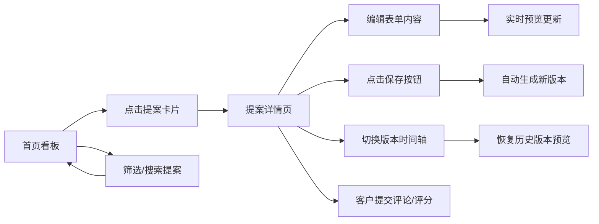

## 1. 产品概述

自由职业者项目提案与客户反馈管理系统，帮助自由职业者快速创建专业报价单，根据客户反馈迭代修改，并清晰追踪所有历史版本。

- **核心价值**：简化报价单创建流程，可视化版本迭代，提升客户沟通效率
- **目标用户**：自由职业者、独立设计师、开发顾问等需要频繁向客户提交报价的专业人士
- **市场定位**：轻量级、专注提案全生命周期管理的SaaS工具

## 2. 核心功能

### 2.1 用户角色

| 角色 | 注册方式 | 核心权限 |
|------|----------|----------|
| 自由职业者（主用户） | 系统内置 | 创建/编辑提案、管理版本、查看反馈 |
| 客户（只读） | 无需注册 | 查看提案、发表评论、星级评分 |

### 2.2 功能模块

1. **首页看板**：提案概览列表、状态/星级筛选、搜索功能
2. **提案详情页**：表单编辑区、实时预览卡、版本时间轴、客户评论区

### 2.3 页面详情

| 页面名称 | 模块名称 | 功能描述 |
|----------|----------|----------|
| 首页看板 | 顶部工具栏 | 状态筛选（草稿/已发送/已接受/已拒绝）、星级筛选、搜索框 |
| 首页看板 | 提案卡片网格 | 展示标题、状态标签、最后更新日期、平均星级，点击进入详情，淡入动画 |
| 提案详情页 | 编辑表单区 | 项目标题、描述、服务项增删改（名称/单价/数量/单位）、实时计算总金额 |
| 提案详情页 | 实时预览卡 | PDF风格布局（左公司信息/右客户信息/中服务表格），100ms内响应更新 |
| 提案详情页 | 版本时间轴 | 侧边栏时间轴展示所有历史版本，点击恢复预览，平滑翻转动画 |
| 提案详情页 | 客户反馈区 | 文字评论输入、1-5星评分、评论时间戳显示 |

## 3. 核心流程

主用户从首页看板浏览或搜索提案，点击进入详情页后在左侧表单编辑提案内容，右侧预览卡实时同步。保存修改自动生成新版本，版本可在时间轴中随时切换回溯。客户可在同一页面提交评论和星级评分。

## 4. 用户界面设计

### 4.1 设计风格

- **主色调**：白色背景 `#ffffff` + 深蓝色 `#1a237e`
- **辅助色**：浅蓝 `#3949ab`、中性灰 `#f5f5f5`、状态色（草稿灰/发送蓝/接受绿/拒绝红）
- **卡片风格**：圆角 `12px`，柔和阴影 `0 2px 12px rgba(26,35,126,0.08)`
- **按钮风格**：胶囊形状（`border-radius: 999px`），悬停时深蓝色到中蓝色渐变
- **字体方案**：`-apple-system, BlinkMacSystemFont, "Segoe UI", "PingFang SC", "Microsoft YaHei", sans-serif`
- **图标风格**：简约线性图标，统一 18px 尺寸

### 4.2 页面设计概览

| 页面名称 | 模块名称 | UI 元素 |
|----------|----------|---------|
| 首页看板 | 顶部导航栏 | 深蓝色背景、白色Logo文字、新建提案胶囊按钮 |
| 首页看板 | 工具栏 | 胶囊形筛选按钮组、搜索输入框、渐变悬停效果 |
| 首页看板 | 卡片网格 | 响应式 3/2/1 列、白色圆角卡片、淡入动画（stagger 50ms） |
| 提案详情页 | 左右分栏 | 大屏左表单右预览、移动端上下堆叠、间隙 24px |
| 提案详情页 | 输入控件 | 聚焦时边框高亮 + 轻微 `scale(1.01)` 缩放动画 |
| 提案详情页 | 预览卡 | A4比例白色卡片、仿PDF排版、翻页过渡动画 |
| 提案详情页 | 版本时间轴 | 左侧竖线、圆点节点、悬停高亮、点击选中 |

### 4.3 响应式设计

- **桌面端**（≥1024px）：左右分栏布局（表单 45% / 预览 55%），卡片网格 3 列
- **平板端**（768-1023px）：左右分栏（表单 50% / 预览 50%），卡片网格 2 列
- **移动端**（<768px）：上下堆叠布局，卡片网格 1 列，触控目标 ≥44px

### 4.4 动画与性能

- **筛选切换**：卡片逐条淡入（`opacity 0→1`, `translateY 8px→0`），间隔 50ms
- **版本切换**：预览卡 Y 轴 3D 翻转（`rotateY 90deg → 0deg`），0.4s 平滑过渡
- **输入聚焦**：`border-color` 过渡 + `transform: scale(1.01)`，0.2s
- **性能指标**：100条卡片首屏渲染 <1s，预览更新延迟 <100ms
