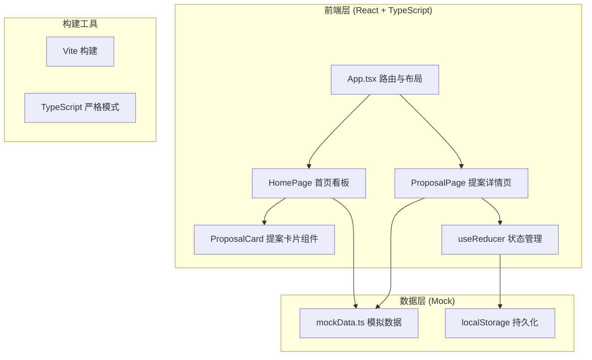
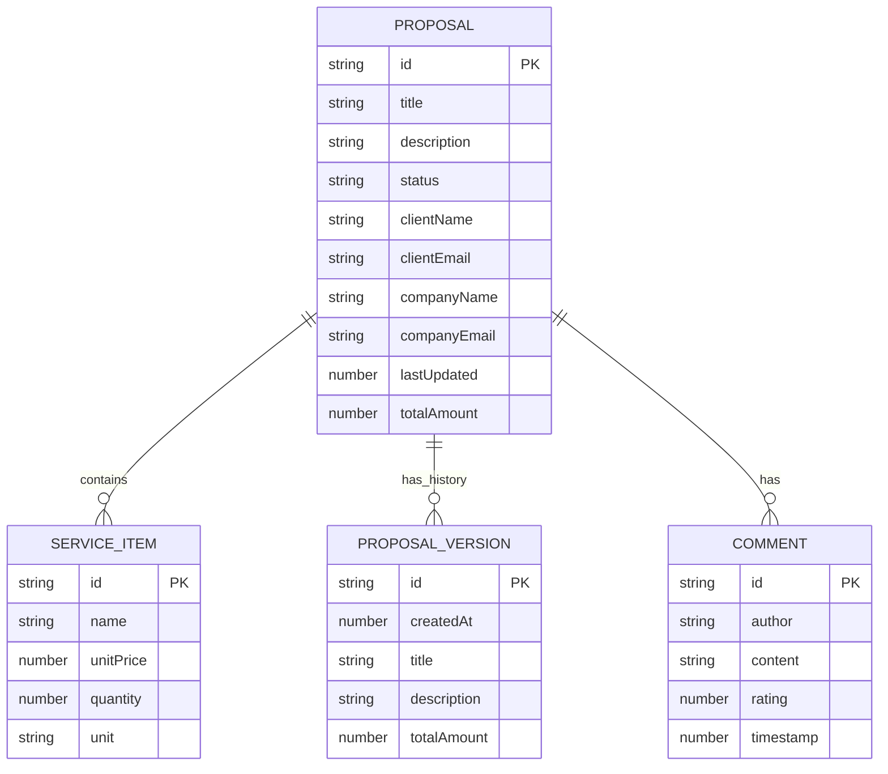

## 1. 架构设计



## 2. 技术栈说明

- **前端框架**：React 18 + TypeScript 5
- **构建工具**：Vite 5 + @vitejs/plugin-react
- **路由方案**：React Router DOM（或简单 hash 路由）
- **状态管理**：React useReducer（提案详情页）+ useState（首页）
- **数据存储**：轻量 JSON Mock 数据 + localStorage 持久化
- **样式方案**：CSS Modules / 内联样式 + CSS 变量
- **UI 图标**：lucide-react

## 3. 路由定义

| 路由 | 页面组件 | 功能说明 |
|------|----------|----------|
| `/` | `HomePage` | 首页看板，展示提案列表、筛选、搜索 |
| `/proposal/:id` | `ProposalPage` | 提案详情页，编辑/预览/版本/评论 |

## 4. 数据模型

### 4.1 核心类型定义

```typescript
type ProposalStatus = 'draft' | 'sent' | 'accepted' | 'rejected';

interface ServiceItem {
  id: string;
  name: string;
  unitPrice: number;
  quantity: number;
  unit: string;
}

interface Comment {
  id: string;
  author: string;
  content: string;
  rating: number; // 1-5
  timestamp: number;
}

interface ProposalVersion {
  id: string;
  title: string;
  description: string;
  services: ServiceItem[];
  totalAmount: number;
  createdAt: number;
}

interface Proposal {
  id: string;
  title: string;
  description: string;
  services: ServiceItem[];
  totalAmount: number;
  status: ProposalStatus;
  clientName: string;
  clientEmail: string;
  companyName: string;
  companyEmail: string;
  lastUpdated: number;
  versions: ProposalVersion[];
  comments: Comment[];
}
```

### 4.2 实体关系图



## 5. 文件结构

```
e:\solo\SoloAutoDemoDuo\tasks\auto12/
├── package.json
├── index.html
├── vite.config.js
├── tsconfig.json
└── src/
    ├── App.tsx
    ├── styles.css
    ├── components/
    │   └── ProposalCard.tsx
    ├── pages/
    │   ├── HomePage.tsx
    │   └── ProposalPage.tsx
    └── data/
        └── mockData.ts
```

## 6. 性能优化策略

- **虚拟列表**：提案列表使用 CSS `content-visibility` 优化离屏渲染
- **防抖优化**：预览更新无需防抖，直接受控渲染保证 <100ms 延迟
- **避免重渲染**：使用 `React.memo` 包裹 `ProposalCard` 等纯展示组件
- **CSS 硬件加速**：动画使用 `transform` 和 `opacity`，触发 GPU 合成
- **首屏数据**：Mock 数据直接同步加载，无异步网络延迟
