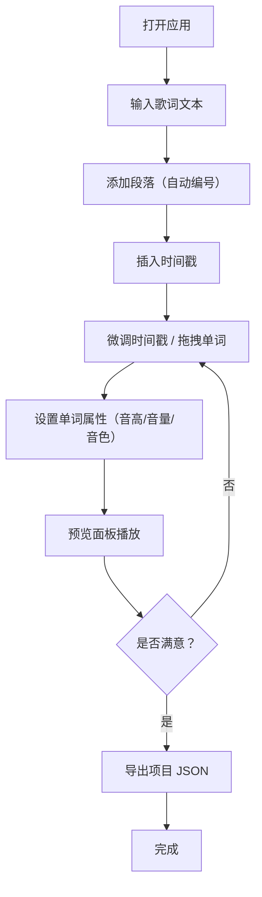

## 1. 产品概述

LyricForge 是一款面向音乐制作爱好者的浏览器端可视化歌词编辑与混音预览应用。用户可以在深色主题的编辑器中创建、编辑歌词时间轴，为每个单词设置音高、音量和音色属性，并通过 Web Audio API 实时预览不同风格的人声合成效果与波形可视化。

- 解决痛点：音乐制作爱好者缺乏轻量级、可视化的歌词时间轴编辑与实时合成预览工具
- 目标用户：独立音乐制作人、Vocaloid/Utauloid 爱好者、播客制作者、有声读物创作者

## 2. 核心功能

### 2.1 功能模块

1. **编辑器面板**：歌词文本输入、时间戳标注、段落分割、单词属性编辑（音高/音量/音色）
2. **预览面板**：波形可视化、播放控制、速度调节、游标拖拽跳转
3. **项目管理**：导入/导出 JSON 项目文件，支持覆盖和追加模式

### 2.2 页面详情

| 页面名称 | 模块名称 | 功能描述 |
|----------|----------|----------|
| 主页面 | 编辑器面板 | 多段歌词添加（自动编号）、暂停标记插入时间戳（[mm:ss.xxx]格式）、时间戳手动微调、微调后自动按比例重排其他单词时间；单词独立设置音高偏移（-12~+12半音）、音量增益（0~200%）；拖拽单词调整时间点 |
| 主页面 | 预览面板 | Canvas 波形图（渐变色 #0f3460→#e94560）+ 白色发光游标线；播放/暂停/重置按钮；速度滑块（0.5x-2x）；波形缩放（1x-10x）；游标拖拽跳转；实时显示当前播放位置 |
| 主页面 | 项目管理工具栏 | 导出项目为 JSON（含歌词、时间戳、单词属性、元数据）；导入 JSON 项目文件（覆盖/追加模式选择） |

## 3. 核心流程

用户打开应用 → 输入/粘贴歌词文本 → 点击暂停标记在当前位置插入时间戳 → 微调时间戳数值 → 为单词设置音高/音量/音色 → 点击预览播放 → 查看波形与游标 → 拖拽游标跳转 → 导出项目文件

## 4. 用户界面设计

### 4.1 设计风格

- **主色调**：深色主题，背景 #1a1a2e，文本 #e0e0ff，强调色 #6c63ff
- **按钮样式**：圆角矩形（border-radius: 8px），hover 变亮，点击缩小 0.95 倍弹回（transform 0.15s ease-out）
- **字体**：等宽字体（monospace）用于时间戳，颜色 #00d2ff；正文使用无衬线字体
- **布局风格**：左右分栏，编辑器 60% / 预览 40%；移动端上下堆叠
- **卡片效果**：每行歌词用玻璃效果卡片展示（backdrop-filter: blur(8px)），当前编辑行有 #6c63ff 高亮边框

### 4.2 页面设计概览

| 页面名称 | 模块名称 | UI 元素 |
|----------|----------|---------|
| 主页面 | 编辑器面板 | 深色背景 #1a1a2e，歌词行卡片（玻璃效果 + 12px 间距），时间戳等宽字体 #00d2ff，当前行 #6c63ff 高亮边框，单词属性面板（滑块/下拉） |
| 主页面 | 预览面板 | 背景 #16213e，Canvas 波形图（渐变 #0f3460→#e94560），白色发光游标线，播放/暂停/重置按钮，速度滑块，缩放滑块 |
| 主页面 | 工具栏 | 导入/导出按钮，项目元数据输入（标题/BPM/调号） |

### 4.3 响应式设计

- 桌面端（≥768px）：编辑器左侧 60%，预览右侧 40%，水平排列
- 移动端（<768px）：编辑器和预览上下堆叠，各占 100% 宽度
- 所有交互控件在移动端保持可用性，按钮点击区域适当增大

### 4.4 性能目标

- 拖拽单词时波形图每帧更新，响应时间 ≤16ms（60FPS）
- 合成引擎局部更新延迟 ≤50ms
- 多音色混合音频缓冲区 2048 帧
- 导入后界面渲染 ≤500ms
- 波形缩放刷新帧率 ≥30FPS
