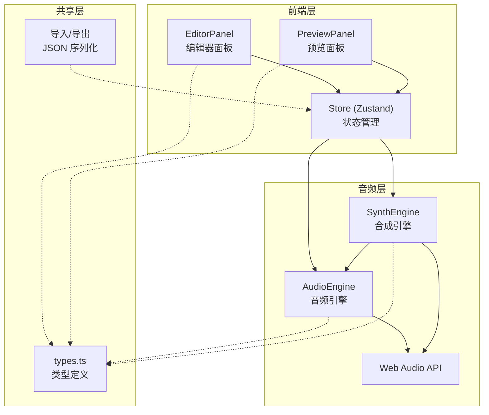

## 1. 架构设计



## 2. 技术说明

- **前端框架**：React 18 + TypeScript + Vite
- **状态管理**：Zustand（轻量级，适合音频状态共享）
- **音频处理**：Web Audio API（AudioContext, AudioBufferSourceNode, GainNode, OscillatorNode）
- **拖拽交互**：react-dnd（单词时间轴拖拽）
- **唯一标识**：uuid（单词/段落 ID 生成）
- **音频播放**：howler（可选辅助，主要用 Web Audio API）
- **样式方案**：CSS Modules + CSS 变量（深色主题）
- **无后端**：纯前端应用，数据存储在浏览器内存和 localStorage

## 3. 路由定义

| 路由 | 用途 |
|------|------|
| / | 主页面（编辑器 + 预览面板） |

本项目为单页应用，无需多路由。

## 4. 数据模型

### 4.1 核心类型定义

```typescript
interface ILyricWord {
  id: string;
  text: string;
  startTime: number;       // 毫秒
  duration: number;        // 毫秒
  pitchOffset: number;     // -12 到 +12 半音
  volumeGain: number;      // 0 到 2.0（0%-200%）
  synthPresetId: string;   // 音色预设ID
}

interface ILyricLine {
  id: string;
  lineNumber: number;      // 自动编号
  words: ILyricWord[];
}

interface IPlayState {
  isPlaying: boolean;
  currentTime: number;     // 当前播放位置（毫秒）
  duration: number;        // 音频总时长（毫秒）
  playbackRate: number;    // 0.5 到 2.0
}

interface ISynthPreset {
  id: string;
  name: string;            // 童声/机器人/饱满男声
  type: 'child' | 'robot' | 'baritone';
  baseFrequency: number;
  formants: number[];      // 共振峰频率
  gain: number;            // 基础增益
}

interface IProjectMetadata {
  title: string;
  bpm: number;
  key: string;             // 调号，如 C, Am
}

interface IProject {
  version: string;
  metadata: IProjectMetadata;
  lines: ILyricLine[];
  synthPresets: ISynthPreset[];
}
```

### 4.2 数据流

1. 用户在 EditorPanel 编辑歌词 → 更新 Zustand Store 中的 lines 数据
2. Store 变化触发 SynthEngine 重新合成受影响的单词音频片段
3. PreviewPanel 监听 Store 和 AudioEngine 状态，更新波形图和游标位置
4. AudioEngine 维护 AudioContext，控制播放/暂停/跳转/速度
5. 导出时序列化 Store 中完整项目数据为 JSON；导入时反序列化并写入 Store

## 5. 音频架构

### 5.1 AudioEngine

- 封装 AudioContext，管理播放状态
- 提供 loadAudio(url)、play()、pause()、seek(time)、setPlaybackRate(rate) 接口
- 返回 currentTime（毫秒精度）和 duration
- 通过 requestAnimationFrame 驱动播放位置更新事件

### 5.2 SynthEngine

- 基于 AudioEngine 的 AudioContext
- 预设3种音色：童声（高基频+共振峰）、机器人（方波+颤音）、饱满男声（低基频+丰富泛音）
- 接收歌词时间轴数据，为每个单词生成 AudioBuffer
- 局部更新：仅重新渲染属性变更的单词，延迟 ≤50ms
- 多音色混合：每个单词独立音色，播放时通过 GainNode 叠加，自动归一化总音量
- 缓冲区大小：2048 帧

### 5.3 波形渲染

- Canvas 2D 渲染，requestAnimationFrame 驱动
- 渐变色波形（#0f3460→#e94560）
- 白色游标线带发光阴影
- 缩放级别 1x-10x，动态刷新帧率 ≥30FPS
- 游标拖拽通过 mousedown/mousemove/mouseup 事件实现
