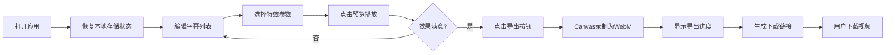

## 1. 产品概述

字幕特效工坊是一款面向短视频创作者的在线工具，帮助用户将日常拍摄的vlog片段快速转换为具有电影级字幕特效的社交媒体卡片。解决了现有工具缺乏中文字幕支持、特效不够丰富的痛点。

- 核心目标：让普通创作者无需专业视频编辑技能，即可制作出具有电影感的字幕特效视频
- 目标用户：短视频创作者、vlog博主、社交媒体内容创作者
- 市场价值：填补中文短视频字幕特效工具的空白，降低创作门槛

## 2. 核心功能

### 2.1 用户角色
| 角色 | 注册方式 | 核心权限 |
|------|----------|----------|
| 普通用户 | 无需注册，直接使用 | 字幕编辑、特效选择、实时预览、导出下载 |

### 2.2 功能模块
1. **字幕编辑模块**：字幕列表管理、添加/删除/拖拽排序、编辑文字/时间戳/样式
2. **特效控制模块**：入场/出场特效选择、动画时长配置、特效参数调整
3. **实时预览模块**：Canvas画布播放、进度条同步、暂停/继续控制
4. **导出下载模块**：WebM格式录制、导出进度显示、下载链接生成
5. **配置持久化模块**：localStorage自动保存、页面刷新状态恢复

### 2.3 页面详情
| 页面名称 | 模块名称 | 功能描述 |
|-----------|-------------|---------------------|
| 主工作区 | 字幕编辑器 | 展示字幕列表卡片，支持添加、删除、拖拽排序，编辑每条字幕的文字、出现时间、持续时长、字体大小和颜色 |
| 主工作区 | 特效控制面板 | 入场/出场特效下拉选择（各3种）、动画时长滑块（0.5-3秒）、预览按钮 |
| 主工作区 | 预览画布区 | 16:9比例Canvas画布、播放进度条、暂停/继续按钮 |
| 主工作区 | 导出控制区 | 导出按钮、导出进度显示、下载链接 |

## 3. 核心流程

用户打开应用 → 恢复上次编辑状态（从localStorage）→ 添加/编辑字幕内容和时间 → 为每条字幕选择入场和出场特效 → 调整动画时长 → 点击预览播放效果 → 暂停/继续调整 → 满意后点击导出 → 等待录制完成 → 下载WebM视频

## 4. 用户界面设计

### 4.1 设计风格
- **主题色调**：深色主题，背景#1a1a2e，主色调#e94560，辅助色#0f3460
- **按钮样式**：圆角按钮，悬停高亮，点击有按下效果（transform: scale(0.95)），过渡动画0.3秒
- **字体**：使用现代无衬线字体，标题粗体，正文常规
- **布局风格**：左右两栏布局，左栏380px宽（编辑控制区），右栏自适应（预览区）
- **卡片样式**：半透明背景（rgba(255,255,255,0.05)），悬停背景变亮，圆角8px

### 4.2 页面设计概述
| 页面名称 | 模块名称 | UI元素 |
|-----------|-------------|-------------|
| 主工作区 | 字幕编辑器 | 卡片列表、拖拽手柄、输入框（文字/时间/字体大小）、颜色选择器、删除按钮、添加按钮 |
| 主工作区 | 特效控制面板 | 自定义下拉菜单（入场/出场特效）、范围滑块（动画时长）、主色调按钮（预览/导出） |
| 主工作区 | 预览画布区 | 16:9 Canvas（1px描边#333）、进度条（主色调填充）、播放控制按钮 |
| 主工作区 | 导出控制区 | 禁用状态按钮、旋转加载动画、进度百分比、下载链接 |

### 4.3 响应式
- 桌面端（≥900px）：左右两栏布局，左栏固定380px，右栏自适应
- 移动端（<900px）：上下布局，编辑区在上，预览区在下
- 所有交互元素支持触摸操作
- 画布尺寸根据屏幕宽度自适应缩放

### 4.4 交互细节
- 所有过渡效果使用transition-duration: 0.3s
- 按钮点击有按下效果transform: scale(0.95)
- 字幕卡片拖拽时有半透明效果
- 下拉菜单展开/收起有平滑过渡
- 进度条动画使用线性缓动
- 导出按钮禁用时显示旋转加载动画
