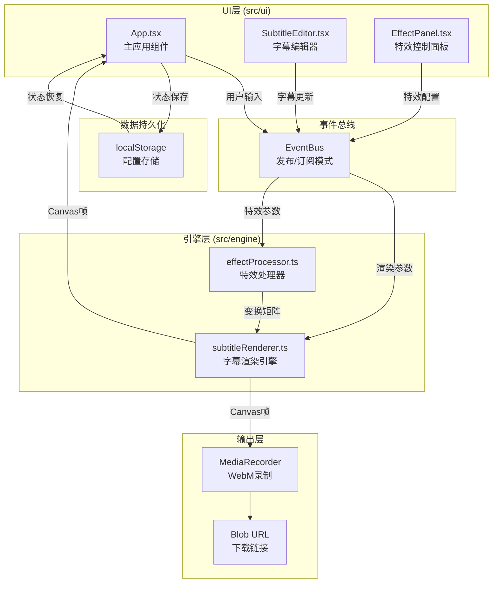

## 1. 架构设计



## 2. 技术描述

- **前端框架**: React 18 + TypeScript 5
- **构建工具**: Vite 5
- **渲染技术**: HTML5 Canvas API + OffscreenCanvas
- **视频录制**: MediaRecorder API (WebM格式)
- **状态管理**: 事件总线（发布/订阅模式）+ React useState
- **数据持久化**: localStorage API
- **样式方案**: 原生CSS + CSS变量 + CSS Modules（可选）
- **拖拽实现**: HTML5 Drag and Drop API

### 项目依赖
```json
{
  "react": "^18.2.0",
  "react-dom": "^18.2.0",
  "typescript": "^5.3.0",
  "vite": "^5.0.0",
  "@vitejs/plugin-react": "^4.2.0"
}
```

### 目录结构
```
├── index.html                 # 入口页面
├── package.json              # 项目配置
├── vite.config.js            # Vite配置
├── tsconfig.json             # TypeScript配置
└── src/
    ├── ui/
    │   ├── App.tsx           # 主应用组件
    │   ├── SubtitleEditor.tsx # 字幕编辑器
    │   └── EffectPanel.tsx   # 特效控制面板
    ├── engine/
    │   ├── subtitleRenderer.ts # 字幕渲染引擎
    │   └── effectProcessor.ts  # 特效处理器
    ├── types/
    │   └── index.ts          # 类型定义
    ├── utils/
    │   └── eventBus.ts       # 事件总线
    └── main.tsx              # 应用入口
```

## 3. 类型定义

```typescript
// 字幕数据结构
interface Subtitle {
  id: string;
  text: string;
  startTime: number;      // 出现时间（秒）
  duration: number;       // 持续时长（秒）
  fontSize: number;       // 字体大小（px）
  color: string;          // 字体颜色
  inEffect: EffectType;   // 入场特效
  outEffect: EffectType;  // 出场特效
}

// 特效类型
type EffectType = 'fadeIn' | 'slideUp' | 'scaleIn' | 'fadeOut' | 'slideUpOut' | 'scaleOut';

// 特效配置
interface EffectConfig {
  animationDuration: number;  // 动画时长（秒）0.5-3
}

// 变换矩阵
interface TransformMatrix {
  opacity: number;
  translateX: number;
  translateY: number;
  scaleX: number;
  scaleY: number;
}

// 渲染状态
interface RenderState {
  isPlaying: boolean;
  currentTime: number;
  totalDuration: number;
  progress: number;
}

// 导出状态
interface ExportState {
  isExporting: boolean;
  progress: number;
  downloadUrl: string | null;
}

// 事件类型
type EventType = 
  | 'subtitle:add'
  | 'subtitle:update'
  | 'subtitle:delete'
  | 'subtitle:reorder'
  | 'effect:update'
  | 'player:play'
  | 'player:pause'
  | 'player:seek'
  | 'export:start'
  | 'export:progress'
  | 'export:complete';
```

## 4. 核心模块说明

### 4.1 事件总线 (eventBus.ts)
- 采用发布-订阅模式
- 提供 on/off/emit 方法
- 支持事件类型安全
- UI层和引擎层通过事件总线解耦

### 4.2 特效处理器 (effectProcessor.ts)
- 计算每帧的变换矩阵
- 支持6种特效：淡入、从底部滑入、缩放出现、淡出、向顶部滑出、缩小消失
- 支持特效叠加（入场+出场）
- 动画时长可配置（0.5-3秒）
- 缓动函数：easeOutCubic（入场）、easeInCubic（出场）

### 4.3 字幕渲染引擎 (subtitleRenderer.ts)
- 使用 Canvas 2D API
- 离屏Canvas预渲染提升性能
- 逐帧渲染字幕和特效
- 支持60FPS渲染
- 提供 start/stop/pause/seek 控制方法
- 导出时通过 MediaRecorder 录制为 WebM

### 4.4 字幕编辑器 (SubtitleEditor.tsx)
- 字幕列表渲染（卡片样式）
- 添加/删除字幕
- HTML5拖拽排序
- 内联编辑：文字、时间戳、字体大小、颜色
- 实时状态同步

### 4.5 特效控制面板 (EffectPanel.tsx)
- 入场/出场特效下拉选择
- 动画时长滑块
- 预览/导出按钮
- 实时特效预览

### 4.6 主应用组件 (App.tsx)
- 整体布局（左右/上下响应式）
- 状态管理（字幕、特效、播放、导出）
- localStorage 持久化
- Canvas 渲染控制
- 事件总线协调

## 5. 性能优化策略

### 5.1 渲染性能
- 使用 requestAnimationFrame 进行帧同步
- 离屏Canvas预渲染静态元素
- 仅在需要时重绘（脏矩形优化）
- 字幕对象池复用

### 5.2 交互响应
- UI操作响应时间 < 100ms
- 拖拽操作使用 CSS transform 提升性能
- 滑块输入使用节流（throttle）优化

### 5.3 帧率保证
- 目标帧率 ≥ 30FPS
- 复杂特效降级处理
- 大字幕数量时分批处理

## 6. 数据流

### 6.1 字幕编辑数据流
用户操作 → SubtitleEditor → 更新本地状态 → 事件总线发布 → App.tsx → 持久化到localStorage

### 6.2 特效配置数据流
用户选择 → EffectPanel → 更新本地状态 → 事件总线发布 → effectProcessor → 计算变换矩阵 → subtitleRenderer

### 6.3 渲染播放数据流
点击预览 → App.tsx → subtitleRenderer.start() → effectProcessor.getFrameTransform() → Canvas 绘制 → 进度更新

### 6.4 导出数据流
点击导出 → subtitleRenderer.startExport() → MediaRecorder 录制每一帧 → 进度回调 → Blob生成 → download URL
