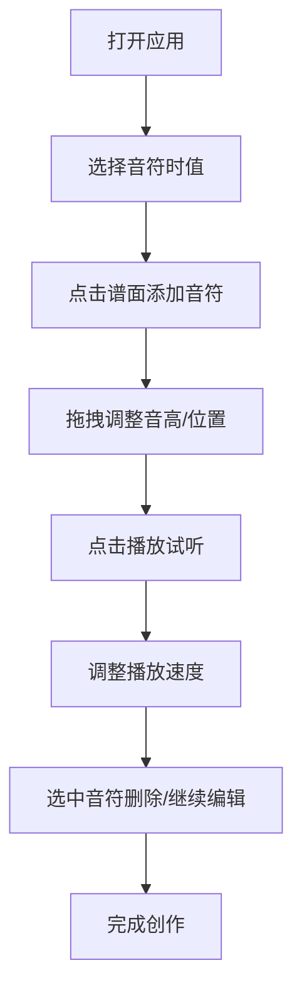

## 1. 产品概述

在线乐谱编辑器是一款基于Web的音乐创作工具，让用户通过可视化界面创建、编辑和播放简单的五线谱旋律。产品面向音乐爱好者、学生和初学者，提供直观的乐谱编辑体验。

- 主要用途：快速创作和编辑简单旋律，即时试听效果
- 目标用户：音乐爱好者、学生、音乐教师
- 市场价值：降低音乐创作门槛，提供零成本的乐谱编辑和试听工具

## 2. 核心功能

### 2.1 用户角色

| 角色 | 注册方式 | 核心权限 |
|------|----------|----------|
| 普通用户 | 无需注册 | 创建、编辑、删除音符，播放乐谱，调整播放速度 |

### 2.2 功能模块

1. **乐谱编辑区**：Canvas绘制的五线谱界面，支持可视化编辑
2. **音符调色板**：四种时值音符选择（全音符、二分音符、四分音符、八分音符）
3. **播放控制面板**：播放/暂停、速度调节、进度显示
4. **音频引擎**：Web Audio API实现的音符播放引擎

### 2.3 页面详情

| 页面名称 | 模块名称 | 功能描述 |
|----------|----------|----------|
| 主页面 | 五线谱编辑区 | 绘制高音谱号五线谱，4小节线，支持点击/拖拽添加音符，拖拽调整音高和位置 |
| 主页面 | 音符调色板 | 右侧面板显示四种时值音符，点击选中后可在谱面添加 |
| 主页面 | 播放控制 | 播放/暂停按钮，速度选择（0.5x/1x/1.5x/2x），当前位置指示 |
| 主页面 | 播放进度 | 垂直红线标记当前播放位置，当前音符高亮显示 |

## 3. 核心流程

用户打开应用 → 在音符调色板选择时值 → 点击五线谱添加音符 → 拖拽调整音符位置/音高 → 点击播放按钮试听 → 调整播放速度 → 选中音符按Delete删除 → 完成创作

## 4. 用户界面设计

### 4.1 设计风格

- **主色调**：背景 #1a1a2e（深靛蓝），五线谱线条 #e94560（玫红），音符 #0f3460（深蓝），高亮音符 #e94560（玫红）
- **按钮样式**：圆角卡片效果，border-radius: 12px，box-shadow: 0 4px 15px rgba(0,0,0,0.3)
- **字体**：使用现代无衬线字体，标题清晰，辅助文字易读
- **布局风格**：左侧80%为乐谱编辑区，右侧20%为控制面板，卡片式设计
- **动画效果**：音符创建/删除0.2s平滑过渡，进度线使用requestAnimationFrame实现60FPS流畅动画

### 4.2 页面设计概述

| 页面名称 | 模块名称 | UI元素 |
|----------|----------|--------|
| 主页面 | 乐谱编辑区 | Canvas画布，五线谱，高音谱号，小节线，音符，播放进度线，音高提示 |
| 主页面 | 音符调色板 | 四种音符图标，选中状态高亮，hover效果 |
| 主页面 | 播放控制 | 播放/暂停按钮，速度选择下拉，状态显示 |
| 主页面 | 整体布局 | 深色背景，卡片式面板，圆角设计，微妙阴影 |

### 4.3 响应式设计

- **桌面端**（1024px以上）：四边留20px padding，左右分栏布局
- **平板/移动端**（1024px以下）：右侧面板变为底部工具条，谱面自适应缩放
- **触摸优化**：支持触摸拖拽，增加触摸目标区域

## 5. 性能要求

- 编辑操作响应延迟：≤50ms
- 播放动画帧率：≥30FPS
- 同时显示活跃音符数量：≤50个（防止Canvas过载）
- 动画流畅度：使用requestAnimationFrame保证60FPS进度动画
