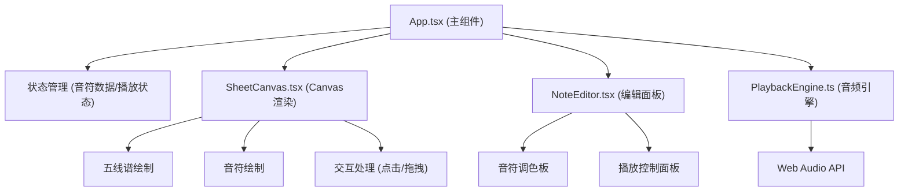

## 1. 架构设计



## 2. 技术描述

- **前端框架**：React 18 + TypeScript
- **构建工具**：Vite 5
- **渲染技术**：HTML5 Canvas API
- **音频技术**：Web Audio API
- **状态管理**：React useState/useReducer（轻量级，无需额外状态库）
- **样式方案**：纯CSS + CSS变量，不使用Tailwind（按用户需求使用自定义样式）

**技术选型理由**：
- 用户明确指定依赖：react, react-dom, typescript, @vitejs/plugin-react, vite
- Canvas用于高效绘制乐谱和动画
- Web Audio API提供低延迟音频播放
- 轻量级状态管理满足需求，避免过度设计

## 3. 数据模型

### 3.1 音符数据结构

```typescript
interface Note {
  id: string;
  pitch: number;      // MIDI音高，C4=60到C6=84
  startTime: number;  // 起始时间（以四分音符为单位，0-16表示4小节）
  duration: number;   // 时值：4=全音符, 2=二分音符, 1=四分音符, 0.5=八分音符
  isPlaying?: boolean;
  isDeleting?: boolean;
}

type NoteDuration = 4 | 2 | 1 | 0.5;

interface PlaybackState {
  isPlaying: boolean;
  currentTime: number;  // 当前播放时间（四分音符单位）
  speed: 0.5 | 1 | 1.5 | 2;
}
```

### 3.2 常量定义

```typescript
// 音高范围：C4(60) - C6(84)，共25个音高
const MIN_PITCH = 60;
const MAX_PITCH = 84;

// 乐谱配置：4小节，每小节4拍（四分音符）
const TOTAL_MEASURES = 4;
const BEATS_PER_MEASURE = 4;
const TOTAL_BEATS = TOTAL_MEASURES * BEATS_PER_MEASURE; // 16拍

// 时间精度：32分音符
const TIME_GRID = 1/8; // 0.125个四分音符

// 五线谱线间距（像素）
const STAFF_LINE_SPACING = 10;
const STAFF_TOP_MARGIN = 50;
const NOTE_WIDTH = 16;
const NOTE_HEIGHT = 12;
```

## 4. 模块设计

### 4.1 PlaybackEngine.ts

音频回放引擎，负责：
- 管理Web Audio API上下文
- 音符音色合成（正弦波+包络）
- 播放调度
- 速度控制

**核心方法**：
- `constructor()`: 初始化AudioContext
- `scheduleNote(frequency: number, startTime: number, duration: number)`: 调度单个音符
- `play(notes: Note[], startTime: number, speed: number, onProgress: (time: number) => void, onNoteStart: (id: string) => void, onNoteEnd: (id: string) => void)`: 开始播放
- `pause()`: 暂停播放
- `stop()`: 停止播放
- `setSpeed(speed: number)`: 设置播放速度

### 4.2 SheetCanvas.tsx

Canvas渲染组件，负责：
- 绘制五线谱、高音谱号、小节线
- 绘制音符（根据时值）
- 绘制播放进度线
- 处理鼠标/触摸交互（点击添加、拖拽移动）
- 显示音高提示

**核心功能**：
- `drawStaff()`: 绘制五线谱
- `drawNotes()`: 绘制所有音符
- `drawPlaybackLine()`: 绘制播放进度线
- `handleCanvasClick()`: 处理点击添加音符
- `handleNoteDrag()`: 处理音符拖拽

### 4.3 NoteEditor.tsx

编辑面板组件，负责：
- 音符调色板（四种时值选择）
- 播放控制按钮
- 速度选择器

### 4.4 App.tsx

主组件，负责：
- 全局状态管理（音符数组、播放状态、选中时值）
- 组件布局
- 事件协调

## 5. 性能优化策略

1. **Canvas渲染优化**：
   - 使用requestAnimationFrame进行动画
   - 只重绘变化区域（脏矩形）
   - 限制同时显示的音符数量≤50

2. **交互响应优化**：
   - 使用useCallback缓存事件处理函数
   - 防抖/节流处理高频事件
   - 拖拽时使用局部重绘

3. **音频性能**：
   - 预先调度音符播放时间
   - 避免在音频回调中执行复杂计算
   - 使用AudioContext.currentTime进行精确计时

## 6. 项目文件结构

```
auto24/
├── package.json
├── vite.config.js
├── tsconfig.json
├── index.html
└── src/
    ├── App.tsx
    ├── SheetCanvas.tsx
    ├── NoteEditor.tsx
    ├── PlaybackEngine.ts
    └── index.css
```
