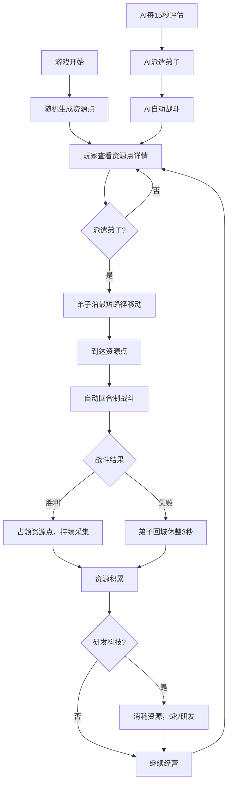

## 1. 产品概述

江湖门派资源争夺战——一款水墨风格的策略博弈游戏。玩家扮演门派掌门，通过派遣弟子争夺矿山、药田、灵泉等资源点来发展门派势力，同时AI对手门派会动态调整策略，形成零和博弈的趣味体验。

- 目标用户：喜欢轻度策略、武侠题材的休闲玩家
- 核心价值：快节奏的资源争夺 + AI博弈的策略深度 + 水墨江湖的视觉沉浸

## 2. 核心功能

### 2.1 玩家角色
| 角色 | 说明 | 核心权限 |
|------|------|----------|
| 玩家掌门 | 扮演门派掌门 | 派遣弟子、占领资源点、研发科技 |
| AI门派 | 自动决策的对手门派 | 自动评估资源、自动派遣弟子、自动战斗 |

### 2.2 功能模块
1. **地图场景**：随机生成5-7个资源点（矿山/药田/灵泉），支持缩放与拖拽，资源点可点击查看详情并派遣弟子
2. **门派经营面板**：展示弟子列表（头像/等级/战力/状态）和科技树（6个研发节点），可折叠
3. **战斗系统**：自动回合制战斗，像素风跳斩动画，胜者占领资源点，败者休整3秒
4. **AI决策系统**：每15秒自动评估资源分配，按"缺什么抢什么"原则派遣弟子

### 2.3 页面详情
| 页面名称 | 模块名称 | 功能描述 |
|----------|----------|----------|
| 主游戏页 | 地图区域 | 网格背景+手绘山水底纹，资源点图标（金色三角/绿色叶子/蓝色水滴），弟子移动虚线指引，地图缩放0.8x-1.5x与拖拽平移 |
| 主游戏页 | 门派面板 | 左侧300px可折叠面板，弟子列表（头像/等级/战力/状态：空闲/出征/休整），科技树6节点，研发5秒倒计时+金色光效 |
| 主游戏页 | 战斗浮层 | 屏幕中央弹出战斗报告，持续2秒后自动消失，像素风角色跳斩效果0.2秒动画 |
| 主游戏页 | 特效系统 | 争执特效（资源点易手超3次时红色粒子上飘1秒），资源数字0.3秒ease-out平滑过渡 |

## 3. 核心流程

玩家进入游戏 → 地图随机生成5-7个资源点（各带驻守NPC） → 玩家点击资源点查看详情 → 派遣弟子（最多同时3队） → 弟子沿最短路径移动（0.5秒/格） → 到达后自动回合制战斗 → 胜者占领资源点/败者回城休整3秒 → 占领后持续采集资源 → AI每15秒评估并派遣 → 资源积累可研发科技 → 循环博弈

## 4. 用户界面设计

### 4.1 设计风格
- **主色调**：墨黑（#1a1a1a）、宣纸白（#f5f0e8）、朱砂红（#c04040）
- **整体风格**：水墨江湖风，手绘山水底纹，网格背景
- **字体**：毛笔风格标题字体 + 清晰宋体正文
- **布局**：左侧门派面板（300px可折叠）+ 右侧地图区域（80%）
- **图标风格**：像素风角色，简洁符号图标（金色三角=矿山，绿色叶子=药田，蓝色水滴=灵泉）

### 4.2 页面设计概述
| 页面名称 | 模块名称 | UI元素 |
|----------|----------|--------|
| 主游戏页 | 地图区域 | 墨黑背景+网格线，手绘山水轮廓底纹，资源点彩色图标，弟子移动虚线，鼠标滚轮缩放控件 |
| 主游戏页 | 门派面板 | 宣纸白背景，朱砂红强调色，弟子头像网格列表，科技树节点连线图，金色光效闪烁动画 |
| 主游戏页 | 战斗浮层 | 半透明墨黑遮罩，宣纸白文字，像素风角色跳斩动画0.2秒，2秒后淡出消失 |
| 主游戏页 | 特效粒子 | 红色粒子上飘动画，资源数字0.3秒ease-out平滑增减 |

### 4.3 响应式设计
- **桌面端（1280px+）**：左侧面板300px + 右侧地图80%，完整功能
- **平板竖屏（iPad）**：面板默认折叠为底部抽屉，地图全屏，触摸手势支持缩放与拖拽
- **交互方式**：桌面端鼠标滚轮缩放+拖拽平移，移动端双指缩放+单指拖拽

### 4.4 性能要求
- 主线程帧率稳定30FPS以上
- 地图缩放和平移操作延迟不超过50ms
- 弟子移动0.5秒/格
- 战斗动画0.2秒/跳斩
- 战斗报告浮层2秒消失
- 资源数字0.3秒ease-out过渡
