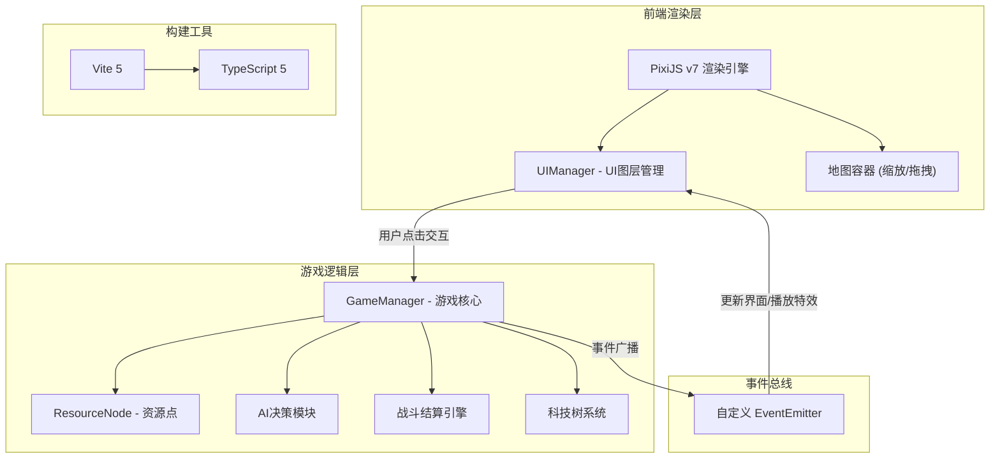
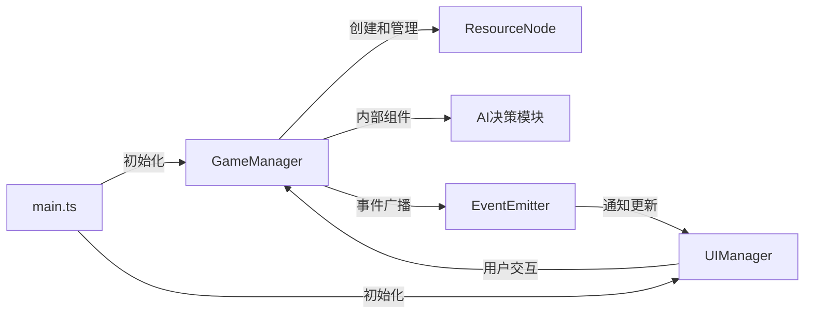

## 1. 架构设计



## 2. 技术说明
- **前端渲染**：PixiJS@7（Canvas/WebGL渲染引擎）
- **开发语言**：TypeScript@5（严格模式，target ESNext）
- **构建工具**：Vite@5（开发端口5173）
- **状态管理**：自定义EventEmitter事件驱动
- **后端**：无（纯前端单机游戏）
- **数据库**：无（所有状态运行时管理）

## 3. 文件结构定义

| 文件路径 | 职责 |
|----------|------|
| `package.json` | 依赖：pixi.js@7, typescript@5, vite@5；脚本：npm run dev |
| `vite.config.js` | 基础路径配置，开发端口5173 |
| `tsconfig.json` | 严格模式，target ESNext |
| `index.html` | 入口页面，全屏无滚动条，背景色#1a1a1a |
| `src/main.ts` | PixiJS应用入口，初始化舞台、加载资源、启动主循环（30FPS） |
| `src/GameManager.ts` | 游戏核心逻辑：管理资源点、弟子队列、战斗结算、AI决策；暴露update和handleClick接口 |
| `src/ResourceNode.ts` | 资源点类：位置、类型、产量、驻守NPC战力、易手次数；提供占领和战斗方法 |
| `src/UIManager.ts` | UI图层管理：门派面板、地图缩放控件、战斗报告浮层、特效粒子动画；继承PixiJS Container |

## 4. 模块间调用关系



- `main.ts` 初始化 `GameManager` 和 `UIManager`
- `GameManager` 通过自定义 `EventEmitter` 广播事件通知 `UIManager` 更新界面和播放特效
- `ResourceNode` 由 `GameManager` 创建和管理
- AI决策模块作为 `GameManager` 的内部组件，对外只暴露决策接口

## 5. 核心数据模型

### 5.1 资源点（ResourceNode）
```typescript
interface ResourceNodeData {
  id: number;
  type: "mine" | "herb" | "spring";
  position: { x: number; y: number };
  baseYield: number;
  guardianPower: number;
  owner: "player" | "ai" | "neutral";
  contestCount: number;
}
```

### 5.2 弟子（Disciple）
```typescript
interface DiscipleData {
  id: number;
  name: string;
  level: number;
  power: number;
  status: "idle" | "marching" | "resting";
  restTimer: number;
  targetNodeId: number | null;
}
```

### 5.3 科技节点（TechNode）
```typescript
interface TechNodeData {
  id: string;
  name: string;
  description: string;
  cost: { ore: number; herb: number; spring: number };
  effect: string;
  researched: boolean;
  researchTimer: number;
}
```

## 6. 关键算法

### 6.1 最短路径移动
- 使用BFS在网格地图上计算弟子从门派到资源点的最短路径
- 弟子以0.5秒/格速度沿路径移动

### 6.2 战斗结算
- 自动回合制，每轮双方概率攻击+伤害浮动
- 攻击命中率 = 70% + 随机浮动
- 伤害 = 战力 × (0.8 ~ 1.2随机系数)
- 先将对方HP降为0者获胜

### 6.3 AI决策
- 每15秒评估一次
- 统计当前各资源类型持有量
- 按稀缺度优先攻击（缺矿石→攻矿山，缺草药→攻药田，缺灵泉→攻灵泉）
- 对外暴露 `makeDecision()` 接口
