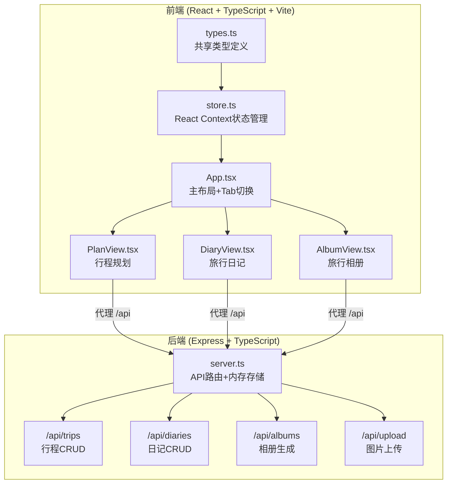
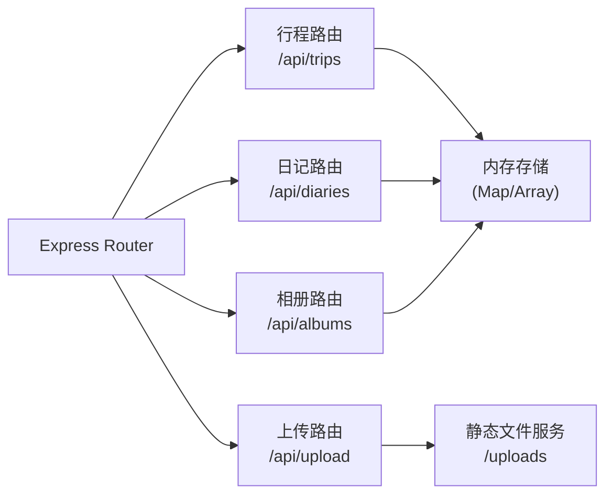
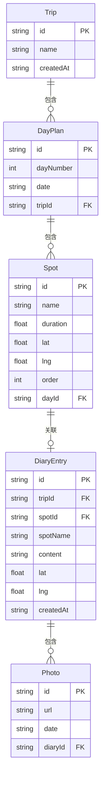

## 1. 架构设计



## 2. 技术说明

- 前端：React@18 + TypeScript + Vite（使用@vitejs/plugin-react）
- 状态管理：React Context（非Zustand，用户明确指定）
- 后端：Express@4 + TypeScript + cors + uuid
- 存储：内存模拟存储（不依赖外部数据库）
- 样式：内联CSS + CSS模块（无Tailwind，用户未要求）
- 初始化工具：vite-init
- 构建工具：Vite

## 3. 路由定义

| 路由 | 用途 |
|------|------|
| / | 主页面，通过Tab切换三个视图（行程规划、旅行日记、旅行相册） |

前端为单页应用，不使用react-router，通过Tab组件在三个视图间切换，切换时有0.3s滑动动画。

## 4. API定义

### 4.1 行程相关API

| 方法 | 路径 | 请求体 | 响应 | 说明 |
|------|------|--------|------|------|
| GET | /api/trips | - | Trip[] | 获取所有旅行 |
| POST | /api/trips | { name: string } | Trip | 创建旅行 |
| GET | /api/trips/:id | - | Trip | 获取旅行详情 |
| PUT | /api/trips/:id | Trip | Trip | 更新旅行（含天数和景点） |
| DELETE | /api/trips/:id | - | { success: boolean } | 删除旅行 |

### 4.2 日记相关API

| 方法 | 路径 | 请求体 | 响应 | 说明 |
|------|------|--------|------|------|
| GET | /api/trips/:tripId/diaries | - | DiaryEntry[] | 获取旅行所有日记 |
| POST | /api/trips/:tripId/diaries | DiaryEntry | DiaryEntry | 创建日记 |
| PUT | /api/diaries/:id | DiaryEntry | DiaryEntry | 更新日记 |
| DELETE | /api/diaries/:id | - | { success: boolean } | 删除日记 |

### 4.3 相册相关API

| 方法 | 路径 | 请求体 | 响应 | 说明 |
|------|------|--------|------|------|
| GET | /api/trips/:tripId/album | - | Photo[] | 获取旅行相册（按日期分组） |

### 4.4 图片上传API

| 方法 | 路径 | 请求体 | 响应 | 说明 |
|------|------|--------|------|------|
| POST | /api/upload | FormData (file) | { url: string } | 上传图片，返回URL |

### 4.5 TypeScript类型定义

```typescript
interface Trip {
  id: string;
  name: string;
  days: DayPlan[];
  createdAt: string;
}

interface DayPlan {
  id: string;
  dayNumber: number;
  date: string;
  spots: Spot[];
}

interface Spot {
  id: string;
  name: string;
  duration: number;
  lat: number;
  lng: number;
  order: number;
}

interface DiaryEntry {
  id: string;
  tripId: string;
  spotId: string;
  spotName: string;
  content: string;
  lat: number;
  lng: number;
  createdAt: string;
}

interface Photo {
  id: string;
  url: string;
  date: string;
  diaryId: string;
}
```

## 5. 服务器架构图



## 6. 数据模型

### 6.1 数据模型定义



### 6.2 数据存储

使用内存中的JavaScript对象模拟数据库存储，数据结构如下：
- `trips: Map<string, Trip>` — 存储所有旅行
- `diaries: Map<string, DiaryEntry>` — 存储所有日记
- `photos: Photo[]` — 存储所有照片引用

服务器重启后数据会丢失，符合用户"内存模拟存储"的要求。
