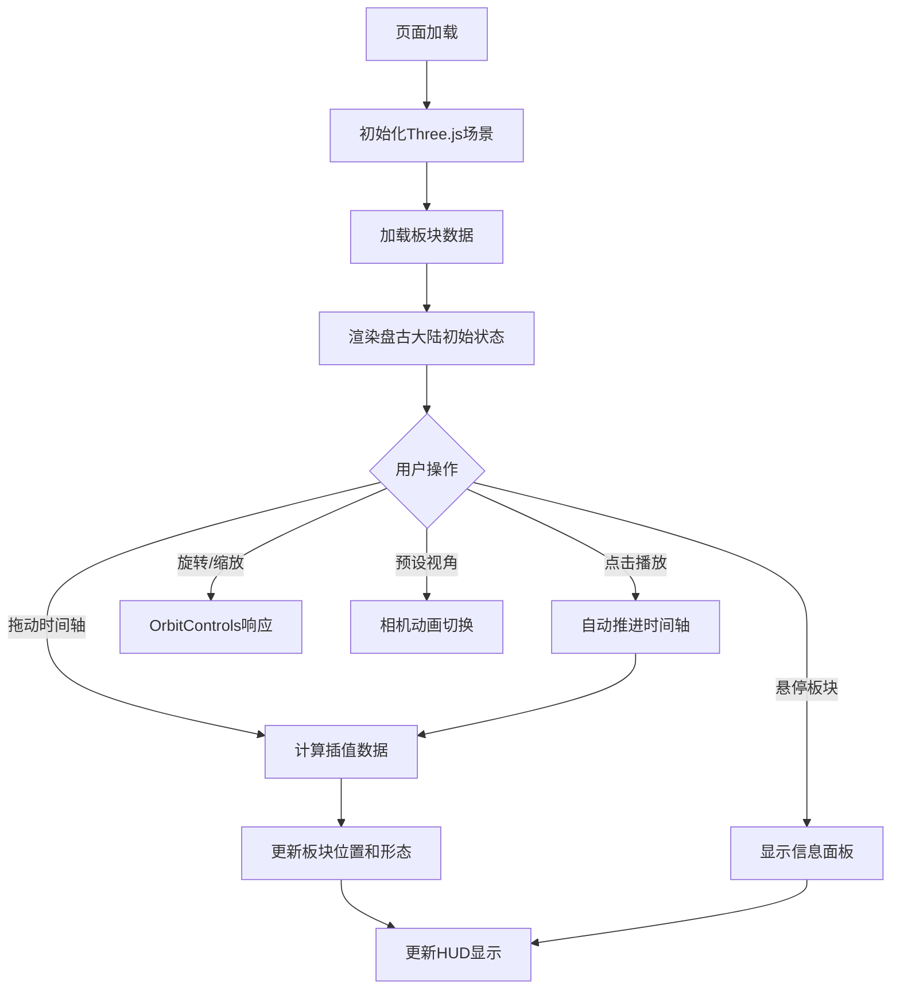

## 1. 产品概述

地球板块漂移模拟器是一个基于 Three.js 的交互式3D可视化应用，让用户通过时间轴滑块直观体验从2.5亿年前盘古大陆到现代各大陆分离的完整过程。目标用户为地理爱好者、教育工作者和学生群体，旨在将抽象的板块构造理论转化为可交互的视觉体验。

## 2. 核心功能

### 2.1 功能模块

1. **3D地球板块可视化**：板块用不同颜色渲染，边界显示挤压/分离箭头动画，板块表面半透明纹理网格线，交界处发光线条
2. **时间轴控制**：拖动滑块切换地质时期，自动播放/暂停，关键地质时期标注，平滑过渡动画
3. **视角控制**：OrbitControls拖拽旋转缩放，预设视角按钮（正面、侧面、俯视）
4. **信息交互**：鼠标悬停板块弹出信息标签，显示板块名称和面积
5. **背景氛围**：深蓝紫色径向渐变星空，星星缓慢闪烁

### 2.2 页面详情

| 页面名称 | 模块名称 | 功能描述 |
|---------|---------|---------|
| 主场景 | 3D板块渲染 | 加载预定义板块JSON数据，用ShapeGeometry生成不规则多边形，半透明纹理网格线，发光边界线，挤压/分离箭头动画 |
| 主场景 | 时间轴控制 | 底部滑块（范围-250到0百万年），刻度标注关键地质时期，播放/暂停按钮（1秒推进1000万年），缓动效果 |
| 主场景 | 视角控制 | OrbitControls旋转缩放，预设视角按钮（正面/侧面/俯视），深蓝紫径向渐变星空背景 |
| 主场景 | 信息面板 | 鼠标悬停弹出板块名称和面积（百万平方公里），右下角地质时期名称和距今年代 |
| 主场景 | HUD叠加层 | 大号白色发光文字显示当前地质时期和距今时间，预设视角按钮 |

## 3. 核心流程

用户打开页面后看到盘古大陆的3D视图，底部时间轴默认在-250百万年位置。用户可以拖动时间轴滑块观看板块分离过程，也可以点击播放按钮自动推进。鼠标悬停在任意板块上显示信息标签，可以用OrbitControls旋转缩放视角，或点击预设视角按钮切换视角。

## 4. 用户界面设计

### 4.1 设计风格

- **主色**：#0a0f1e（深色科幻底色）
- **辅助色**：#1c2a4a（磨砂玻璃底色）
- **文字色**：#e0e6ff（冷白文字）
- **按钮样式**：磨砂玻璃渐变效果，点击缩放动画（0.1秒 scale变化）
- **滑块样式**：磨砂玻璃渐变效果，拖动时柔和阴影跟随
- **字体**：科技感无衬线字体，大号标题带发光效果
- **布局**：全屏3D场景，底部时间轴覆盖层，右下角HUD信息

### 4.2 页面设计概览

| 页面名称 | 模块名称 | UI元素 |
|---------|---------|--------|
| 主场景 | 星空背景 | 深蓝(#0a0f1e)到紫色径向渐变，星星随机闪烁(2-5秒周期) |
| 主场景 | 板块渲染 | 不同颜色半透明板块，纹理网格线，发光边界线，箭头动画 |
| 主场景 | 时间轴 | 底部磨砂玻璃滑块，刻度标注(侏罗纪/白垩纪等)，播放/暂停按钮 |
| 主场景 | HUD信息 | 右下角大号白色发光文字，如"白垩纪 - 距今1.45亿年" |
| 主场景 | 信息面板 | 悬停弹出的磨砂玻璃卡片，显示板块名称+面积 |
| 主场景 | 视角按钮 | 左上角磨砂玻璃按钮组：正面/侧面/俯视 |

### 4.3 响应式设计

桌面优先设计，3D场景全屏自适应，时间轴和HUD根据窗口大小调整位置和字号。

### 4.4 3D场景指引

- **环境**：深空宇宙背景，径向渐变从深蓝到紫色
- **灯光**：环境光 + 方向光模拟太阳照射
- **相机**：透视相机，OrbitControls交互，预设视角平滑过渡
- **动画**：板块位移线性插值30FPS+，边界箭头脉冲动画，星星闪烁
- **后处理**：板块边界发光效果（通过材质实现，不用后处理pass以保性能）
- **性能预算**：帧率稳定30FPS以上，板块数据切换无卡顿
