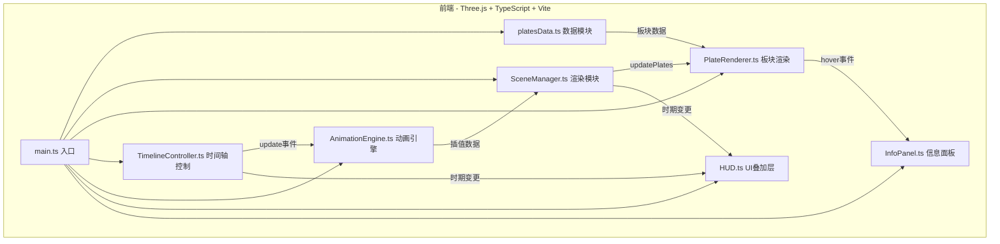

## 1. 架构设计



## 2. 技术说明

- **前端**：TypeScript + Three.js + Vite（纯3D项目，不使用React/Vue）
- **构建工具**：Vite，开发端口5173
- **3D引擎**：Three.js，使用OrbitControls交互
- **TypeScript**：严格模式，target ES2020
- **依赖**：three, typescript, @types/three, vite
- **无后端**：所有数据预定义在前端

## 3. 文件结构

| 文件路径 | 职责 |
|---------|------|
| package.json | 依赖管理，启动脚本 npm run dev |
| vite.config.js | 基础Vite配置，端口5173 |
| tsconfig.json | 严格模式，ES2020 |
| index.html | 入口页面，背景色#0a0f1e，全屏无滚动 |
| src/data/platesData.ts | 板块数据结构定义和预设顶点数据 |
| src/renderer/SceneManager.ts | Three.js场景/相机/灯光/OrbitControls，暴露updatePlates |
| src/renderer/PlateRenderer.ts | 板块Mesh生成/边界线/几何体更新/悬停交互 |
| src/animation/TimelineController.ts | 时间轴滑块逻辑/插值计算/update事件 |
| src/animation/AnimationEngine.ts | 线性插值动画/帧率控制/缓动策略 |
| src/ui/HUD.ts | 地质时期名称/距今年代/预设视角按钮 |
| src/ui/InfoPanel.ts | 悬停信息弹出面板 |
| src/main.ts | 入口，初始化所有模块，建立调用关系 |

## 4. 数据模型

### 4.1 板块数据结构

```typescript
interface PlateKeyframe {
  time: number;
  vertices: [number, number][];
}

interface PlateData {
  id: string;
  name: string;
  nameCN: string;
  color: string;
  area: number;
  keyframes: PlateKeyframe[];
}

interface GeologicalPeriod {
  name: string;
  nameCN: string;
  start: number;
  end: number;
}
```

### 4.2 数据流

1. `platesData.ts` 导出8个主要板块的keyframe数据（7个关键时间点）
2. `TimelineController` 根据当前时间计算相邻keyframe的插值权重
3. `AnimationEngine` 执行线性插值，生成当前帧的板块顶点
4. `PlateRenderer` 根据插值后的顶点更新ShapeGeometry
5. `SceneManager` 协调渲染循环

## 5. 关键地质时期

| 时期名称 | 时间范围（百万年前） |
|---------|-------------------|
| 二叠纪末/盘古大陆 | -250 |
| 三叠纪 | -250 ~ -200 |
| 侏罗纪 | -200 ~ -145 |
| 白垩纪 | -145 ~ -66 |
| 古近纪 | -66 ~ -23 |
| 新近纪 | -23 ~ -2.6 |
| 第四纪/现代 | -2.6 ~ 0 |
