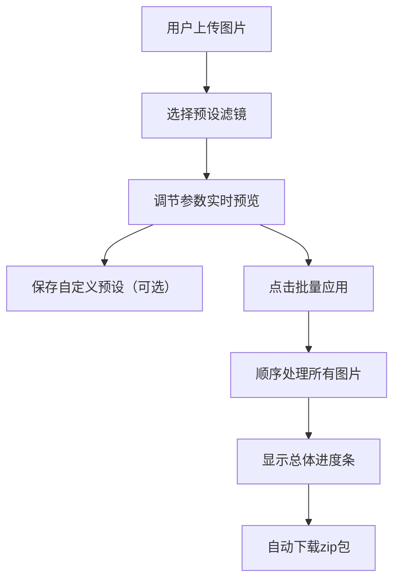

## 1. 产品概述
拍立调是一款面向摄影师和修图工作者的批量图片色彩风格调整工具，解决手动逐张调节费时、效果不一致的痛点。
用户可上传多张图片、创建并应用预设滤镜，一键同步色彩风格，大幅提升修图效率。

## 2. 核心功能

### 2.1 用户角色
| 角色 | 注册方式 | 核心权限 |
|------|----------|----------|
| 普通用户 | 无需注册 | 上传图片、使用预设滤镜、保存自定义预设、批量处理下载 |

### 2.2 功能模块
1. **图片上传模块**：拖拽/点击上传、格式校验、大小限制、进度显示
2. **滤镜引擎模块**：Canvas像素处理、滤镜矩阵运算、图片导出
3. **预设管理模块**：内置预设、自定义预设增删改、localStorage持久化
4. **滤镜列表模块**：预设展示、拖拽排序、选中应用
5. **实时预览模块**：原图/效果图对比、分割线拖拽、缩放平移、旋转
6. **批量处理模块**：多图顺序处理、进度显示、zip打包下载

### 2.3 页面详情
| 页面名称 | 模块名称 | 功能描述 |
|---------|----------|----------|
| 主页面 | 上传区域 | 虚线边框拖拽上传，支持jpg/png，单图≤10MB，最多10张 |
| 主页面 | 滤镜列表 | 横向滚动卡片，展示内置+自定义预设，拖拽排序，选中发光效果 |
| 主页面 | 预览区域 | 左右对比视图，可拖动分割线，滚轮缩放，拖拽平移，90度旋转 |
| 主页面 | 参数调节 | 亮度/对比度/色相/饱和度滑块，实时预览，保存自定义预设 |
| 主页面 | 批量处理 | 顺序处理图片，总体进度条，自动下载zip包 |

## 3. 核心流程
用户上传图片 → 选择或调节滤镜参数 → 实时预览效果 → 保存为自定义预设（可选）→ 点击批量应用 → 系统顺序处理所有图片 → 自动下载zip包

## 4. 用户界面设计

### 4.1 设计风格
- **主题**：深色专业风格，背景#1a1a2e，卡片#16213e
- **主色调**：#e94560（珊瑚红）作为强调色
- **按钮**：圆角设计，点击缩放效果scale(0.95)，持续0.1s
- **字体**：采用现代无衬线字体，标题粗体，正文常规
- **布局**：三栏式布局（上传区、滤镜列表、预览区），桌面优先
- **动效**：平滑过渡、悬停缩放、进度条跳动动画

### 4.2 页面设计概述
| 页面名称 | 模块名称 | UI元素 |
|---------|----------|--------|
| 主页面 | 上传区域 | 虚线边框#e94560，悬停实线+缩放，过渡0.2s ease |
| 主页面 | 滤镜卡片 | 80x80px，圆角12px，选中时底部发光轮廓box-shadow扩散4px |
| 主页面 | 分割线 | 2px细亮线#eee，圆形手柄直径16px，hover放大到20px |
| 主页面 | 进度条 | 每张完成时跳动更新，动画持续0.3秒 |
| 主页面 | 抽屉面板 | <1024px时滤镜列表变为垂直折叠抽屉 |

### 4.3 响应式
- 桌面优先设计，最小宽度768px
- ≥1024px：滤镜列表横向滚动
- <1024px：滤镜列表变为垂直折叠抽屉式面板，点击按钮展开
- 触摸操作优化：拖拽、滑块支持触摸事件

### 4.4 性能指标
- 滤镜参数调节预览响应≤100ms
- 批量处理10张1920x1080图片总耗时≤5秒
- 单张处理≤200ms
- 分割线拖动延迟≤16ms
- 使用requestAnimationFrame确保流畅性
