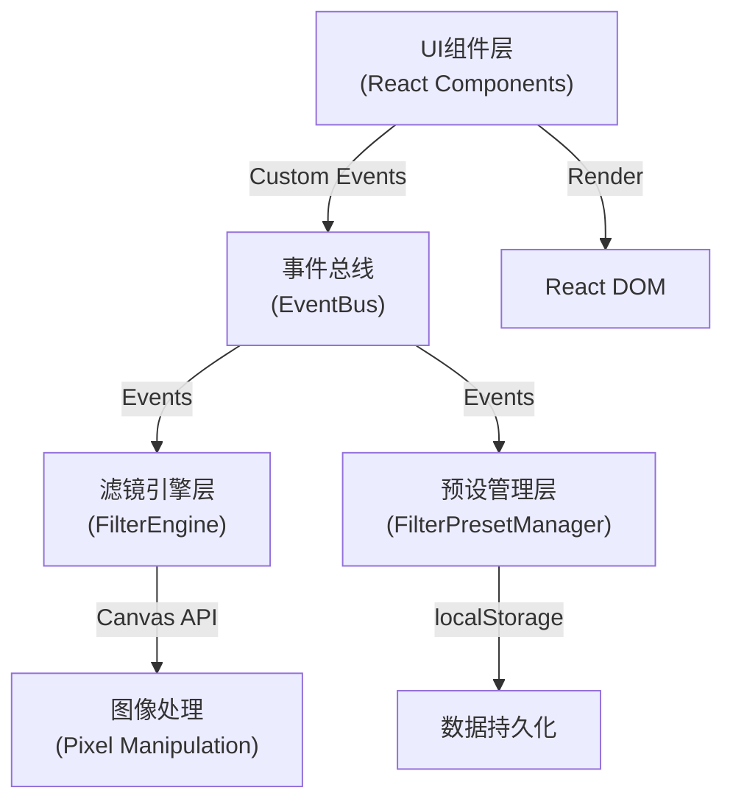

## 1. 架构设计



## 2. 技术描述
- **前端**：React@18 + TypeScript@5 + Vite@5
- **初始化工具**：Vite 脚手架
- **后端**：纯前端应用，无后端
- **数据存储**：localStorage存储自定义预设
- **核心库**：
  - color-science@2.5：色彩空间转换和计算
  - file-saver：文件下载
  - Canvas API：像素级图像处理
  - JSZip：批量图片打包下载

## 3. 目录结构

```
src/
├── App.tsx                 # 主应用组件
├── main.tsx               # 入口文件
├── index.css              # 全局样式
├── types/
│   └── index.ts           # 类型定义
├── utils/
│   └── EventBus.ts        # 自定义事件总线
├── engine/
│   ├── FilterEngine.ts    # 滤镜引擎
│   └── FilterPresetManager.ts  # 预设管理器
└── components/
    ├── ImageUploader.tsx  # 图片上传组件
    ├── FilterList.tsx     # 滤镜列表组件
    ├── ColorPreview.tsx   # 颜色预览组件
    └── FilterControls.tsx # 参数调节组件
```

## 4. 核心数据模型

### 4.1 FilterParams 滤镜参数
```typescript
interface FilterParams {
  brightness: number;   // -100 ~ 100
  contrast: number;     // -100 ~ 100
  hueRotate: number;    // 0 ~ 360
  saturation: number;   // 0 ~ 200
}
```

### 4.2 FilterPreset 滤镜预设
```typescript
interface FilterPreset {
  id: string;
  name: string;
  params: FilterParams;
  thumbnail?: string;
  isBuiltIn: boolean;
  createdAt: number;
}
```

### 4.3 ImageItem 图片项
```typescript
interface ImageItem {
  id: string;
  file: File;
  url: string;
  name: string;
  rotation: number;      // 0, 90, 180, 270
  processedUrl?: string;
  status: 'pending' | 'processing' | 'done' | 'error';
}
```

## 5. 事件总线定义

| 事件名称 | 参数 | 触发方向 | 说明 |
|---------|------|----------|------|
| `FILTER_PARAMS_CHANGED` | FilterParams | UI → Engine | 滤镜参数变化 |
| `FILTER_APPLIED` | { imageId: string, dataUrl: string } | Engine → UI | 单图处理完成 |
| `BATCH_PROGRESS` | { current: number, total: number } | Engine → UI | 批量处理进度 |
| `BATCH_COMPLETE` | Blob[] | Engine → UI | 批量处理完成 |
| `PRESET_SAVED` | FilterPreset | UI → PresetMgr | 保存预设 |
| `PRESET_DELETED` | string | UI → PresetMgr | 删除预设 |
| `PRESETS_UPDATED` | FilterPreset[] | PresetMgr → UI | 预设列表更新 |
| `IMAGE_UPLOADED` | ImageItem[] | Uploader → App | 图片上传完成 |
| `IMAGE_ROTATED` | { imageId: string, rotation: number } | Preview → App | 图片旋转 |

## 6. 性能优化策略

1. **Web Worker**：滤镜计算使用Web Worker避免阻塞主线程
2. **requestAnimationFrame**：UI动画使用RAF确保60fps
3. **离屏Canvas**：图像处理使用OffscreenCanvas
4. **防抖节流**：参数调节使用防抖，滚动使用节流
5. **内存管理**：及时revokeObjectURL释放内存
6. **懒渲染**：批量处理时逐张处理，避免内存溢出

## 7. 模块间通信

采用发布-订阅模式的自定义事件总线：
- 组件间通过事件总线通信，实现解耦
- 滤镜引擎独立运行，通过事件通知UI更新
- 预设管理器独立管理存储，状态变化通知所有订阅者
