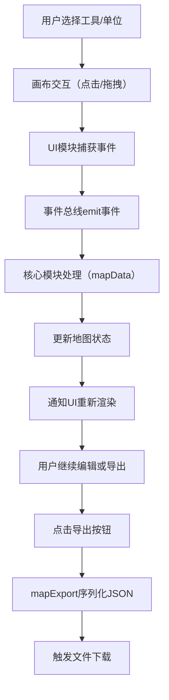

## 1. 产品概述

PathForge是一款面向回合制策略游戏开发者的2D俯视角地图编辑器，玩家可通过可视化操作快速构建关卡原型。

- 核心用途：自定义放置单位、绘制巡逻路径、绑定触发事件，一键导出可复用的JSON关卡数据
- 目标用户：独立游戏开发者、关卡设计师、策略游戏原型制作人员

## 2. 核心功能

### 2.1 功能模块

1. **主编辑界面**：网格画布 + 左侧工具面板 + 顶部导出按钮
2. **地图网格编辑**：地形类型切换（草地/墙壁/水域）、格子选中高亮
3. **单位放置与管理**：3种预置单位（角色/怪物/宝箱）、拖拽移动、删除
4. **路径绘制与编辑**：路径点生成、折线连接、与单位绑定
5. **事件绑定系统**：事件名称输入、类型选择、预览弹窗
6. **数据导出功能**：JSON序列化、自动下载、加载/成功反馈

### 2.2 页面详情

| 页面名称 | 模块名称 | 功能描述 |
|---------|---------|---------|
| 主编辑页 | 顶部导出区 | 高亮导出按钮、加载动画、成功提示横幅 |
| 主编辑页 | 左侧工具面板 | 单位选择按钮组、路径模式开关、地形切换、事件编辑器 |
| 主编辑页 | 中央画布区 | 20x15网格渲染、单位/路径绘制、鼠标交互、视觉反馈 |
| 主编辑页 | 事件预览Modal | 淡入缩放动画、事件名称/类型展示 |

## 3. 核心流程

用户从左侧面板选择工具 → 在画布上进行编辑操作 → 操作通过事件总线传递至核心模块 → 核心模块更新状态并通知UI重绘 → 点击导出按钮触发JSON序列化与下载

## 4. 用户界面设计

### 4.1 设计风格
- **主色调**：深色主题，背景#1a1a2e，面板#2d2d44，强调色#e94560（导出按钮）
- **辅助色**：草地绿、墙壁灰、水域蓝、路径蓝、金色选中边框、黄色闪电标志
- **按钮风格**：圆角设计，弹性缩放动画（scale 0.95→1.0，0.15s），悬停发光效果
- **字体**：现代无衬线字体，清晰可读，层级分明
- **布局风格**：双栏固定布局（≥1024px），顶部水平菜单（<1024px）
- **视觉细节**：毛玻璃面板（半透明白色）、画布阴影渐变、所有交互均有过渡动画

### 4.2 页面设计概览

| 页面名称 | 模块名称 | UI元素 |
|---------|---------|--------|
| 主编辑页 | 顶部导出区 | 红色高亮按钮、旋转加载动画、顶部滑入成功提示（2s消失） |
| 主编辑页 | 左侧工具面板 | 240px固定宽、圆角12px、毛玻璃背景、弹性按钮、路径开关、输入框、下拉菜单 |
| 主编辑页 | 中央画布区 | 800x600 Canvas、40px网格线、地形半透明覆盖、单位几何图形、路径蓝色折线、路径点数字圆圈、闪电标志 |
| 主编辑页 | 事件预览Modal | 淡入缩放0.2s、居中卡片、事件信息、关闭按钮 |

### 4.3 响应式适配
- 桌面优先（≥1024px）：左侧240px固定工具面板 + 右侧自适应画布区
- 小屏适配（<1024px）：工具面板折叠为顶部水平滚动菜单，画布区占满全屏
- 触控优化：拖拽操作支持鼠标与触控双模式
