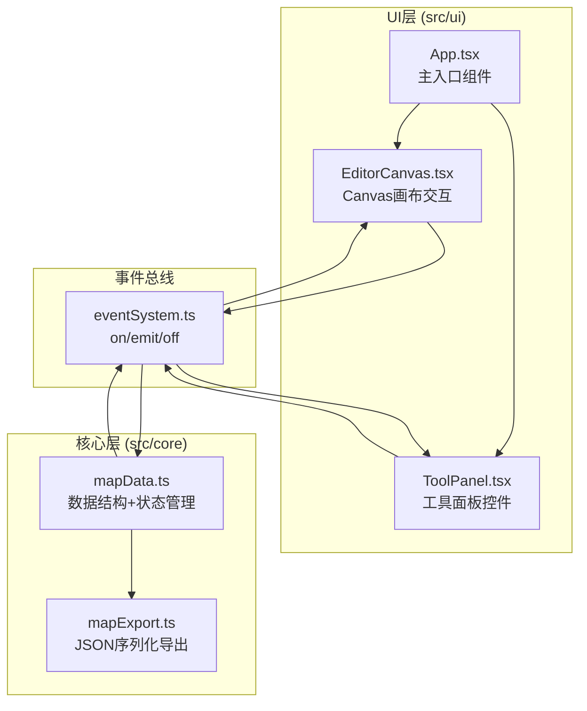
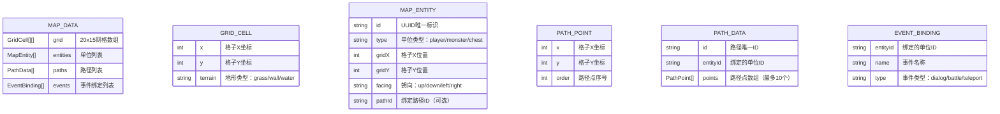

## 1. 架构设计



## 2. 技术描述

- **前端框架**：React@18 + TypeScript@5 + Vite@5
- **初始化工具**：Vite（手动配置）
- **构建工具**：Vite + @vitejs/plugin-react
- **依赖库**：uuid（生成唯一ID）
- **渲染技术**：HTML5 Canvas 2D API（画布渲染）+ React DOM（UI控件）
- **状态管理**：自定义事件总线（EventEmitter模式），UI与核心模块解耦
- **样式方案**：原生CSS + CSS变量，动画使用CSS transitions/animations
- **后端**：无（纯前端应用）
- **数据存储**：浏览器内存 + 本地文件导出（JSON）

## 3. 路由定义

| 路由 | 用途 |
|-----|------|
| / | 地图编辑器主界面（单页应用，无多路由） |

## 4. 数据模型

### 4.1 数据模型定义



### 4.2 TypeScript类型定义

```typescript
// 地形类型
type TerrainType = 'grass' | 'wall' | 'water';

// 单位类型
type EntityType = 'player' | 'monster' | 'chest';

// 朝向
type Facing = 'up' | 'down' | 'left' | 'right';

// 事件类型
type EventType = 'dialog' | 'battle' | 'teleport';

// 网格单元
interface GridCell {
  x: number;
  y: number;
  terrain: TerrainType;
}

// 路径点
interface PathPoint {
  x: number;
  y: number;
  order: number;
}

// 地图单位
interface MapEntity {
  id: string;
  type: EntityType;
  gridX: number;
  gridY: number;
  facing: Facing;
  pathId?: string;
}

// 路径数据
interface PathData {
  id: string;
  entityId: string;
  points: PathPoint[];
}

// 事件绑定
interface EventBinding {
  entityId: string;
  name: string;
  type: EventType;
}

// 完整地图数据
interface MapData {
  grid: GridCell[][];
  entities: MapEntity[];
  paths: PathData[];
  events: EventBinding[];
}

// 事件总线事件名
enum EditorEvent {
  ADD_ENTITY = 'ADD_ENTITY',
  MOVE_ENTITY = 'MOVE_ENTITY',
  DELETE_ENTITY = 'DELETE_ENTITY',
  SET_TERRAIN = 'SET_TERRAIN',
  SET_PATH = 'SET_PATH',
  BIND_EVENT = 'BIND_EVENT',
  MAP_UPDATED = 'MAP_UPDATED',
  EXPORT_MAP = 'EXPORT_MAP',
}
```

## 5. 性能优化策略

- **Canvas渲染优化**：使用requestAnimationFrame循环，只在状态变更时标记重绘
- **拖拽性能**：鼠标位置计算缓存，单位拖拽延迟<30ms
- **帧率保证**：稳定≥55fps，重绘区域最小化
- **导出速度**：纯内存操作序列化，<50ms完成
- **事件节流**：高频鼠标事件适度节流，避免过度重绘
