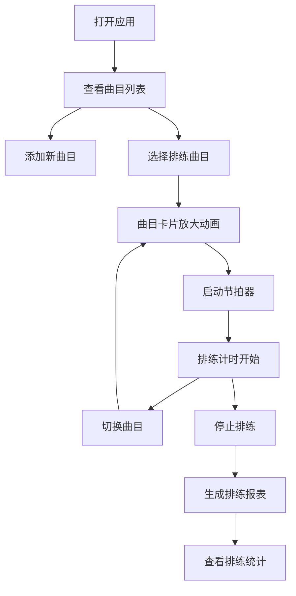

## 1. 产品概述

乐队排练管理应用，旨在解决小型乐队在排练时曲目列表混乱和缺少统一节奏参考的问题。通过曲目管理、节拍器引擎和排练计时器三大核心功能，帮助乐队成员高效组织排练、统一节奏、记录排练时长。

- **目标用户**：小型乐队成员（2-6人）
- **核心价值**：曲目集中管理、精准节拍参考、排练数据追踪
- **使用场景**：乐队排练室、日常练习、演出前排练

## 2. 核心功能

### 2.1 用户角色

| 角色 | 注册方式 | 核心权限 |
|------|----------|----------|
| 乐队成员 | 无需注册，本地使用 | 管理曲目、使用节拍器、查看排练记录 |

### 2.2 功能模块

1. **曲目管理模块**：添加/编辑/删除曲目，曲目卡片展示，选中曲目放大突出显示
2. **节拍器引擎模块**：四分音符/八分音符切换，音量调节，开始/停止控制，高精度节拍
3. **排练计时器模块**：当前曲目计时，累计排练时长，排练结束生成简报表

### 2.3 页面详情

| 页面名称 | 模块名称 | 功能描述 |
|----------|----------|----------|
| 主页面 | 曲目列表区 | 卡片式展示所有曲目，选中卡片放大并播放节拍，未选中卡片缩小半透明排列两侧，0.4秒弹性动画过渡 |
| 主页面 | 添加曲目表单 | 曲名、艺术家、BPM、时长、备注字段 |
| 主页面 | 底部工具栏 | 节拍器控制（模式切换、音量滑块、开始/停止按钮）、实时波形显示、排练计时器 |
| 主页面 | 排练报表 | 排练结束后显示每首曲目排练次数和总时长 |

## 3. 核心流程

用户打开应用后，可以管理曲目列表；选择曲目后卡片放大并可启动节拍器；排练过程中计时器自动累计；结束后生成包含每首曲目排练次数和总时长的简报表。

## 4. 用户界面设计

### 4.1 设计风格

- **主色调**：深色主题，背景色 #1a1a2e，卡片底色 #16213e，强调色 #e94560
- **卡片风格**：圆角12px，轻微阴影，悬停上升3px过渡动画
- **字体**：现代无衬线字体，清晰易读
- **布局风格**：卡片式布局，底部固定工具栏
- **动画风格**：0.4秒弹性动画过渡，脉动光环效果

### 4.2 页面设计概览

| 页面名称 | 模块名称 | UI元素 |
|----------|----------|--------|
| 主页面 | 曲目卡片 | 宽280px 高120px，圆角12px，阴影，悬停上升，选中脉动光环 |
| 主页面 | 底部工具栏 | 半透明毛玻璃效果 #0f3460，backdrop-filter: blur(10px) |
| 主页面 | 波形可视化 | Canvas 200x40px，60fps 实时音频频率波形 |
| 主页面 | 节拍器控制 | 模式切换按钮、音量滑块、开始/停止按钮 |
| 主页面 | 排练计时器 | 当前曲目时长、累计排练时长 |

### 4.3 响应式设计

- **桌面端**：曲目卡片横向排列，选中放大居中，两侧缩略图
- **移动端**（<768px）：曲目列表单列垂直滚动，工具栏固定底部
- **触摸优化**：按钮最小触控区域 44px，卡片点击区域足够大

### 4.4 动画效果

- **卡片选中**：0.4秒弹性放大动画，缩放过渡
- **卡片排列**：非选中卡片自动排列两侧，半透明效果
- **脉动光环**：选中卡片边缘1.2秒周期扩散光环
- **悬停效果**：卡片悬停上升3px，阴影加深
- **波形动画**：60fps 实时绘制音频波形
